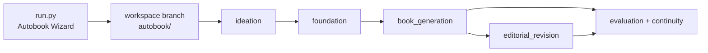
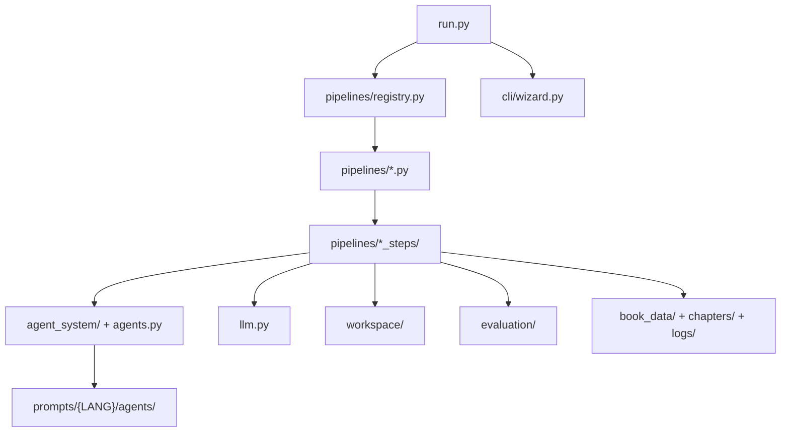

# autobook

Autobook is a Python workspace for planning, writing, revising and validating
books with LLM-assisted pipelines. The current architecture is centered on a
single orchestrator, protected work branches, modular pipeline steps, structured
feedback, localized prompts and a fast local test suite.

> [!NOTE]
> The project is based on and inspired by
> [NousResearch/autonovel](https://github.com/NousResearch/autonovel), with a
> refactored multi-provider LLM client, pipeline registry, wizard, modular
> agents and local tests.

Inspired by [karpathy/autoresearch](https://github.com/karpathy/autoresearch):
the same modify-evaluate-keep/discard loop, applied to books.

**First book produced:** *The Second Son of the House of Bells* - 19 chapters,
79,456 words. See the `autobook/bells` branch.

## Quick Start

```bash
git clone <repo-url> && cd autobook
cp .env.example .env
uv sync
uv run python run.py
```

Running `uv run python run.py` without arguments opens the Autobook Wizard. It
shows the current workspace, recommends next steps, helps create an
`autobook/<slug>` branch, registers `book_data/workspace.json`, and can execute
the selected pipeline through the classic CLI.

## Main Flow



Classic CLI mode remains available:

```bash
uv run python run.py --pipeline ideation
uv run python run.py --pipeline foundation
uv run python run.py --pipeline book_generation --from-scratch
uv run python run.py --pipeline book_generation --chapter 5-7
uv run python run.py --pipeline editorial_revision --chapter 3
```

Protected pipelines only run on branches matching `autobook/<slug>`. This keeps
`main`/`master` clean from generated book artifacts.

## Architecture At A Glance



Key directories:

| Path | Purpose |
| --- | --- |
| `run.py` | Unified entry point for wizard and classic pipeline CLI. |
| `cli/` | Console wizard and discovery helpers. |
| `pipelines/` | Pipeline classes, registry and modular step helpers. |
| `agent_system/` | Modern agent registry/factory adapter. |
| `agents.py` | Legacy-compatible concrete agent implementations. |
| `prompts/` | Localized prompt files for agents, tools, foundation and evaluation. |
| `workspace/` | Git/workspace branch guards and workspace metadata helpers. |
| `evaluation/` | Structured quality evaluation package used by `evaluate.py`. |
| `book_data/` | Runtime workspace for a specific book, ignored on the clean main branch. |
| `docs/` | Current documentation, backlog and historical references. |
| `legacy/` | Historical scripts and disabled tests kept for reference. |

## Pipelines

| Pipeline | Output | Notes |
| --- | --- | --- |
| `ideation` | `seed.txt`, optional `book_data/MYSTERY.md`, initial state | Supports interactive and testable non-interactive context. |
| `foundation` | `world.md`, `characters.md`, `outline.md`, `canon.md` | Uses localized foundation prompts and `docs/en/others/CRAFT.md`. |
| `book_generation` | `chapters/ch_XX.md`, attempts, evaluation logs | Uses modular context, planning, drafting, critique, revision and persistence steps. |
| `editorial_revision` | Revised chapters and evaluation history | Reads `book_data/editorial.md`, retries corrective edits, keeps best attempts. |

## Environment

Copy `.env.example` to `.env` and configure the provider/model keys you use:

```bash
AUTOBOOK_PROVIDER=openrouter
AUTOBOOK_WRITER_MODEL=openrouter/owl-alpha
AUTOBOOK_JUDGE_MODEL=openrouter/owl-alpha
AUTOBOOK_REVIEW_MODEL=openrouter/owl-alpha

OPENROUTER_API_KEY=your-key
OPENAI_API_KEY=your-key
ANTHROPIC_API_KEY=your-key
GEMINI_API_KEY=your-key
FAL_KEY=your-key
ELEVENLABS_API_KEY=your-key
```

See [docs/en/configuration/configuration.md](docs/en/configuration/configuration.md)
for the full configuration contract.

## Quality Checks

```bash
uv run --group dev ruff check .
uv run --with pytest pytest tests -q
uv run --with pytest pytest legacy/tests -q
```

Current verified baseline: 320 modern tests passing. `legacy/tests` is
intentionally disabled and exits successfully with no tests collected.

## Documentation

Start with the documentation in your preferred language:

- English: [docs/en/INDICE.md](docs/en/INDICE.md)
- Portugues (Brasil): [docs/pt-br/INDICE.md](docs/pt-br/INDICE.md)

The most useful English documents are:

- [architecture/arquitetura.md](docs/en/architecture/arquitetura.md)
- [pipelines/pipelines.md](docs/en/pipelines/pipelines.md)
- [agents/agentes.md](docs/en/agents/agentes.md)
- [prompts/prompts.md](docs/en/prompts/prompts.md)
- [operacional/comandos.md](docs/en/operacional/comandos.md)
- [tests/tests.md](docs/en/tests/tests.md)
