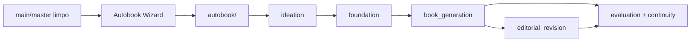

# Snapshot Atual Do Autobook

Este documento resume a situacao atual do projeto depois do refactor de
plataforma, reorganizacao de pipelines, hardening operacional e revisao da
documentacao. O nome do arquivo foi preservado para compatibilidade com links
antigos, mas o conteudo representa o estado atual.

## Estado Geral



Autobook hoje e um orquestrador Python para produzir uma obra em uma branch
dedicada. `run.py` concentra a entrada principal, `pipelines/registry.py`
declara as pipelines disponiveis, `workspace/` protege branches e metadados,
e os pacotes `*_steps/` mantem a logica operacional testavel.

## Componentes Cobertos

| Area | Estado | Observacao |
| --- | --- | --- |
| Wizard e CLI | Atual | `run.py` sem argumentos abre o wizard; com `--pipeline` preserva a CLI classica. |
| Branch/workspace | Atual | Pipelines protegidas exigem `autobook/<slug>` e podem registrar `book_data/workspace.json`. |
| Pipelines | Atual | Quatro pipelines principais registradas e protegidas por `PipelineSpec`. |
| Book generation | Atual | Contexto, planejamento, drafting, critica, revisao e persistencia foram extraidos para `book_generation_steps/`. |
| Editorial revision | Atual | Config, parsing, contexto, avaliacao e operacoes de revisao estao em `editorial_revision_steps/`. |
| Agentes | Atual | `agent_system/` e o adapter moderno; classes concretas seguem em `agents.py`. |
| Prompts | Atual | Prompts de agentes e ferramentas foram externalizados com fallback por idioma. |
| Avaliacao | Atual | `evaluate.py` e fachada sobre o pacote `evaluation/`. |
| Continuidade | Atual | `verify_continuity.py` e `resolve_continuity.py` usam caminhos e orquestracao modernos. |
| Testes | Atual | 320 testes modernos passando; legacy tests desativados. |
| Legacy | Historico | Mantido como referencia, fora do contrato moderno. |

## Contratos Importantes

- `book_data/`, `chapters/`, `logs/` e `seed.txt` sao artefatos de obra.
- A branch principal deve permanecer limpa; geracoes acontecem em
  `autobook/<slug>`.
- `book_data/workspace.json`, quando presente, precisa validar
  `schema_version`, `title`, `branch` e `created_at`.
- `docs/others/CRAFT.md`, `ANTI-SLOP.md` e `ANTI-PATTERNS.md` ainda sao
  referencias operacionais; os demais arquivos de `docs/others/` sao
  historicos ou criativos.
- `legacy/tests` nao mede a saude atual do projeto.

## Baseline Verificado

```bash
uv run --group dev ruff check .
uv run --with pytest pytest tests -q
uv run --with pytest pytest legacy/tests -q
```

Resultado esperado:

- Ruff sem erros.
- `320 passed` na suite moderna.
- `legacy/tests`: nenhum teste coletado, exit code 0.

## Proximas Decisoes Nao Bloqueantes

1. Decidir se scripts experimentais viram contrato suportado ou permanecem
   documentados como ferramentas auxiliares.
2. Evoluir criticos para emitirem `CriticReport` JSON nativo sempre que o custo
   de modelo permitir.
3. Expandir gradualmente as regras de lint para areas hoje excluidas, sem
   misturar isso com mudancas funcionais.
4. Melhorar a ergonomia do wizard sem alterar os contratos de pipeline.
