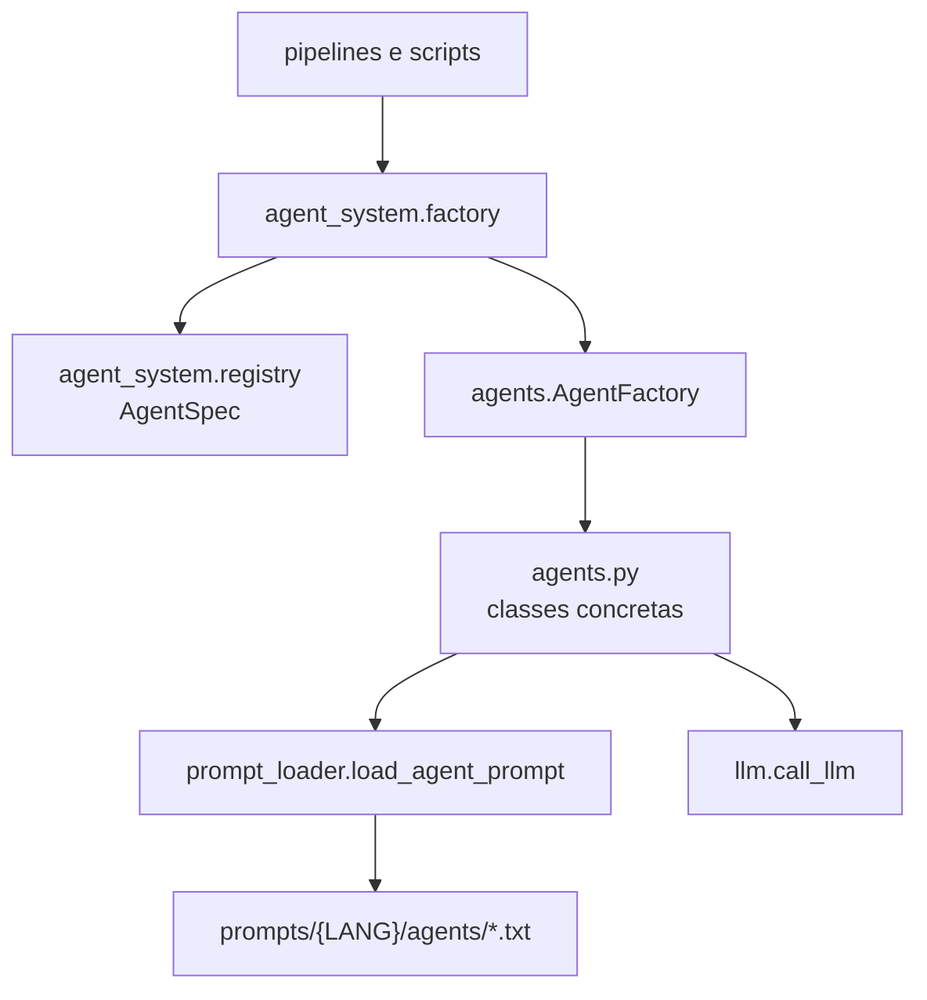
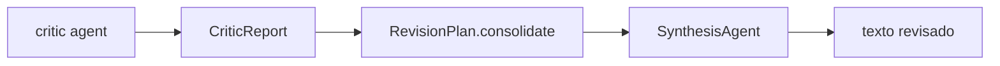

# Agentes

O sistema de agentes atual combina uma camada moderna (`agent_system/`) com as
classes concretas legadas em `agents.py`. Essa decisao preserva compatibilidade
e reduz risco: codigo novo usa contratos modernos, enquanto a implementacao
concreta continua onde ja estava.

## Arquitetura



## Papeis Registrados

| Role | Classe concreta | Uso principal |
| --- | --- | --- |
| `drafting` | `DraftingAgent` | Rascunhar beats e capitulos. |
| `stylist` | `StylistAgent` | Reescrita estilistica quando usada por fluxos auxiliares. |
| `technical_editor` | `TechnicalEditorAgent` | Diagnostico tecnico/editorial. |
| `canon_critic` | `CanonCriticAgent` | Consistencia com canon, fatos e lore. |
| `style_critic` | `StyleCriticAgent` | Voz, estilo e anti-slop. |
| `flow_critic` | `FlowCriticAgent` | Ritmo, continuidade local e progressao. |
| `synthesis` | `SynthesisAgent` | Aplicar criticas sequencialmente no texto revisado. |

## Prompts

Prompts de agentes vivem em:

```text
prompts/{LANG}/agents/{role}.txt
```

Exemplo:

```text
prompts/EN/agents/drafting.txt
prompts/EN/agents/canon_critic.txt
```

`prompt_loader.load_agent_prompt()` normaliza idioma/papel e usa fallback para
`EN` quando permitido. Agentes migrados mantem fallback hardcoded apenas para
garantir compatibilidade quando o arquivo externo estiver ausente.

Erros de template em prompts existentes sao tratados como erro real, nao como
fallback silencioso. Isso evita mascarar placeholders invalidos.

## Feedback Estruturado

O contrato de feedback fica em `writing/feedback.py`.



Estrutura esperada:

```json
{
  "critic_role": "canon_critic",
  "findings": [
    {
      "source": "canon_critic",
      "instruction": "Corrigir contradicao X.",
      "quote": "trecho afetado",
      "severity": "high"
    }
  ],
  "metadata": {}
}
```

O parser aceita JSON, listas markdown e texto livre como fallback. Saidas que
declaram explicitamente ausencia de problemas viram relatorio vazio.

## Extensibilidade

`agents.AgentFactory` ainda suporta registro dinamico e carregamento de skills:

```python
factory.register_agent("custom_role", CustomAgent)
factory.load_skill_agent("create_agent")
```

Codigo novo deve preferir:

```python
from agent_system.factory import AgentFactory, create_agent
```

Nao use `_agents_registry` diretamente. O legado expoe metodos publicos para
checar, registrar e remover agentes dinamicos.

## Estrategia Atual

A decisao vigente esta documentada em
[agent-system-strategy.md](agent-system-strategy.md): `agent_system/` permanece
como adapter moderno sobre `agents.py`. Migrar as classes concretas so deve ser
considerado se houver ganho claro de manutencao.
