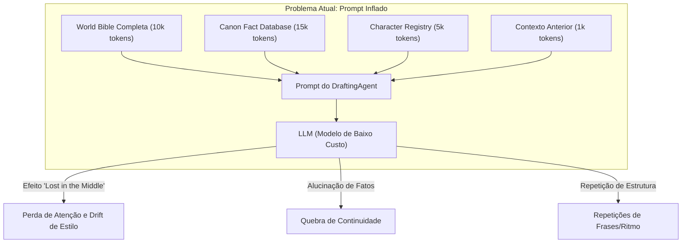
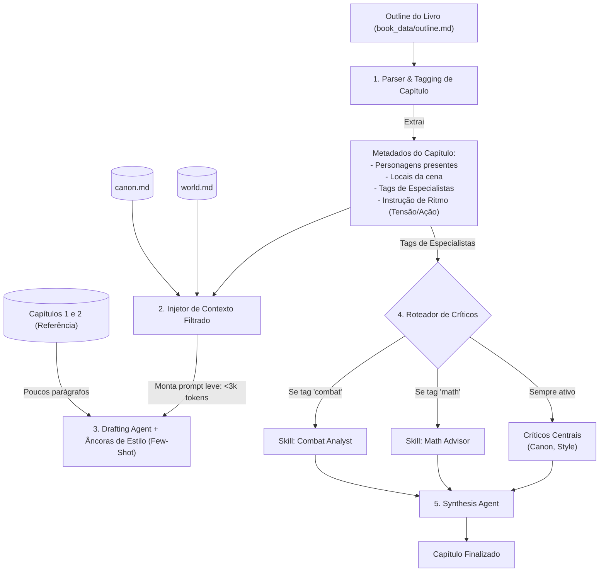

# Análise Arquitetural e Proposta de Nova Fundação — Autobook

Este documento apresenta uma análise técnica profunda sobre os fundamentos do projeto Autobook, diagnosticando as falhas relatadas (continuidade, ritmo, especialização de papéis e rigidez estrutural) sob a restrição de uso de modelos de menor custo. Ao final, propõe-se uma arquitetura híbrida otimizada chamada **Mesa Editorial Dinâmica com Injeção Seletiva de Contexto**.

---

## 1. Diagnóstico Técnico das Falhas Atuais

Para entender por que os problemas de continuidade, ritmo e especialização ocorrem, precisamos olhar para como os LLMs processam dados sob restrições de contexto e custo (como ao usar Llama-3, GPT-4o-mini ou Gemini Flash).



### A. Quebras de Continuidade e Repetições
Quando passamos a **Bíblia do Mundo**, o **Cânone Acumulado**, o **Registro de Personagens** e o **Estilo de Voz** inteiros em todos os prompts de capítulo, criamos um fenômeno chamado **Attention Dilution** (Diluição de Atenção).
*   **Modelos de menor custo** sofrem para priorizar instruções quando o prompt excede 5k-10k tokens. Eles dão mais peso ao início e ao final do prompt (efeito *Lost in the Middle*).
*   **Repetições de Prosa:** O Drafting Agent recebe os últimos parágrafos do beat anterior como "gancho". Modelos menores tendem a copiar a estrutura sintática, tom e até vocabulário desse gancho, gerando repetições mecânicas.

### B. Perda de Ritmo e Drift de Estilo (Estilo Genérico)
No primeiro capítulo, o modelo lê as instruções de estilo com "frescor". A partir do terceiro capítulo:
*   O contexto histórico acumulado aumenta.
*   O LLM "esquece" as nuances micro-estilísticas (como o uso de frases curtas ou densidade de diálogo) porque a tarefa principal passa a ser "não violar o cânone massivo". O modelo escolhe a rota mais segura e estatisticamente provável: **prosa genérica e morna (slop)**.

### C. Ineficiência de Papéis Especializados
No modelo atual, os críticos (`canon_critic`, `style_critic`, `flow_critic`) rodam em **todos** os capítulos. 
*   Se um capítulo é uma cena de ação física pura, o crítico de fluxo funciona, mas um "Crítico Científico" ou de "Pesquisa de Época" seria inútil e consumiria tokens à toa.
*   Ao mesmo tempo, em capítulos onde esses especialistas são vitais (ex: desarmar uma bomba química, resolver um enigma matemático), a IA geral do Drafting falha por falta de dados especializados no prompt local.

---

## 2. Comparativo de Abordagens de Arquitetura

O usuário apresentou duas linhas de evolução. Abaixo, analisamos as vantagens e desvantagens de cada uma:

| Dimensão | Linha A: Equipe do Livro sob Demanda (Dynamic Prompting) | Linha B: Equipe Agnóstica Robusta (Static Prompting) |
| :--- | :--- | :--- |
| **Funcionamento** | Um pipeline intermediário analisa o outline do livro e gera dinamicamente agentes e prompts sob medida para a obra (ex: cria o agente "Perito em Magia Tonal" para o livro X). | Mantém um conjunto fixo de agentes (ex: 12 críticos e pesquisadores padrão) com prompts genéricos super robustos que cobrem qualquer cenário. |
| **Eficiência de Tokens** | **Alta.** O prompt contém apenas o que é relevante para o livro e capítulo atual. | **Baixa.** O prompt precisa carregar regras gigantescas para prever qualquer tipo de gênero ou situação. |
| **Manutenibilidade** | **Complexa.** O código precisa gerar prompts dinamicamente. Se o gerador falhar ou alucinar o prompt do agente, o processo de escrita quebra. | **Fácil.** Prompts são arquivos estáticos na pasta `prompts/`, fáceis de versionar no Git e debugar. |
| **Qualidade da Escrita** | **Excelente.** Os agentes falam a linguagem do livro e conhecem as regras específicas intimamente. | **Média.** Os agentes tendem a dar feedbacks muito genéricos ("melhore a tensão", "evite clichês") que não ajudam na voz específica da obra. |
| **Custo de Execução** | **Muito Baixo.** Evita o envio de regras inúteis para o LLM. | **Alto.** Multiplica o custo de tokens em todas as interações. |

---

## 3. A Solução Proposta: Mesa Editorial Dinâmica (Abordagem Híbrida)

Para resolver os problemas de ritmo, continuidade e custo, propomos uma arquitetura híbrida chamada **Mesa Editorial Dinâmica com Injeção Seletiva**. 

Esta solução mantém os prompts centrais **estáticos e testáveis** (Linha B), mas torna a **montagem do contexto e a seleção de agentes dinâmica por capítulo** (Linha A).



### Componente 1: Injeção Seletiva de Contexto (Context Stripping)
Em vez de passar todas as 50 páginas do lore do livro, o sistema analisa os **Beats do Capítulo** antes de chamar o modelo de escrita.
*   **Como funciona:** Um parser lê o capítulo atual e busca correspondências de palavras-chave no `characters.md` e `world.md`.
*   **Resultado:** Se o Capítulo 3 se passa apenas na "Taverna do Bronze" com os personagens "Cass" e "Maret", o prompt de escrita **ignora** as regras sobre o "Palácio de Cristal" e os outros 10 personagens secundários.
*   *Benefício:* Reduz o tamanho do prompt em até 70%, eliminando o efeito de distração do modelo e reduzindo drasticamente os custos.

### Componente 2: Elenco Dinâmico de Críticos (Dynamic Casting)
O pipeline central não roda todos os críticos em todos os capítulos. 
*   **Como funciona:** O `outline.md` passa a aceitar tags de configuração por capítulo. Exemplo:
    ```markdown
    ### Chapter 4: O Enigma da Torre
    **Beats:** ...
    **Tags:** [research: cryptography, critic: pacing]
    ```
*   O `AgentFactory` lê as tags e instancia apenas os agentes necessários para aquele capítulo específico.
*   *Benefício:* Evita o desperdício de tokens com agentes inativos e foca a capacidade do modelo em problemas reais de cada cena.

### Componente 3: Âncoras de Ritmo e Amostragem (Style Anchors)
Para combater a degradação do estilo após os primeiros capítulos:
*   **Instruções de Ritmo por Beat:** O outline passa a ditar a dinâmica de prosa do Beat (ex: `[Ritmo: Rápido, Sentenças Curtas, Foco Visual]`). Isso impede que o modelo caia no modo "narrativa expositiva" (tell).
*   **Few-Shot Style Anchors:** O prompt de escrita sempre carrega **3 parágrafos de alta qualidade dos primeiros capítulos aprovados** como exemplo prático de tom. Isso serve como uma "âncora estilística" física que o modelo imita em tempo de execução, garantindo consistência sem precisar de prompts gigantescos.

### Componente 4: Outline Dinâmico e Ajuste de Escopo (Dynamic Sizing)
Para resolver o problema de "Quantidade vs Qualidade":
*   **Pre-Draft Outline Refiner:** Antes da escrita começar, um passo do pipeline analisa a densidade de cada capítulo no outline. Se o volume de ação em um único capítulo for excessivo, o pipeline divide-o em dois capítulos menores automaticamente, reajustando o `state.json`.
*   **Feedback de Tamanho:** Se o `evaluate.py` detectar que a densidade do texto gerado ficou muito alta (excesso de acontecimentos por palavra), ele rejeita o capítulo e aciona um sub-passo de desdobramento (split).

---

## 4. Como Ficaria o Fluxo de Trabalho com Modelos de Baixo Custo

Ao utilizar esta abordagem híbrida, conseguimos rodar com modelos baratos (como `gpt-4o-mini`, `gemini-1.5-flash` ou `llama-3-70b-instruct`) mantendo a altíssima fidelidade literária:

1.  **Orquestração por Prompt Curto:** O Drafting Agent recebe instruções curtas, focadas apenas nos beats do capítulo atual, com o contexto de lore filtrado a menos de 2.000 tokens.
2.  **Verificação Específica:** O LLM não precisa tentar avaliar consistência factual, estilo, ritmo e gramática ao mesmo tempo. Ele faz isso em etapas focadas (Primeiro o draft, depois o Crítico de Consistência de Enredo, depois o Crítico de Tom).
3.  **Loop Fechado de Baixo Custo:** Como os prompts são curtos, podemos rodar 3 a 4 tentativas (attempts) de escrita por capítulo e manter a melhor sem estourar o orçamento de tokens da API.

---

## 5. Perguntas para Refinamento do Parecer

Para que possamos alinhar esta arquitetura e iniciar a prototipação, gostaria de entender melhor suas preferências:

1.  **Formato do Outline:** Você prefere que as tags de ritmo e especialistas sejam definidas manualmente por você no `outline.md` antes de começar a escrever, ou prefere que a pipeline de Fundação analise o texto e gere essas tags automaticamente?
2.  **Banco de Conhecimento (RAG Local):** Para o filtro de lore (Context Stripping), você acha que a busca por palavras-chave simples nos arquivos Markdown é suficiente, ou deveríamos estruturar a "World Bible" em formato JSON/YAML para consultas mais limpas e sem alucinações?
3.  **Âncoras de Estilo:** Qual capítulo escrito até hoje você considera que tem o "estilo perfeito" que deveria servir de base (âncora) para todo o livro?

---

> [!TIP]
> Você pode usar o comando `/grill-me` se preferir fazer uma entrevista rápida no chat para decidirmos estes detalhes de design de forma dinâmica!
