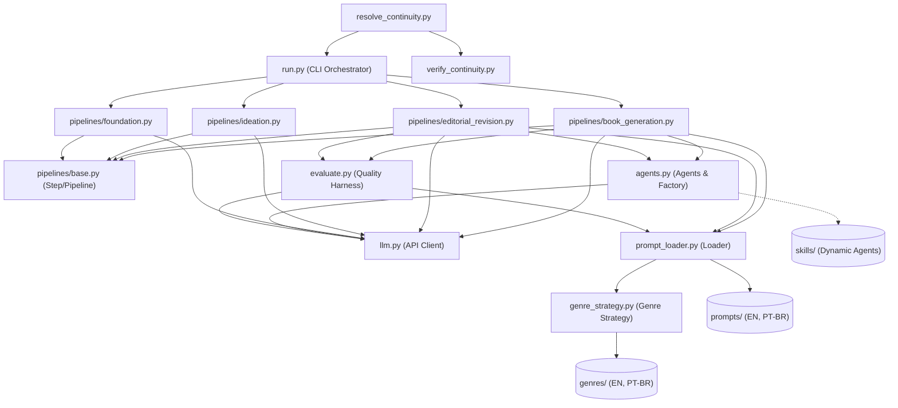
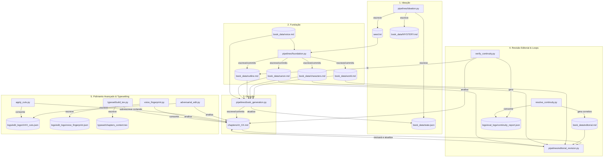

# Auditoria e Plano de Atualização da Documentação (docs) — Autobook

Este documento apresenta o resultado do cruzamento detalhado entre os arquivos de documentação na pasta `docs/` e a implementação real no repositório `autobook`. O objetivo é identificar o que está coberto, o que está correto, o que está faltando ou desatualizado e traçar um plano de ação para atingirmos um **snapshot v0** consistente de todo o sistema.

> Atualizacao pos-refatoracao: este documento registra achados do snapshot
> inicial. Depois dele, os problemas operacionais de `resolve_continuity.py`,
> caminho de `CRAFT.md`, coleta de `legacy/tests` e hardcodes de obra especifica
> em `foundation.py`, `evaluate.py`, `gen_revision.py`,
> `gen_audiobook_script.py` e `book_generation_steps/planning.py` foram
> corrigidos. Mantenha as secoes abaixo como historico da analise original.

---

## 1. Estrutura de Arquivos: INDICE.md vs. Arquivos Reais

A primeira grande divergência está no layout físico dos arquivos de documentação. O arquivo [INDICE.md](file:///home/alessandro/dev/autobook/docs/INDICE.md) lista uma estrutura de dezenas de pequenos arquivos separados por assunto, enquanto a pasta `docs/` contém arquivos **consolidados** por pasta.

### Tabela de Comparação de Layout

| Seção no Índice | Arquivos Anunciados no INDICE.md | Arquivo Real Existente na Pasta | Status |
| :--- | :--- | :--- | :--- |
| **1. Arquitetura Geral** | `visao-geral.md`, `command-composite.md`, `fluxo-dados.md`, `dependencias-config.md` | [arquitetura.md](file:///home/alessandro/dev/autobook/docs/architecture/arquitetura.md) | **Consolidado** (correto, mas desatualizado) |
| **2. Pipelines** | `ideation.md`, `foundation.md`, `book-generation.md`, `editorial-revision.md`, `comparacao.md` | [pipelines.md](file:///home/alessandro/dev/autobook/docs/pipelines/pipelines.md) | **Consolidado** (correto) |
| **3. Sistema de Agentes** | `visao-geral.md`, `factory.md`, `drafting.md`, `stylist.md`... (10 arquivos) | [agentes.md](file:///home/alessandro/dev/autobook/docs/agents/agentes.md) | **Consolidado** (correto) |
| **4. Cliente LLM** | `visao-geral.md`, `provedores.md`, `resolucao-modelos.md`... (5 arquivos) | [llm.md](file:///home/alessandro/dev/autobook/docs/llm/llm.md) | **Consolidado** (correto) |
| **5. Prompts e Localização** | `prompt-loader.md`, `anti-slop.md`, `continuidade.md`... (7 arquivos) | [prompts.md](file:///home/alessandro/dev/autobook/docs/prompts/prompts.md) | **Consolidado** (correto) |
| **6. Estratégia de Gênero** | `estrategia.md`, `generos.md`, `fallback.md`, `anti-patterns.md` | *Nenhum* (pasta `genre-strategy` não existe em `docs/`) | **Totalmente Ausente** |
| **7. Avaliação e Qualidade** | `evaluate.md`, `slop-mecanico.md`, `llm-juiz.md`... (5 arquivos) | [evaluation.md](file:///home/alessandro/dev/autobook/docs/evaluation/evaluation.md) | **Consolidado** (correto) |
| **8. Verificação de Continuidade** | `verify-continuity.md`, `resolve-continuity.md`, `parse-outline.md`... | *Nenhum* (pasta `continuity` não existe em `docs/`) | **Totalmente Ausente** |
| **9. Testes** | `visao-geral.md`, `test-continuity.md`, `test-evaluate.md`... (12 arquivos) | [tests.md](file:///home/alessandro/dev/autobook/docs/tests/tests.md) | **Consolidado** (correto) |
| **10. Configuração e Ambiente**| `env.md`, `pyproject.md`, `variaveis-ambiente.md`... (4 arquivos) | [configuration.md](file:///home/alessandro/dev/autobook/docs/configuration/configuration.md) | **Consolidado** (correto) |
| **11. Dados do Livro** | `visao-geral.md`, `world.md`, `characters.md`, `outline.md`... (9 arquivos) | *Nenhum* (pasta `book-data` não existe em `docs/`) | **Totalmente Ausente** |
| **12. Typesetting** | `visao-geral.md`, `latex.md`, `epub.md`, `metadados.md`, `landing.md` | [typesetting.md](file:///home/alessandro/dev/autobook/docs/typesetting/typesetting.md) | **Consolidado** (correto) |
| **13. Código Legado** | `visao-geral.md`, `scripts.md`, `testes.md` | [legacy.md](file:///home/alessandro/dev/autobook/docs/legacy/legacy.md) | **Consolidado** (contém erros de caminhos) |
| **14. Qualidade de Código** | `solid.md`, `hardcoding.md`, `padroes-design.md`... (6 arquivos) | [quality-analysis.md](file:///home/alessandro/dev/autobook/docs/quality-analysis/quality-analysis.md) | **Consolidado** (correto) |
| **15. Habilidades (Skills)** | `create-agent.md`, `redundancy-detector.md` | *Nenhum* (pasta `skills` não existe em `docs/`) | **Totalmente Ausente** |

*Nota: A pasta `docs/fluxo-detalhado/` contém o arquivo [guia-completo-fluxos.md](file:///home/alessandro/dev/autobook/docs/fluxo-detalhado/guia-completo-fluxos.md), que **não está referenciado no INDICE.md**, mas está muito completo e descreve os fluxos operacionais de forma detalhada.*

---

## 2. Cruzamento de Conteúdo: Documentação vs. Código Real

Abaixo, avaliamos a exatidão técnica e o nível de cobertura de cada componente principal do sistema:

### 2.1. Inconsistência Crítica: O Paradoxo do "Framework Agnóstico"
Tanto no [INDICE.md](file:///home/alessandro/dev/autobook/docs/INDICE.md) quanto no [PROJECT_STUDY.md](file:///home/alessandro/dev/autobook/docs/others/PROJECT_STUDY.md) (um rascunho de estudo do projeto), é declarado:
> *"**Branch principal**: main — framework agnóstico, sem referências a livros específicos"*
> *"O projeto está na fase inicial — nenhum livro foi gerado nesta branch ainda."*

**A Realidade do Código:**
Esta afirmação é **incorreta**. O código-fonte na branch principal está fortemente atrelado a livros específicos:
1. **[pipelines/foundation.py](file:///home/alessandro/dev/autobook/pipelines/foundation.py):** Os prompts de sistema e usuário estão codificados diretamente com referências ao livro *"The Second Son of the House of Bells"*. Ele força a criação de personagens específicos (`Cass Bellwright`, `Eddan Bellwright`, `Perin Bellwright`, `Maret Corda`, `Rector Suvaine`, `Torvald Hess`) e o sistema de magia de "Tonal Law".
2. **[evaluate.py](file:///home/alessandro/dev/autobook/evaluate.py):** No prompt do juiz de avaliação de capítulos (`CHAPTER_PROMPT`), existem verificações explícitas de cânone voltadas para **duas histórias diferentes simultaneamente**:
   - Uma de ficção científica/cyberpunk: Protagonista `Marina`, uso da substância `ECO-9` e implantes neurais/vigilância (regras 6. "MAGICAL & TECH SYSTEM LAWS").
   - Uma de fantasia: Protagonista `Cass` e metáforas de som/bronze (regras de "character_voice" e "prose_quality").
   
**Implicação:** Para o v0 de snapshot, a documentação e o código precisam se alinhar: ou removemos os hardcodes do código parametrizando-os via arquivos de prompt/configuração (o ideal), ou atualizamos a documentação para admitir que a branch principal atualmente contém um template/exemplo ativo baseado nessa história específica de fantasia e ficção científica.

---

### 2.2. Desalinhamento de Caminhos e Scripts no Módulo Legado
O arquivo de documentação [legacy.md](file:///home/alessandro/dev/autobook/docs/legacy/legacy.md) lista vários scripts como pertencentes à pasta `legacy/`, mas o mapeamento físico do projeto é diferente:

- **`build_tex.py`:** Documentado como legado sob `/legacy`, mas fisicamente reside e opera em [/typeset/build_tex.py](file:///home/alessandro/dev/autobook/typeset/build_tex.py).
- **`gen_audiobook_script.py`:** Documentado como legado sob `/legacy`, mas reside na raiz [/gen_audiobook_script.py](file:///home/alessandro/dev/autobook/gen_audiobook_script.py).
- **`gen_brief.py`:** Documentado como legado sob `/legacy`, mas reside na raiz [/gen_brief.py](file:///home/alessandro/dev/autobook/gen_brief.py).
- **`gen_revision.py`:** Documentado como legado sob `/legacy`, mas reside na raiz [/gen_revision.py](file:///home/alessandro/dev/autobook/gen_revision.py).
- **`gen_archive.py`:** Documentado como legado, mas **não existe** em nenhuma pasta do repositório.
- **`build_arc_summary.py`:** Existe em [legacy/build_arc_summary.py](file:///home/alessandro/dev/autobook/legacy/build_arc_summary.py), mas **não está listado** na estrutura de diretórios do `legacy.md`.

---

### 2.3. Assuntos Ausentes (Sem Documentos Próprios)
Os quatro assuntos abaixo possuem lógica implementada no código, constam no `INDICE.md`, mas **não possuem arquivos de documentação** correspondentes:

1. **Genre Strategy (`genre_strategy.py` + pasta `genres/`):**
   - *O que faz:* Implementa o padrão Strategy para carregar dinamicamente as regras de estilo de escrita e formatação com base no gênero literário e no idioma (ex: `genres/PT-BR/drama.txt`), aplicando fallbacks estruturados (PT-BR -> EN -> drama -> drama EN).
   - *Status:* Sem documentação na pasta `docs/`. Apenas mencionado de forma breve em arquivos da pasta `docs/others/`.
2. **Verificação de Continuidade (`verify_continuity.py` e `resolve_continuity.py`):**
   - *O que faz:* Analisa o outline dos capítulos e usa um juiz LLM para rastrear consistência factual e cronológica do enredo (timeline, relacionamentos, fatos geográficos) entre os capítulos. O `resolve_continuity.py` atua na reconciliação de incoerências.
   - *Status:* Sem documentação dedicada.
3. **Dados do Livro (`book_data/`):**
   - *O que faz:* Armazena o lore dinâmico da obra em progresso (`world.md`, `characters.md`, `outline.md`, `canon.md`, `voice.md`, `state.json`).
   - *Status:* Sem documentação formal sobre a estrutura e finalidade de cada um desses arquivos.
4. **Habilidades Extensíveis (`skills/`):**
   - *O que faz:* Scripts externos carregados dinamicamente pela fábrica para registrar agentes ou comportamentos específicos. Contém `create_agent.py` e `redundancy_detector.py`.
   - *Status:* Parcialmente descrito em `quality-analysis.md`, mas sem uma seção ou arquivo dedicado como planejado no índice.

---

### 2.4. Ferramentas Recentes e Avançadas Não Documentadas no Índice
Existem scripts na raiz do projeto voltados para edição e refinamento avançado que não foram contemplados na documentação principal (são apenas citados em rascunhos em `docs/others/`):

1. **`adversarial_edit.py` (Edição Adversária):**
   - *O que faz:* Pede ao LLM Judge para cortar exatamente 500 palavras de um capítulo. O que o modelo decide cortar expõe as partes mais fracas da prosa (separadas em categorias como FAT, REDUNDANT, OVER-EXPLAIN, GENERIC, TELL, STRUCTURAL). O log gerado é o plano de corte.
2. **`apply_cuts.py` (Aplicador de Cortes):**
   - *O que faz:* Aplica mecanicamente e em lote as sentenças candidatas a corte de volta no manuscrito (markdown) de cada capítulo.
3. **`compare_chapters.py` (Torneio Head-to-Head):**
   - *O que faz:* Faz confrontos diretos entre capítulos (estilo torneio round-robin / sistema suíço) avaliados por um juiz LLM para gerar um ranking unificado de qualidade baseado em pontuações de Elo.
4. **`voice_fingerprint.py` (Impressão Digital de Voz):**
   - *O que faz:* Faz análises quantitativas (estatísticas) de estilo em todos os capítulos: densidade das "três fontes de vocabulário" (Musical, Trade, Body), comprimento médio de frases, variação de comprimento (CV), percentual de diálogo, densidade de similes e outliers estatísticos.

### 2.5. Inconsistências de Código e Bugs Ocultos Detectados
Durante a auditoria completa do código-fonte realizada para esta verificação, descobrimos os seguintes problemas críticos de lógica e compatibilidade que não estão documentados ou previstos:

1. **Bug Crítico de Execução em [resolve_continuity.py](file:///home/alessandro/dev/autobook/resolve_continuity.py):**
   - Na linha 264 do script, ele tenta acionar o orquestrador editorial chamando `uv run python run_editorial.py -c ...`.
   - **O problema:** O arquivo `run_editorial.py` **não existe mais no repositório**! A lógica de orquestração de revisões editoriais foi integrada na nova arquitetura unificada e deve ser executada através do comando: `uv run python run.py --pipeline editorial_revision --chapter <ch_list_str>`. Este bug quebra a execução do loop fechado de continuidade.
2. **Suíte de Testes Legados Quebrada (`legacy/tests/`):**
   - Os testes em `legacy/tests/` (como `test_editorial.py`, `test_draft_chapter_unit.py` e `test_pipeline_control.py`) tentam importar módulos que foram deletados ou renomeados (`run_editorial`, `run_pipeline` e `draft_chapter`), falhando na fase de coleta do `pytest` (collection errors).
3. **Script Inativo / Stub na Raiz:**
   - O arquivo `main.py` na raiz do projeto é apenas um stub inativo de 86 bytes que exibe `"Hello from autobook!"`, embora a orquestração real ocorra via `run.py`.
4. **Estado da Geração de Audiobook (Incompleto/Hardcoded):**
   - Os arquivos de suporte à geração de audiobook ([gen_audiobook_script.py](file:///home/alessandro/dev/autobook/gen_audiobook_script.py) e [legacy/gen_audiobook.py](file:///home/alessandro/dev/autobook/legacy/gen_audiobook.py)) estão presentes no projeto, mas não são imediatamente utilizáveis:
     - O pacote `elevenlabs` **não está instalado** e não foi incluído como dependência no [pyproject.toml](file:///home/alessandro/dev/autobook/pyproject.toml).
     - O script `gen_audiobook_script.py` possui um dicionário `CHARACTERS` fixo e hardcoded para a história do `Cass` (Eddan, Maret, etc.), o que inviabiliza a atribuição automática de falas para qualquer outro livro sem edição manual do próprio código do script.
     - Requer configuração manual de `ELEVENLABS_API_KEY` no `.env` e de IDs de voz em `audiobook_voices.json`.
5. **Estado da Geração de PDF (Requer Dependências Externas):**
   - O typeset via LaTeX ([typeset/build_tex.py](file:///home/alessandro/dev/autobook/typeset/build_tex.py)) é totalmente funcional para estruturar o arquivo [typeset/chapters_content.tex](file:///home/alessandro/dev/autobook/typeset/chapters_content.tex). No entanto, a compilação final para PDF não é automatizada no pipeline e exige que o usuário tenha um compilador de LaTeX instalado no sistema operacional (como `pdflatex` via TeX Live) para executar a compilação manual de [typeset/novel.tex](file:///home/alessandro/dev/autobook/typeset/novel.tex).

---

## 3. Fluxo de Dados e Interação entre Arquivos/Pastas

Para termos a certeza absoluta de que mapeamos todos os arquivos e pastas do projeto e como eles interagem durante o processo, desenvolvemos dois diagramas de fluxo de dados.

### 3.1. Mapa de Dependências Arquiteturais (Fluxo de Imports)
Este diagrama mostra quais arquivos e pastas dependem de outros para importação de código e orquestração interna:

*Como cada pasta/arquivo é usado:*
- **`run.py`**: Ponto de entrada CLI que lê o terminal e aciona o pipeline composto em `pipelines/`.
- **`pipelines/base.py`**: Define a interface composite de Steps e Pipelines que os 4 fluxos herdam.
- **`agents.py`**: Gerencia as Personas/LLM prompts de escrita/critica. Permite carregar extensões em `skills/`.
- **`llm.py`**: Camada unificada HTTP que faz chamadas à API da Anthropic, OpenAI, Gemini ou OpenRouter com retry e backoff.
- **`prompt_loader.py` & `genre_strategy.py`**: Carregam dinamicamente strings e JSONs de `prompts/` e `genres/` baseados no idioma e gênero vigentes.
- **`evaluate.py`**: Blackbox de qualidade que executa análise mecânica de slop e chama juízes LLM.

---

### 3.2. Mapa de Fluxo de Leitura/Escrita de Dados (I/O)
Este diagrama detalha quais arquivos físicos são criados, atualizados ou consumidos em cada etapa do ciclo de vida da obra:

*Fluxo físico do ciclo de vida:*
1. **Ideação:** Consome o input do usuário e grava a semente (`seed.txt`) e inicia o estado (`state.json`).
2. **Fundação:** Lê `seed.txt` e `voice.md`, gerando as "bíblias" do livro (`world.md`, `characters.md`, `outline.md`, `canon.md`).
3. **Geração:** Lê as bíblias geradas e escreve parágrafo por parágrafo em arquivos markdown sequenciais na pasta `chapters/`. Atualiza o ponteiro de progresso em `state.json`.
4. **Revisão:** O script `verify_continuity.py` cruza capítulos com o outline e cria o `continuity_report.json`. `resolve_continuity.py` lê o relatório e atualiza o arquivo `editorial.md` com diretivas de re-correção. `editorial_revision.py` consome `editorial.md` e reescreve os capítulos de `chapters/` passando pelo crivo do `evaluate.py`.
5. **Polimento & Typesetting:** `adversarial_edit.py` e `apply_cuts.py` limpam gordura do texto em `chapters/`. `voice_fingerprint.py` faz a auditoria final de vozes. E `typeset/build_tex.py` lê os markdowns e converte em LaTeX unificado (`chapters_content.tex`) para compilação.

---

## 4. Planejamento de Atualização (Roteiro para v0)

Para obtermos um v0 de documentação completo e correto que sirva como snapshot do projeto atual, propomos o seguinte plano de trabalho:

### Fase 1: Correção de Erros e Alinhamento Estrutural
- [ ] **Ajustar INDICE.md:** Atualizar os links de dezenas de arquivos divididos para os arquivos consolidados reais (ex: apontar para `architecture/arquitetura.md` em vez das sub-seções inexistentes).
- [ ] **Alinhar a documentação do Módulo Legado (`legacy.md`):** Corrigir os caminhos dos scripts `build_tex.py`, `gen_audiobook_script.py`, `gen_brief.py` e `gen_revision.py` para suas localizações reais. Remover referência ao `gen_archive.py` e adicionar o `build_arc_summary.py`.
- [ ] **Explicar o Paradoxo dos Hardcodes:** Adicionar uma nota de aviso no início da documentação (`arquitetura.md` ou `visao-geral`) explicando que, embora o framework seja conceitualmente agnóstico, a branch `main` atualmente carrega regras e prompts de lore concretos (`Cass` / `Marina`) para fins de baseline e teste de execução.

### Fase 2: Redação dos Módulos Ausentes (Criação de Novos Documentos)
Para manter o padrão de documentos consolidados por pasta, criaremos os seguintes novos arquivos:
- [ ] **[NEW] `docs/genre-strategy/genre-strategy.md`:** Explicar o funcionamento de `genre_strategy.py`, a estrutura de pastas em `genres/`, as regras de fallback por idioma/gênero e o formato das regras textuais (como `drama.txt`).
- [ ] **[NEW] `docs/continuity/continuity.md`:** Detalhar a lógica de funcionamento do `verify_continuity.py` e `resolve_continuity.py`, como eles parseiam o `outline.md` e usam o juiz LLM para identificar inconsistências factuais e temporais.
- [ ] **[NEW] `docs/book-data/book-data.md`:** Documentar a função e o formato esperado para cada arquivo na pasta `book_data/` (`world.md`, `characters.md`, `outline.md`, `canon.md`, `voice.md`, `MYSTERY.md`, `editorial.md`, `state.json`).
- [ ] **[NEW] `docs/skills/skills.md`:** Explicar o sistema de carregamento dinâmico de habilidades e documentar detalhadamente o `create_agent.py` e o `redundancy_detector.py`.

### Fase 3: Documentação das Ferramentas de Edição Avançada e Qualidade
- [ ] **Atualizar `docs/quality-analysis/quality-analysis.md` ou criar seção própria:**
  - Documentar `adversarial_edit.py` e `apply_cuts.py` (ciclo de edição adversária e remoção de "gordura" do texto).
  - Documentar `compare_chapters.py` (ranking comparativo via Elo).
  - Documentar `voice_fingerprint.py` (análise estatística e acompanhamento de métricas de estilo como os três poços vocabulares).

### Fase 4: Limpeza e Organização Interna
- [ ] Mover ou indexar formalmente os rascunhos úteis que estão na pasta `docs/others/` (como `CRAFT.md` e `WORKFLOW.md`), garantindo que não confundam o usuário sobre a documentação de referência oficial.

---

## 4. Próximos Passos recomendados
Para iniciar a execução desse plano, sugere-se a discussão sobre a Fase 1 (limpeza e indexação real dos caminhos atuais) para que possamos traçar o snapshot exato, seguido pela redação dos arquivos das Fases 2 e 3.
