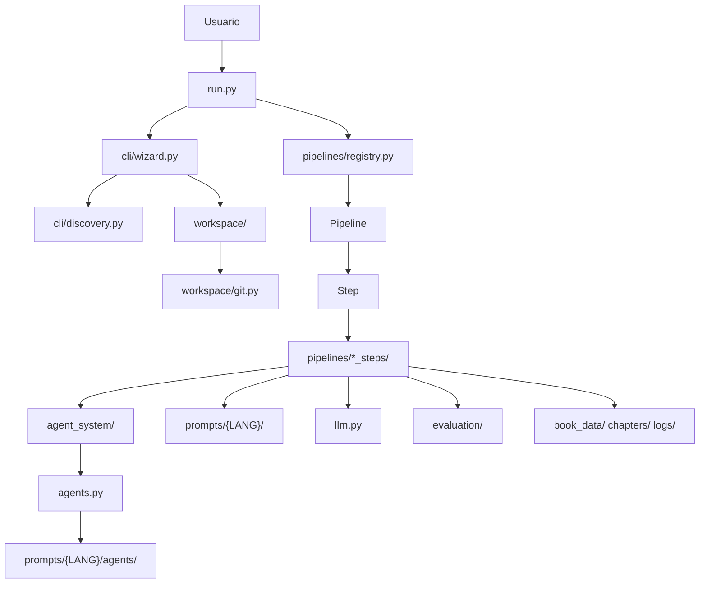
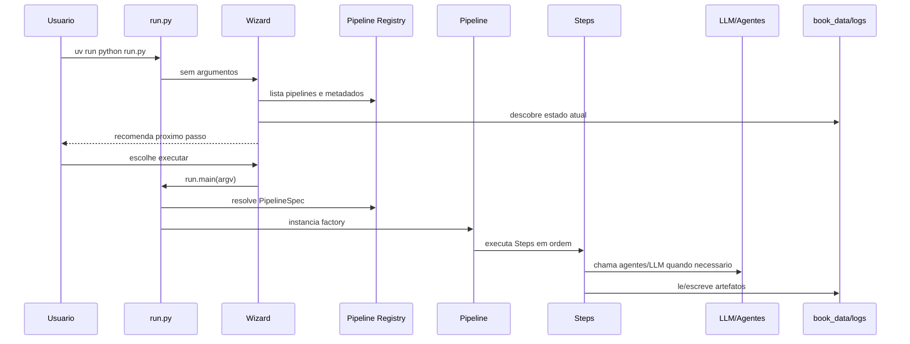

# Arquitetura Do Autobook

Autobook e organizado como um orquestrador local de pipelines literarias. A
arquitetura atual privilegia contratos pequenos, helpers testaveis, prompts
externalizados e protecao contra escrita acidental na branch principal.

## Visao Geral

## Principios Atuais

- `run.py` e a unica entrada operacional suportada.
- Pipelines sao registradas em `pipelines/registry.py`, nao descobertas por
  imports laterais.
- Cada pipeline publica continua fina; a logica detalhada vive em
  `pipelines/*_steps/`.
- Operacoes Git e regras de branch ficam em `workspace/`.
- Agentes novos devem usar `agent_system/`; `agents.py` continua como backend
  de compatibilidade.
- Prompts mutaveis ficam em `prompts/{LANG}/`, nao embutidos em codigo quando
  fazem parte de comportamento editorial.
- Testes unitarios validam helpers puros; testes de fluxo validam integracao
  sem chamadas reais a LLM ou Git destrutivo.

## Camadas

| Camada | Modulos | Responsabilidade |
| --- | --- | --- |
| Entrada | `run.py`, `main.py` | Wizard, CLI classica e delegacao simples. |
| UI de terminal | `cli/wizard.py`, `cli/discovery.py` | Estado do projeto, recomendacoes, escolha de pipeline e execucao opcional. |
| Orquestracao | `pipelines/base.py`, `pipelines/registry.py`, `pipelines/*.py` | Contratos de `Step`/`Pipeline`, metadados e ordem de execucao. |
| Helpers de pipeline | `pipelines/*_steps/` | Contexto, prompts, persistencia, avaliacao, subprocessos e parsing. |
| Agentes | `agent_system/`, `agents.py` | Registry/factory moderna e classes concretas legadas. |
| LLM | `llm.py` | Provedores Anthropic, OpenAI, Gemini e OpenRouter. |
| Prompts | `prompt_loader.py`, `prompts/` | Resolucao por idioma, fallback e templates externos. |
| Workspace | `workspace/` | Branches `autobook/<slug>`, metadata, Git e protecoes. |
| Avaliacao | `evaluate.py`, `evaluation/` | Slop, juiz LLM, score estruturado e reports. |
| Artefatos | `book_data/`, `chapters/`, `logs/` | Estado runtime da obra e trilha de auditoria. |

## Fluxo De Execucao

## Contratos Criticos

- `PipelineSpec.requires_work_branch=True` impede execucao em `main`, `master`
  ou branches genericas.
- `Step` e `Pipeline` aceitam metadados opcionais `description`, `requires` e
  `produces`, mas eles ainda nao sao validadores bloqueantes.
- `workspace/project.py` valida `workspace.json` antes de ler ou escrever.
- `workspace/git.py` centraliza chamadas Git usadas pelo fluxo moderno.
- `writing/feedback.py` define `CriticFinding`, `CriticReport`,
  `RevisionPlan` e `VerificationReport`.
- `evaluation/json_utils.py` concentra parsing JSON robusto usado por scripts
  e avaliacao.

## O Que E Historico

`legacy/` e parte de `docs/others/` preservam material antigo, mas nao definem
o comportamento atual. O contrato moderno deve ser inferido dos documentos
principais desta pasta e dos testes em `tests/`.
