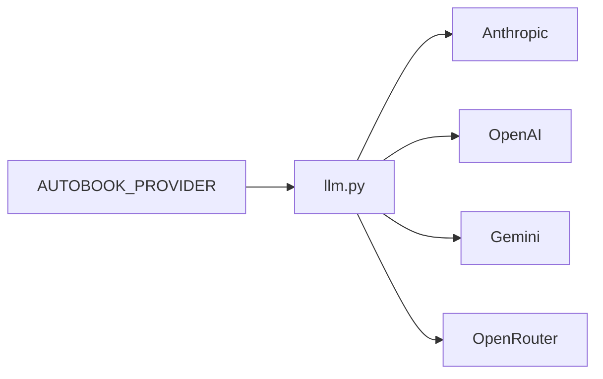

# Configuracao

Autobook usa variaveis de ambiente, arquivos de prompt e arquivos runtime em
`book_data/`. A configuracao recomendada comeca copiando `.env.example` para
`.env`.

## Variaveis Principais

| Variavel | Uso |
| --- | --- |
| `AUTOBOOK_PROVIDER` | Provedor ativo: `anthropic`, `openai`, `gemini` ou `openrouter`. |
| `AUTOBOOK_WRITER_MODEL` | Modelo usado para escrita. |
| `AUTOBOOK_JUDGE_MODEL` | Modelo usado para avaliacao/julgamento. |
| `AUTOBOOK_REVIEW_MODEL` | Modelo usado para revisoes. |
| `AUTOBOOK_LANGUAGE` | Idioma ativo de prompts e generos, como `EN` ou `PT-BR`. |
| `AUTOBOOK_GENRE` | Genero ativo em `genres/{LANG}/`. |
| `OPENROUTER_API_KEY` | Chave OpenRouter. |
| `OPENAI_API_KEY` | Chave OpenAI. |
| `ANTHROPIC_API_KEY` | Chave Anthropic. |
| `GEMINI_API_KEY` | Chave Gemini. |
| `FAL_KEY` | Chave para ferramentas de imagem quando usadas. |
| `ELEVENLABS_API_KEY` | Chave para ferramentas de audiobook quando usadas. |

## Provedores LLM



`llm.py` valida configuracao e levanta erros tipados quando uma chave ou modelo
necessario esta ausente.

## Idioma E Genero

`AUTOBOOK_LANGUAGE` afeta prompts localizados. `AUTOBOOK_GENRE` afeta
`GenreStrategy`, que procura regras nesta ordem:

1. `genres/{AUTOBOOK_LANGUAGE}/{AUTOBOOK_GENRE}.txt`
2. `genres/EN/{AUTOBOOK_GENRE}.txt`
3. `genres/{AUTOBOOK_LANGUAGE}/drama.txt`
4. `genres/EN/drama.txt`

## Workspace

O wizard pode criar:

```text
book_data/workspace.json
```

Contrato minimo:

```json
{
  "schema_version": 1,
  "title": "Minha Obra",
  "branch": "autobook/minha-obra",
  "created_at": "2026-06-18T12:00:00"
}
```

## Git

Nao existem flags efetivas `GIT_AUTO_COMMIT` ou `GIT_AUTO_PUSH` no contrato
moderno. Operacoes Git usadas por pipelines passam por `workspace/git.py` ou
helpers dedicados de workspace.

## Testes E Lint

Dependencias de desenvolvimento ficam no grupo `dev` do `pyproject.toml`:

```bash
uv run --group dev ruff check .
uv run --with pytest pytest tests -q
```

`legacy/tests` e desativado por contrato operacional.
