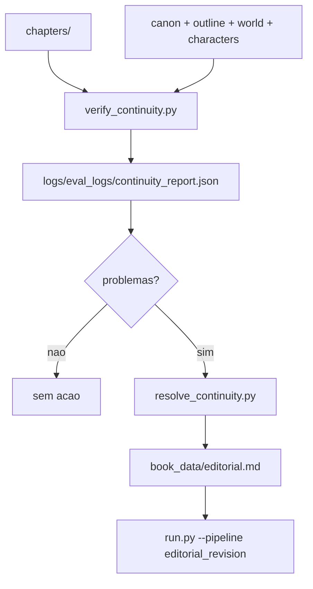

# Continuidade

A continuidade protege linha temporal, fatos estabelecidos, personagens e
causalidade entre capitulos.

## Componentes

| Arquivo | Responsabilidade |
| --- | --- |
| `verify_continuity.py` | Analisa capitulos e lore, escreve report em `logs/eval_logs/continuity_report.json`. |
| `resolve_continuity.py` | Le o report, gera `book_data/editorial.md` corretivo e chama `run.py`. |
| `book_data/canon.md` | Base de fatos estabelecidos. |
| `book_data/outline.md` | Sequencia planejada de capitulos e beats. |

## Fluxo



## Uso

```bash
uv run python verify_continuity.py
uv run python resolve_continuity.py
```

`book_generation` executa verificacao de continuidade durante a persistencia de
capitulos. A execucao manual e util para auditoria.

## Report

O report principal fica em:

```text
logs/eval_logs/continuity_report.json
```

`resolve_continuity.py` espera esse caminho. Se o report estiver ausente ou nao
indicar problemas, o script encerra sem acionar revisao.
