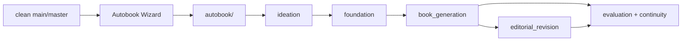

# Current Autobook Snapshot

This document summarizes the project after the platform refactor, pipeline
reorganization, operational hardening and documentation review. The filename is
kept for compatibility with older links, but the content represents the current
state.

## General State



Autobook is currently a Python orchestrator for producing a book on a dedicated
branch. `run.py` is the main entry point, `pipelines/registry.py` declares the
available pipelines, `workspace/` protects branches and metadata, and the
`*_steps/` packages keep operational logic testable.

## Covered Components

| Area | State | Note |
| --- | --- | --- |
| Wizard and CLI | Current | `run.py` without arguments opens the wizard; `--pipeline` keeps the classic CLI. |
| Branch/workspace | Current | Protected pipelines require `autobook/<slug>` and can register `book_data/workspace.json`. |
| Pipelines | Current | Four main pipelines are registered and protected by `PipelineSpec`. |
| Book generation | Current | Context, planning, drafting, critique, revision and persistence live in `book_generation_steps/`. |
| Editorial revision | Current | Config, parsing, context, evaluation and revision operations live in `editorial_revision_steps/`. |
| Agents | Current | `agent_system/` is the modern adapter; concrete classes remain in `agents.py`. |
| Prompts | Current | Agent and tool prompts are externalized with language fallback. |
| Evaluation | Current | `evaluate.py` is a facade over the `evaluation/` package. |
| Continuity | Current | `verify_continuity.py` and `resolve_continuity.py` use modern paths and orchestration. |
| Tests | Current | 320 modern tests passing; legacy tests disabled. |
| Legacy | Historical | Kept as reference, outside the modern contract. |

## Important Contracts

- `book_data/`, `chapters/`, `logs/` and `seed.txt` are book artifacts.
- The main branch should stay clean; generation happens on `autobook/<slug>`.
- `book_data/workspace.json`, when present, must validate `schema_version`,
  `title`, `branch` and `created_at`.
- `docs/en/others/CRAFT.md`, `ANTI-SLOP.md` and `ANTI-PATTERNS.md` remain
  useful references; the other files under `others/` are historical or creative.
- `legacy/tests` does not measure the current health of the project.

## Verified Baseline

```bash
uv run --group dev ruff check .
uv run --with pytest pytest tests -q
uv run --with pytest pytest legacy/tests -q
```

Expected result:

- Ruff without errors.
- `320 passed` in the modern suite.
- `legacy/tests`: no tests collected, exit code 0.

## Non-Blocking Future Decisions

1. Decide whether experimental scripts become supported contracts or remain
   auxiliary tools.
2. Evolve critics so they consistently emit native JSON `CriticReport`.
3. Gradually expand lint rules to currently excluded areas without mixing that
   with functional changes.
4. Improve wizard ergonomics without changing pipeline contracts.
