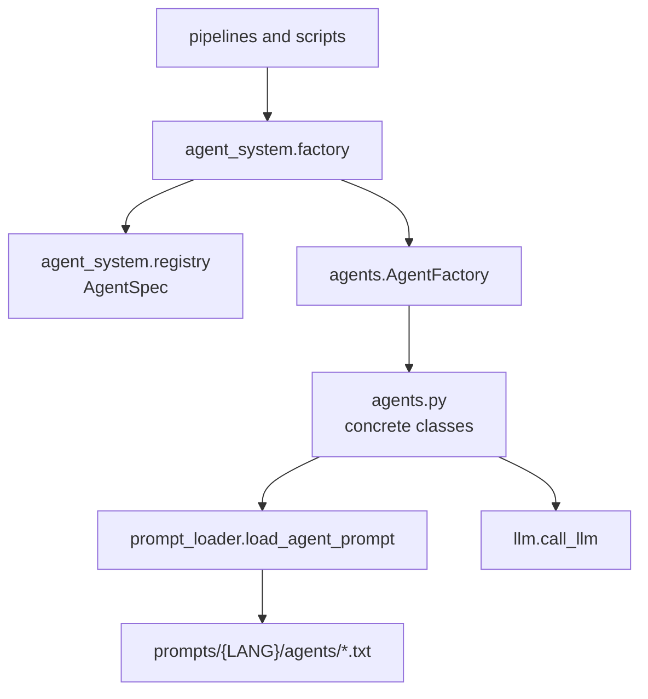
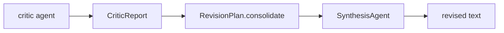

# Agents

The current agent system combines a modern layer (`agent_system/`) with the
legacy concrete classes in `agents.py`. This preserves compatibility and
reduces risk: new code uses modern contracts while the concrete implementation
remains where it already existed.

## Architecture



## Registered Roles

| Role | Concrete class | Main use |
| --- | --- | --- |
| `drafting` | `DraftingAgent` | Draft beats and chapters. |
| `stylist` | `StylistAgent` | Stylistic rewrite when used by auxiliary flows. |
| `technical_editor` | `TechnicalEditorAgent` | Technical/editorial diagnostics. |
| `canon_critic` | `CanonCriticAgent` | Consistency with canon, facts and lore. |
| `style_critic` | `StyleCriticAgent` | Voice, style and anti-slop. |
| `flow_critic` | `FlowCriticAgent` | Rhythm, local continuity and progression. |
| `synthesis` | `SynthesisAgent` | Apply critiques sequentially to the revised text. |

## Prompts

Agent prompts live in:

```text
prompts/{LANG}/agents/{role}.txt
```

Example:

```text
prompts/EN/agents/drafting.txt
prompts/EN/agents/canon_critic.txt
```

`prompt_loader.load_agent_prompt()` normalizes language/role and falls back to
`EN` when allowed. Migrated agents keep hardcoded fallback only for
compatibility when the external file is missing.

Template errors in existing prompt files are treated as real errors, not silent
fallbacks. This prevents broken placeholders from being hidden.

## Structured Feedback

The feedback contract lives in `writing/feedback.py`.



Expected shape:

```json
{
  "critic_role": "canon_critic",
  "findings": [
    {
      "source": "canon_critic",
      "instruction": "Fix contradiction X.",
      "quote": "affected passage",
      "severity": "high"
    }
  ],
  "metadata": {}
}
```

The parser accepts JSON, markdown lists and free text as fallback. Outputs that
explicitly state there are no issues become empty reports.

## Extensibility

`agents.AgentFactory` still supports dynamic registration and skill loading:

```python
factory.register_agent("custom_role", CustomAgent)
factory.load_skill_agent("create_agent")
```

New code should prefer:

```python
from agent_system.factory import AgentFactory, create_agent
```

Do not use `_agents_registry` directly. The legacy layer exposes public methods
to check, register and remove dynamic agents.

## Current Strategy

The current decision is documented in
[agent-system-strategy.md](agent-system-strategy.md): `agent_system/` remains a
modern adapter over `agents.py`. Moving concrete classes should only be
considered if it clearly improves maintenance.
