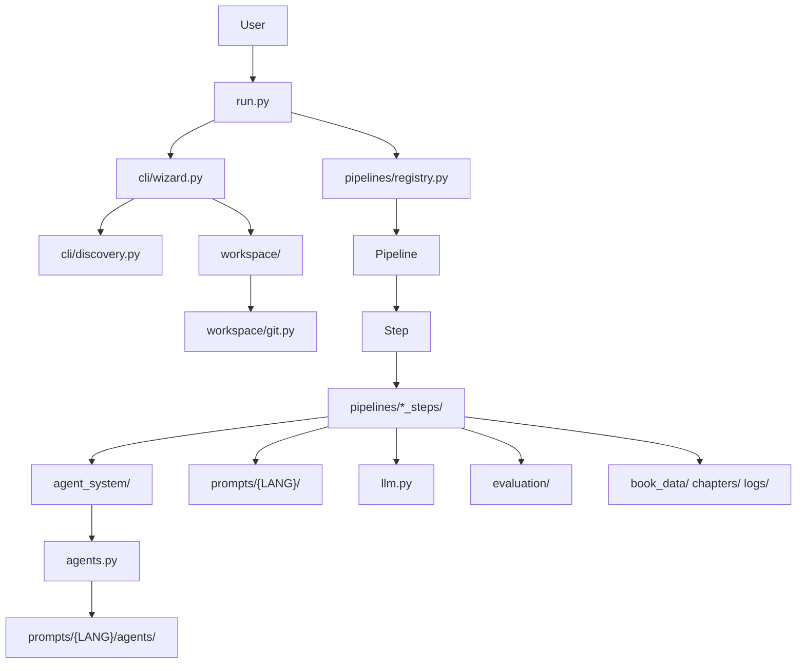
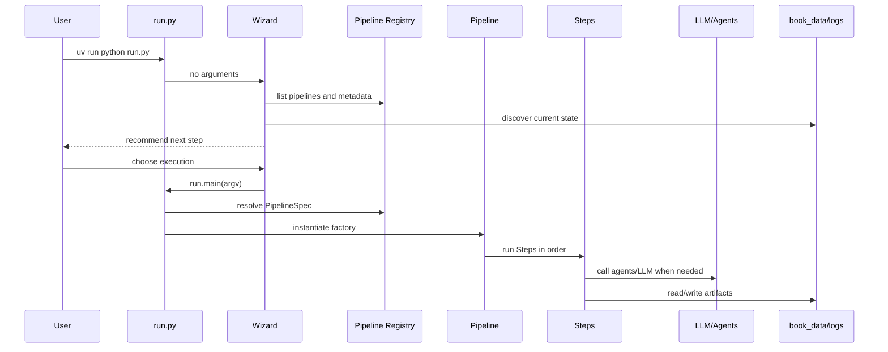

# Autobook Architecture

Autobook is organized as a local orchestrator for literary pipelines. The
current architecture favors small contracts, testable helpers, externalized
prompts and protection against accidental writes to the main branch.

## Overview

## Current Principles

- `run.py` is the only supported operational entry point.
- Pipelines are registered in `pipelines/registry.py`, not discovered through
  side-effect imports.
- Public pipeline classes stay thin; detailed logic lives in
  `pipelines/*_steps/`.
- Git operations and branch rules live in `workspace/`.
- New agent code should use `agent_system/`; `agents.py` remains the
  compatibility backend.
- Mutable editorial prompts live in `prompts/{LANG}/`, not embedded in code.
- Unit tests validate pure helpers; flow tests validate integration without real
  LLM calls or destructive Git operations.

## Layers

| Layer | Modules | Responsibility |
| --- | --- | --- |
| Entry | `run.py`, `main.py` | Wizard, classic CLI and simple delegation. |
| Terminal UI | `cli/wizard.py`, `cli/discovery.py` | Project state, recommendations, pipeline selection and optional execution. |
| Orchestration | `pipelines/base.py`, `pipelines/registry.py`, `pipelines/*.py` | `Step`/`Pipeline` contracts, metadata and execution order. |
| Pipeline helpers | `pipelines/*_steps/` | Context, prompts, persistence, evaluation, subprocesses and parsing. |
| Agents | `agent_system/`, `agents.py` | Modern registry/factory and legacy concrete classes. |
| LLM | `llm.py` | Anthropic, OpenAI, Gemini and OpenRouter providers. |
| Prompts | `prompt_loader.py`, `prompts/` | Language resolution, fallback and external templates. |
| Workspace | `workspace/` | `autobook/<slug>` branches, metadata, Git and protections. |
| Evaluation | `evaluate.py`, `evaluation/` | Slop, LLM judge, structured score and reports. |
| Artifacts | `book_data/`, `chapters/`, `logs/` | Runtime book state and audit trail. |

## Execution Flow

## Critical Contracts

- `PipelineSpec.requires_work_branch=True` blocks execution on `main`,
  `master` or generic branches.
- `Step` and `Pipeline` accept optional `description`, `requires` and
  `produces` metadata, but those are not blocking dependency validators yet.
- `workspace/project.py` validates `workspace.json` before reading or writing.
- `workspace/git.py` centralizes Git calls used by the modern flow.
- `writing/feedback.py` defines `CriticFinding`, `CriticReport`,
  `RevisionPlan` and `VerificationReport`.
- `evaluation/json_utils.py` centralizes robust JSON parsing used by scripts
  and evaluation.

## Historical Areas

`legacy/` and part of `docs/*/others/` preserve old material, but they do not
define current behavior. The modern contract should be inferred from the main
documents in this folder and the tests in `tests/`.
