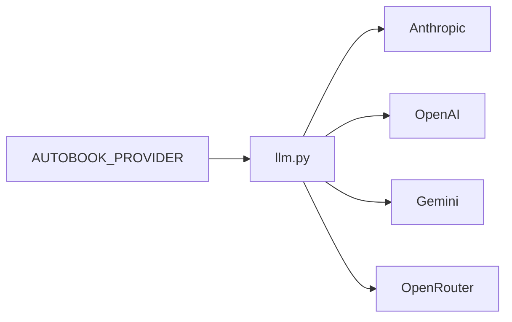

# Configuration

Autobook uses environment variables, prompt files and runtime files under
`book_data/`. Recommended setup starts by copying `.env.example` to `.env`.

## Main Variables

| Variable | Use |
| --- | --- |
| `AUTOBOOK_PROVIDER` | Active provider: `anthropic`, `openai`, `gemini` or `openrouter`. |
| `AUTOBOOK_WRITER_MODEL` | Model used for writing. |
| `AUTOBOOK_JUDGE_MODEL` | Model used for evaluation/judging. |
| `AUTOBOOK_REVIEW_MODEL` | Model used for revisions. |
| `AUTOBOOK_LANGUAGE` | Active prompt and genre language, such as `EN` or `PT-BR`. |
| `AUTOBOOK_GENRE` | Active genre under `genres/{LANG}/`. |
| `OPENROUTER_API_KEY` | OpenRouter key. |
| `OPENAI_API_KEY` | OpenAI key. |
| `ANTHROPIC_API_KEY` | Anthropic key. |
| `GEMINI_API_KEY` | Gemini key. |
| `FAL_KEY` | Image tooling key when used. |
| `ELEVENLABS_API_KEY` | Audiobook tooling key when used. |

## LLM Providers



`llm.py` validates configuration and raises typed errors when a required key or
model is missing.

## Language And Genre

`AUTOBOOK_LANGUAGE` affects localized prompts. `AUTOBOOK_GENRE` affects
`GenreStrategy`, which searches rules in this order:

1. `genres/{AUTOBOOK_LANGUAGE}/{AUTOBOOK_GENRE}.txt`
2. `genres/EN/{AUTOBOOK_GENRE}.txt`
3. `genres/{AUTOBOOK_LANGUAGE}/drama.txt`
4. `genres/EN/drama.txt`

## Workspace

The wizard can create:

```text
book_data/workspace.json
```

Minimum contract:

```json
{
  "schema_version": 1,
  "title": "My Book",
  "branch": "autobook/my-book",
  "created_at": "2026-06-18T12:00:00"
}
```

## Git

There are no effective `GIT_AUTO_COMMIT` or `GIT_AUTO_PUSH` flags in the modern
contract. Git operations used by pipelines go through `workspace/git.py` or
dedicated workspace helpers.

## Tests And Lint

Development dependencies live in the `dev` group in `pyproject.toml`:

```bash
uv run --group dev ruff check .
uv run --with pytest pytest tests -q
```

`legacy/tests` is disabled by operational contract.
