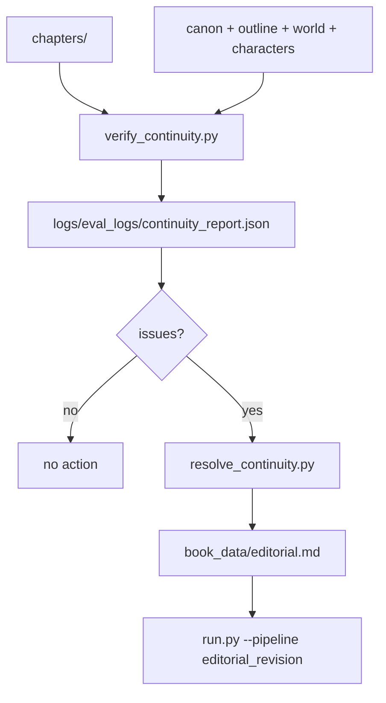

# Continuity

Continuity protects timeline, established facts, characters and causality
between chapters.

## Components

| File | Responsibility |
| --- | --- |
| `verify_continuity.py` | Analyzes chapters and lore, writes report to `logs/eval_logs/continuity_report.json`. |
| `resolve_continuity.py` | Reads the report, creates corrective `book_data/editorial.md` and calls `run.py`. |
| `book_data/canon.md` | Base of established facts. |
| `book_data/outline.md` | Planned sequence of chapters and beats. |

## Flow



## Usage

```bash
uv run python verify_continuity.py
uv run python resolve_continuity.py
```

`book_generation` runs continuity verification while persisting chapters.
Manual execution is useful for audits.

## Report

The main report is:

```text
logs/eval_logs/continuity_report.json
```

`resolve_continuity.py` expects this path. If the report is missing or does not
indicate issues, the script exits without triggering revision.
