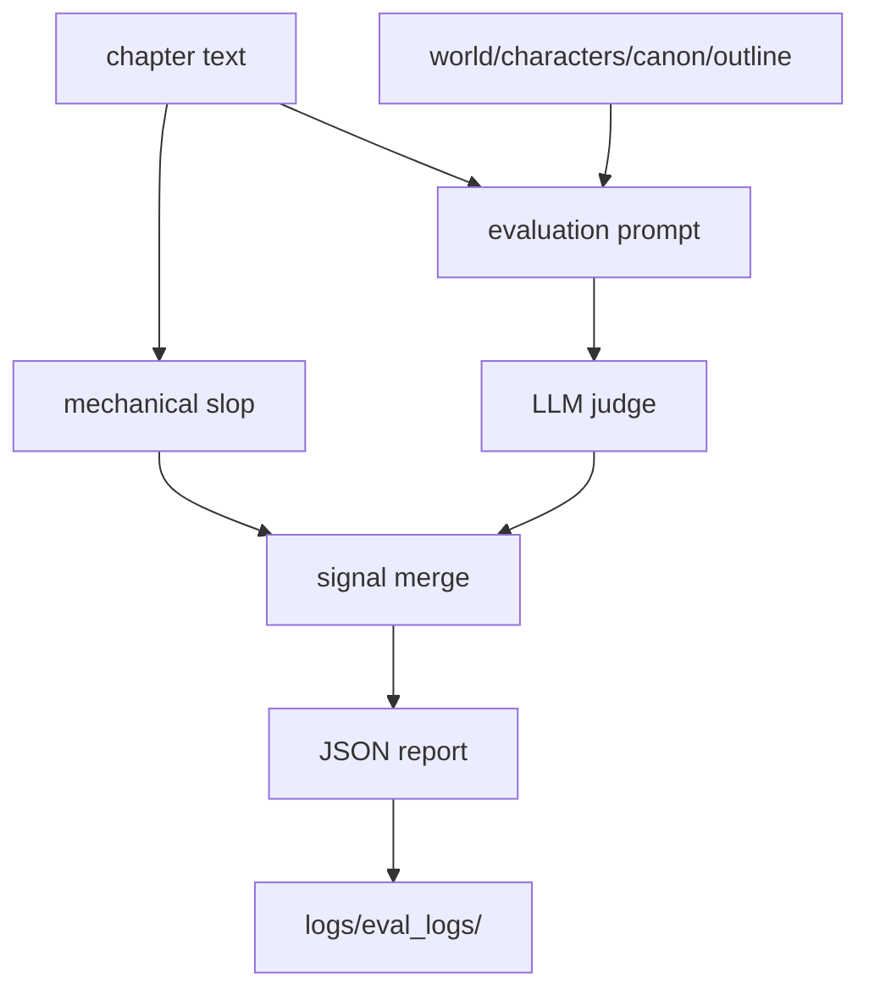

# Evaluation

Evaluation measures textual quality, lore adherence, local continuity and
mechanical prose slop signals. `evaluate.py` is the facade/CLI; the main
implementation lives in the `evaluation/` package.

## Flow



## Components

| Module | Responsibility |
| --- | --- |
| `evaluate.py` | CLI/facade for chapter evaluation. |
| `evaluation/` | Package with prompts, parsing, scoring and reports. |
| `evaluation/json_utils.py` | Tolerant reusable JSON parsing. |
| `prompts/{LANG}/evaluation/` | Localized judge prompts. |
| `prompts/{LANG}/slop.json` | Language-specific mechanical slop rules. |
| `logs/eval_logs/` | Evaluation and continuity JSON outputs. |

## Usage

```bash
uv run python evaluate.py --chapter 3
uv run python evaluate.py --chapter-file chapters/ch_03.md
```

Pipelines call evaluation internally, so manual usage is most useful for
auditing or debugging.

## Output Contract

Reports may contain:

- overall score;
- quality dimensions;
- textual diagnostics;
- mechanical slop findings;
- attempt/chapter metadata.

Consumers should handle missing fields tolerantly because smaller models may
return partial JSON.

## Relation To Book Generation

In `book_generation`, evaluation happens after revised synthesis. The result is
archived together with attempt artifacts. If evaluation fails after base
archiving, the attempt is still preserved for diagnostics.

## Relation To Editorial Revision

`editorial_revision` uses evaluation in a corrective loop. The pipeline tries
to reach quality and slop targets; when it cannot, it preserves the best known
attempt.
