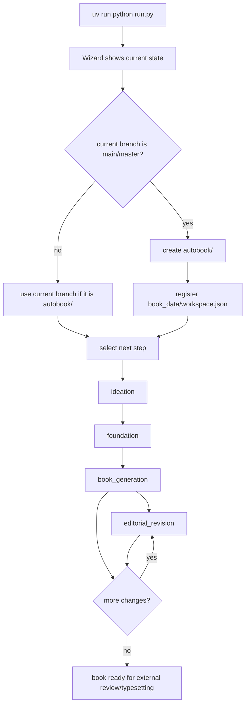
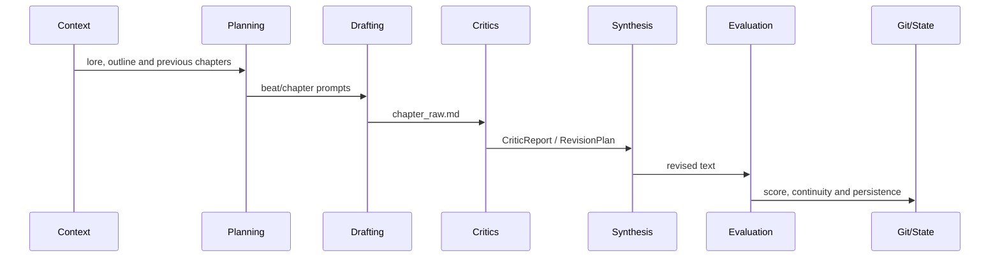

# Complete Flow Guide

This guide describes the current operational journey for creating and revising
a book with Autobook.

## Recommended Flow



## 1. Prepare The Workspace

On the main branch, run:

```bash
uv run python run.py
```

The wizard can suggest and create a branch:

```bash
git switch -c autobook/<slug>
```

After creation, it registers metadata in:

```text
book_data/workspace.json
```

## 2. Ideation

Goal: turn creative choices into a usable seed.

```bash
uv run python run.py --pipeline ideation
```

Expected outputs:

- `seed.txt`
- `book_data/MYSTERY.md` when applicable
- `book_data/state.json`

## 3. Foundation

Goal: generate the bibles that support the book.

```bash
uv run python run.py --pipeline foundation
```

Main inputs:

- `seed.txt`
- `book_data/MYSTERY.md`
- `book_data/voice.md`
- `docs/en/others/CRAFT.md`

Outputs:

- `book_data/world.md`
- `book_data/characters.md`
- `book_data/outline.md`
- `book_data/canon.md`

## 4. Chapter Generation

```bash
uv run python run.py --pipeline book_generation --from-scratch
uv run python run.py --pipeline book_generation --chapter 3
uv run python run.py --pipeline book_generation --chapter 5-7
```

Internal flow:



Each attempt is tracked under `logs/generation_attempts/`.

## 5. Editorial Revision

Create or update `book_data/editorial.md` with general and per-chapter
instructions.

```bash
uv run python run.py --pipeline editorial_revision --chapter 4
uv run python run.py --pipeline editorial_revision --chapter 2,5,7
```

The pipeline:

1. interprets the editorial markdown;
2. builds initial and corrective briefs;
3. calls `gen_revision.py`;
4. evaluates each attempt;
5. preserves the best known result when the target is not reached.

## 6. Continuity

`book_generation` automatically runs `verify_continuity.py` when persisting
chapters. To run it manually:

```bash
uv run python verify_continuity.py
```

To turn continuity findings into an editorial revision:

```bash
uv run python resolve_continuity.py
```

## 7. Final Artifacts

Typesetting and auxiliary scripts exist, but they are not one closed pipeline.
See:

- [../typesetting/typesetting.md](../typesetting/typesetting.md)
- [../scripts/scripts.md](../scripts/scripts.md)

## Safety Rules

- Do not run protected pipelines on `main`, `master` or `feature/*`.
- Always use an `autobook/<slug>` branch for books.
- Do not edit `state.json` manually unless you understand the chapter cursor.
- Treat `legacy/` and `docs/*/others/` as historical unless the current docs
  explicitly reference the file.
