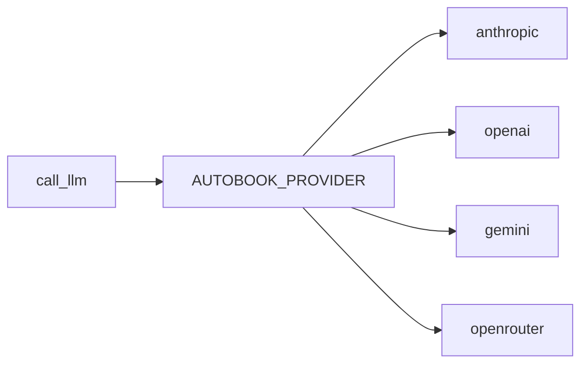

# LLM Client

`llm.py` centralizes model calls. It isolates providers, environment variables,
timeouts, retries and configuration errors.

## Providers

## Models By Role

| Variable | Use |
| --- | --- |
| `AUTOBOOK_WRITER_MODEL` | Chapter writing, foundation and creative prompts. |
| `AUTOBOOK_JUDGE_MODEL` | Evaluation and verification. |
| `AUTOBOOK_REVIEW_MODEL` | Editorial revision and synthesis when separated. |

The project can use cheaper models, but compensates with more steps, critics,
retries and structured validation.

## Usage Contracts

- Do not call provider SDKs directly in pipelines.
- Use `call_llm` or existing wrappers.
- Tests must mock LLM calls.
- Configuration errors should be propagated clearly.

## Cost And Quality

The current design favors interaction volume and step specialization:

1. context and planning before writing;
2. beat-level drafting when possible;
3. independent critics;
4. sequential synthesis;
5. evaluation and continuity.

This allows intermediate models to be used in parts of the flow while reserving
a better model or supervisor for audit steps when needed.
