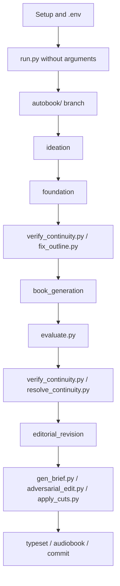

# Autobook Terminal Commands

This document lists the terminal commands available to interact with the
project. Run commands from the repository root.

Conventions:

- Recommended command style: `uv run python <script.py>`.
- Book-producing pipelines must run on an `autobook/<slug>` branch.
- The `main` branch must remain clean, without generated book artifacts.
- Scripts under `legacy/` are historical; use them only when there is a clear
  reason.

## Overview



## Setup And Environment

| Command | Parameters | Use |
| --- | --- | --- |
| `uv sync` | none | Installs project dependencies. |
| `cp .env.example .env` | none | Creates local configuration from the template. |
| `uv run python tests/test_llm_connectivity.py` | none | Tests the configured LLM connection. |

Example:

```bash
uv sync
cp .env.example .env
uv run python tests/test_llm_connectivity.py
```

### Operational Environment Variables

These variables can be set in `.env` or prefixed on a single command.

| Variable | Default | Use |
| --- | --- | --- |
| `AUTOBOOK_PROVIDER` | `anthropic` in code; template uses `openrouter` | LLM provider: `anthropic`, `openai`, `gemini`, `openrouter`. |
| `AUTOBOOK_API_BASE_URL` | provider URL | Alternative base URL for compatible APIs. |
| `AUTOBOOK_WRITER_MODEL` | provider default | Model for writing and creative generation. |
| `AUTOBOOK_JUDGE_MODEL` | provider default or `openrouter/free` in evaluators | Evaluation model(s). Evaluation and continuity accept comma-separated failover lists. |
| `AUTOBOOK_REVIEW_MODEL` | provider default | Revision/synthesis model when separated. |
| `ANTHROPIC_WRITER_MODEL`, `ANTHROPIC_JUDGE_MODEL`, `ANTHROPIC_REVIEW_MODEL` | empty | Anthropic-specific overrides. |
| `OPENAI_WRITER_MODEL`, `OPENAI_JUDGE_MODEL`, `OPENAI_REVIEW_MODEL` | empty | OpenAI-specific overrides. |
| `GEMINI_WRITER_MODEL`, `GEMINI_JUDGE_MODEL`, `GEMINI_REVIEW_MODEL` | empty | Gemini-specific overrides. |
| `OPENROUTER_WRITER_MODEL`, `OPENROUTER_JUDGE_MODEL`, `OPENROUTER_REVIEW_MODEL` | empty | OpenRouter-specific overrides. |
| `AUTOBOOK_LANGUAGE` | `EN` | Active language for localized prompts and configuration. Examples: `EN`, `PT-BR`. |
| `AUTOBOOK_GENRE` | `drama` | Active genre for literary rules. Examples: `drama`, `crime_mystery`, `cyber_horror`, `light_novel`. |
| `AUTOBOOK_PIPELINE_TIMEOUT` | `3600` | General timeout used as fallback for LLM calls. |
| `AUTOBOOK_LLM_TIMEOUT` | empty | LLM-specific timeout; if empty, uses `AUTOBOOK_PIPELINE_TIMEOUT`. |
| `AUTOBOOK_CRITICS` | `canon_critic,style_critic,flow_critic` | Critics used by `book_generation`, comma-separated. |
| `MAX_CHAPTER_ATTEMPTS` | `3` | Attempts per chapter in `book_generation`. |
| `CHAPTER_THRESHOLD` | `6.0` | Minimum score to accept a chapter attempt. |
| `CONTINUITY_THRESHOLD` | `7.0` | Threshold used by continuity validation inside chapter generation. |
| `NUM_EDITORIAL_RETRIES` | `5` | Corrective loops per chapter in `editorial_revision`. |
| `FIX_OUTLINE_GLOBAL_PLAN` | `1` | Enables/disables the global repair plan before chunked outline fixing. |
| `FIX_OUTLINE_CHUNK_CHAPTERS` | `4` | Chapters per chunk in `fix_outline.py`. |
| `FIX_OUTLINE_CONTEXT_CHAPTERS` | `1` | Neighbor chapters sent as reference context per chunk. |
| `FIX_OUTLINE_MAP_CHARS_PER_CHAPTER` | `900` | Character limit per chapter in the compact global outline map. |
| `OPENROUTER_API_KEY`, `OPENAI_API_KEY`, `ANTHROPIC_API_KEY`, `GEMINI_API_KEY` | empty | Provider API keys. |
| `FAL_KEY` | empty | Key for legacy/experimental image tools. |
| `ELEVENLABS_API_KEY` | empty | Key for audiobook scripts. |

Example with per-command variables:

```bash
AUTOBOOK_LANGUAGE=EN \
AUTOBOOK_LLM_TIMEOUT=300 \
AUTOBOOK_CRITICS=canon_critic,style_critic,flow_critic \
uv run python run.py --pipeline book_generation --chapter 1-3
```

## Git And Workspace

| Command | Parameters | Use |
| --- | --- | --- |
| `git status --short` | none | Shows local changes compactly. |
| `git switch main` | branch | Switches back to the main branch. |
| `git switch -c autobook/<slug>` | branch name | Creates a book branch manually. |
| `git add <files>` | paths | Stages files for commit. |
| `git commit -m "<message>"` | message | Creates a local commit. |
| `git push -u origin autobook/<slug>` | remote and branch | Publishes the book branch for the first time. |
| `git push` | none | Pushes commits on a branch with upstream configured. |

The wizard can also suggest/create the `autobook/<slug>` branch and register:

```text
book_data/workspace.json
```

Manual example:

```bash
git status --short
git switch main
git switch -c autobook/my-book
```

## Main Entry Point: `run.py`

### Interactive Wizard

| Command | Parameters | Use |
| --- | --- | --- |
| `uv run python run.py` | none | Opens the interactive wizard. |
| `uv run python main.py` | none | Delegator equivalent to `run.py`. |

The wizard:

- shows the current branch;
- shows registered workspace metadata;
- lists available pipelines;
- recommends next steps;
- can suggest/create an `autobook/<slug>` branch;
- can assemble and execute the classic `run.py` call.

### Classic Pipeline CLI

Syntax:

```bash
uv run python run.py --pipeline <pipeline> [--from-scratch] [--yes] [--chapter <list>]
```

Parameters:

| Parameter | Values | Required | Use |
| --- | --- | --- | --- |
| `--pipeline` | `ideation`, `foundation`, `book_generation`, `editorial_revision` | yes | Pipeline to execute. |
| `--from-scratch` | flag | no | Resets progress when the pipeline supports reset. |
| `--yes` | flag | no | Auto-approves confirmation prompts when used by the pipeline. |
| `--chapter` | string | no | Specific chapters. Accepts `3`, `1-4`, `1,3,7`, `2-4,8`. |

Registered pipelines:

| Pipeline | `--chapter` | `--from-scratch` | Requires `autobook/<slug>` branch | Use |
| --- | --- | --- | --- | --- |
| `ideation` | no | yes | yes | Creates/preserves the seed and initializes creative state. |
| `foundation` | no | yes | yes | Generates world, characters, outline and canon. |
| `book_generation` | yes | yes | yes | Writes chapters, critiques, synthesizes, evaluates and validates continuity. |
| `editorial_revision` | yes | no | yes | Rewrites chapters from `book_data/editorial.md`. |

Examples:

```bash
uv run python run.py --pipeline ideation
uv run python run.py --pipeline foundation --from-scratch
uv run python run.py --pipeline book_generation --from-scratch
uv run python run.py --pipeline book_generation --chapter 5-7
uv run python run.py --pipeline editorial_revision --chapter 3
uv run python run.py --pipeline editorial_revision --chapter 2,5,7
```

## Evaluation And Continuity

### `evaluate.py`

Syntax:

```bash
uv run python evaluate.py (--phase foundation | --chapter <N> | --full)
```

Mutually exclusive parameters:

| Parameter | Values | Use |
| --- | --- | --- |
| `--phase` | `foundation` | Evaluates foundation documents. |
| `--chapter` | integer | Evaluates one chapter. |
| `--full` | flag | Evaluates the whole novel. |

Examples:

```bash
uv run python evaluate.py --phase foundation
uv run python evaluate.py --chapter 4
uv run python evaluate.py --full
```

### `verify_continuity.py`

Syntax:

```bash
uv run python verify_continuity.py [-s|--strict] [-t|--threshold <score>]
```

Parameters:

| Parameter | Default | Use |
| --- | --- | --- |
| `-s`, `--strict` | off | Exits with code 1 if the score is below the threshold. |
| `-t`, `--threshold` | `7.5` | Threshold used in strict mode. |

Examples:

```bash
uv run python verify_continuity.py
uv run python verify_continuity.py --strict --threshold 7.0
```

Main output:

```text
logs/eval_logs/continuity_report.json
```

### `fix_outline.py`

Syntax:

```bash
uv run python fix_outline.py
```

CLI parameters: none.

Inputs:

- `book_data/outline.md`
- `logs/eval_logs/continuity_report.json`

Output:

- rewrites `book_data/outline.md`

Environment controls:

| Variable | Default | Use |
| --- | --- | --- |
| `FIX_OUTLINE_GLOBAL_PLAN` | `1` | Creates a global plan before chunks. |
| `FIX_OUTLINE_CHUNK_CHAPTERS` | `4` | Chapters per chunk. |
| `FIX_OUTLINE_CONTEXT_CHAPTERS` | `1` | Neighbor chapters sent as context. |
| `FIX_OUTLINE_MAP_CHARS_PER_CHAPTER` | `900` | Compact map size per chapter. |
| `AUTOBOOK_WRITER_MODEL` | `openrouter/owl-alpha` if absent in script | Model used to rewrite the outline. |

Examples:

```bash
uv run python verify_continuity.py
uv run python fix_outline.py
uv run python verify_continuity.py --strict --threshold 7.0
```

```bash
FIX_OUTLINE_CHUNK_CHAPTERS=3 \
FIX_OUTLINE_CONTEXT_CHAPTERS=2 \
uv run python fix_outline.py
```

### `resolve_continuity.py`

Syntax:

```bash
uv run python resolve_continuity.py
```

CLI parameters: none.

Use:

- reads or generates `logs/eval_logs/continuity_report.json`;
- backs up `book_data/editorial.md`;
- generates a corrective `book_data/editorial.md`;
- calls `run.py --pipeline editorial_revision --chapter <affected_chapters>`.

Example:

```bash
uv run python verify_continuity.py
uv run python resolve_continuity.py
```

## Revision And Assisted Refinement

### `gen_brief.py`

Syntax:

```bash
uv run python gen_brief.py (--panel <CH> | --eval <CH> | --cuts <CH> | --auto) [--dry-run]
```

Parameters:

| Parameter | Use |
| --- | --- |
| `--panel <CH>` | Generates a brief from reader-panel feedback for the chapter. |
| `--eval <CH>` | Generates a brief from evaluation callouts. |
| `--cuts <CH>` | Generates a brief from `adversarial_edit.py` cuts. |
| `--auto` | Automatically detects the weakest chapter and generates a combined brief. |
| `--dry-run` | Prints to stdout without saving. |

Rules:

- Exactly one mode must be provided: `--panel`, `--eval`, `--cuts` or `--auto`.
- Without `--dry-run`, saves to `book_data/briefs/chXX_<type>.md`.

Examples:

```bash
uv run python gen_brief.py --eval 3
uv run python gen_brief.py --cuts 8 --dry-run
uv run python gen_brief.py --auto
```

### `gen_revision.py`

Syntax:

```bash
uv run python gen_revision.py <chapter_num> <brief_file> [--temperature <value>]
```

Parameters:

| Parameter | Default | Use |
| --- | --- | --- |
| `chapter_num` | required | Chapter number to rewrite. |
| `brief_file` | required | Revision brief path. |
| `--temperature` | `0.8` | Creative temperature for rewriting. |

Example:

```bash
uv run python gen_revision.py 3 book_data/briefs/ch03_eval.md --temperature 0.7
```

This script is normally called by the `editorial_revision` pipeline.

### `adversarial_edit.py`

Syntax:

```bash
uv run python adversarial_edit.py <chapter_num|all>
```

Parameters:

| Parameter | Use |
| --- | --- |
| `chapter_num` | Analyzes one chapter. |
| `all` | Analyzes chapters 1 through 24. |

Output:

```text
logs/edit_logs/chXX_cuts.json
```

Examples:

```bash
uv run python adversarial_edit.py 12
uv run python adversarial_edit.py all
```

### `apply_cuts.py`

Syntax:

```bash
uv run python apply_cuts.py <chapter|all> [--types <TYPE...>] [--min-fat <PCT>] [--dry-run]
```

Parameters:

| Parameter | Values | Use |
| --- | --- | --- |
| `chapter` | number or `all` | Chapter to process, or all chapters with cut files. |
| `--types` | `FAT`, `GENERIC`, `OVER-EXPLAIN`, `REDUNDANT`, `STRUCTURAL`, `TELL` | Applies only the selected cut types. |
| `--min-fat` | integer | Processes only chapters with `overall_fat_percentage` greater than or equal to this value. |
| `--dry-run` | flag | Shows cuts without modifying files. |

Examples:

```bash
uv run python apply_cuts.py 12 --dry-run
uv run python apply_cuts.py all --types OVER-EXPLAIN REDUNDANT
uv run python apply_cuts.py all --min-fat 17
```

### `compare_chapters.py`

Syntax:

```bash
uv run python compare_chapters.py
uv run python compare_chapters.py <chapter_a> <chapter_b>
```

Parameters:

| Parameter | Use |
| --- | --- |
| none | Runs a chapter comparison tournament for chapters 1 through 24. |
| `chapter_a chapter_b` | Compares two specific chapters. |

Tournament output:

```text
logs/edit_logs/tournament_results.json
```

Examples:

```bash
uv run python compare_chapters.py
uv run python compare_chapters.py 1 10
```

### `voice_fingerprint.py`

Syntax:

```bash
uv run python voice_fingerprint.py
```

CLI parameters: none.

Use:

- measures quantitative voice patterns across chapters;
- prints a table to the terminal;
- saves `logs/edit_logs/voice_fingerprint.json`.

## Typesetting And Audiobook

### `typeset/build_tex.py`

Syntax:

```bash
uv run python typeset/build_tex.py
```

CLI parameters: none.

Output:

```text
typeset/chapters_content.tex
```

### `gen_audiobook_script.py`

Syntax:

```bash
uv run python gen_audiobook_script.py [start] [end]
```

Parameters:

| Parameter | Use |
| --- | --- |
| none | Processes all chapters found in `chapters/`. |
| `start` | Processes one chapter when used alone. |
| `start end` | Processes a closed chapter range. |

Output:

```text
audiobook/scripts/chXX_script.json
```

Examples:

```bash
uv run python gen_audiobook_script.py
uv run python gen_audiobook_script.py 1
uv run python gen_audiobook_script.py 1 5
```

### `legacy/gen_audiobook.py`

Historical/auxiliary script for generating audio from scripts.

Syntax:

```bash
uv run python legacy/gen_audiobook.py [start] [end] [--list-voices] [--test <CH>] [--assemble] [--status]
```

Parameters:

| Parameter | Use |
| --- | --- |
| `start` | Start chapter. |
| `end` | End chapter. |
| `--list-voices` | Lists voices available in the API. |
| `--test <CH>` | Generates a test with the first 10 segments of the chapter. |
| `--assemble` | Joins chapter audio into `audiobook/full_audiobook.mp3`. |
| `--status` | Shows chapter generation status. |

Examples:

```bash
uv run python legacy/gen_audiobook.py --status
uv run python legacy/gen_audiobook.py --test 1
uv run python legacy/gen_audiobook.py 1 5
uv run python legacy/gen_audiobook.py --assemble
```

## Quality, Tests And Lint

| Command | Parameters | Use |
| --- | --- | --- |
| `uv run --with pytest pytest tests -q` | optional suite/path | Runs the modern test suite. |
| `uv run --with pytest pytest legacy/tests -q` | none | Confirms the legacy suite is disabled without error. |
| `uv run --group dev ruff check .` | optional path | Runs lint configured in `pyproject.toml`. |
| `git diff --check` | optional paths | Detects whitespace and conflict markers in diffs. |
| `uv run python tests/test_llm_connectivity.py` | none | Tests a real call to the configured LLM. |

Examples:

```bash
uv run --with pytest pytest tests -q
uv run --with pytest pytest tests/test_fix_outline.py -q
uv run --group dev ruff check .
git diff --check
```

## Legacy And Historical Scripts

Use this section only when you need old behavior. The modern main flow goes
through `run.py`.

| Command | Parameters | Note |
| --- | --- | --- |
| `uv run python legacy/seed.py` | `--count <N>`, `--riff <text>` | Historical seed generator. May require `PYTHONPATH` depending on the environment. |
| `uv run python legacy/gen_world.py` | none | Historical world generator. |
| `uv run python legacy/gen_characters.py` | none | Historical character generator. |
| `uv run python legacy/gen_outline.py` | none | Historical outline generator. |
| `uv run python legacy/gen_outline_part2.py` | none | Historical outline complement. |
| `uv run python legacy/gen_canon.py` | none | Historical canon generator. |
| `uv run python legacy/build_outline.py` | none | Historical outline rebuild from chapters. |
| `uv run python legacy/build_arc_summary.py` | none | Historical arc summary. |
| `uv run python legacy/reader_panel.py` | none | Historical LLM reader panel. |
| `uv run python legacy/review.py` | `--output <file>`, `-o <file>`, `--parse` | Historical deep review. |
| `uv run python legacy/draft_chapter.py <N>` | chapter number | Historical chapter drafting. |
| `uv run python legacy/run_drafts.py` | none | Historical draft orchestrator. |
| `uv run python legacy/gen_art.py style` | none | Derives visual style. Requires `FAL_KEY` for non-vectorize commands. |
| `uv run python legacy/gen_art.py curate <cover|ornament|map|scene-break> [--n <N>]` | type and count | Generates art variants. |
| `uv run python legacy/gen_art.py pick <art_type> <number>` | type and number | Selects a final variant. |
| `uv run python legacy/gen_art.py ornaments-all` | none | Generates ornaments for chapters. |
| `uv run python legacy/gen_art.py scene-break` | none | Generates scene-break decoration. |
| `uv run python legacy/gen_art.py vectorize [target]` | target or `all` | Converts images to SVG. |
| `uv run python legacy/gen_art.py all` | none | Historical full art pipeline. |
| `uv run python legacy/gen_art_directions.py [art_type] [n]` | optional type and count | Historical art directions. |
| `uv run python legacy/gen_cover_composite.py <art_path>` | `--title`, `--author`, `--subtitle`, `--preset auto|dark|light`, `--output` | Composes text over cover art. |
| `uv run python legacy/gen_cover_print.py <art_path>` | `--title`, `--author`, `--subtitle`, `--blurb`, `--pages`, `--preview`, `--output`, `--canvas-width`, `--canvas-height`, `--spine-width` | Historical print-ready cover. |

## Examples For Common Situations

### Open the wizard and let it guide the run

```bash
uv run python run.py
```

### Create a book branch manually

```bash
git switch main
git status --short
git switch -c autobook/my-book
```

### Run foundation from scratch

```bash
uv run python run.py --pipeline ideation --from-scratch
uv run python run.py --pipeline foundation --from-scratch
```

### Generate chapters in batches

```bash
AUTOBOOK_LLM_TIMEOUT=300 \
uv run python run.py --pipeline book_generation --from-scratch --chapter 1-3

AUTOBOOK_LLM_TIMEOUT=300 \
uv run python run.py --pipeline book_generation --chapter 4-6
```

### Reduce cost during generation

```bash
AUTOBOOK_CRITICS=canon_critic \
MAX_CHAPTER_ATTEMPTS=1 \
uv run python run.py --pipeline book_generation --chapter 7-9
```

### Verify and fix the outline

```bash
uv run python verify_continuity.py
uv run python fix_outline.py
uv run python verify_continuity.py --strict --threshold 7.0
```

### Generate editorial revision for specific chapters

```bash
NUM_EDITORIAL_RETRIES=2 \
uv run python run.py --pipeline editorial_revision --chapter 2-3
```

### Turn continuity findings into revision

```bash
uv run python verify_continuity.py
uv run python resolve_continuity.py
```

### Analyze excess prose and apply cuts safely

```bash
uv run python adversarial_edit.py 8
uv run python apply_cuts.py 8 --dry-run
uv run python apply_cuts.py 8 --types OVER-EXPLAIN REDUNDANT
```

### Generate a typesetting artifact

```bash
uv run python typeset/build_tex.py
```

## End-To-End Sequence To Generate A Book

This is a complete operational sequence. Adjust models, language and genre in
`.env` before starting.

### 1. Prepare the environment

```bash
uv sync
cp .env.example .env
uv run python tests/test_llm_connectivity.py
```

Description: installs dependencies, creates `.env` and validates the LLM
connection.

### 2. Create the book workspace

```bash
git switch main
git status --short
uv run python run.py
```

Description: the wizard should create/suggest the `autobook/<slug>` branch and
register `book_data/workspace.json`. If you prefer doing it manually:

```bash
git switch -c autobook/my-book
```

### 3. Create ideation

```bash
uv run python run.py --pipeline ideation --from-scratch
```

Description: generates or preserves the creative seed and initializes state.

### 4. Generate foundation

```bash
uv run python run.py --pipeline foundation --from-scratch
uv run python evaluate.py --phase foundation
```

Description: creates `world.md`, `characters.md`, `outline.md` and `canon.md`,
then evaluates the foundation.

### 5. Validate and fix the outline before chapters

```bash
uv run python verify_continuity.py
uv run python fix_outline.py
uv run python verify_continuity.py --strict --threshold 7.0
```

Description: verifies global planning continuity and fixes the outline in
chunks coordinated by a global plan. If the score remains low, repeat the round
with a higher `FIX_OUTLINE_CONTEXT_CHAPTERS` or lower
`FIX_OUTLINE_CHUNK_CHAPTERS` before generating chapters.

### 6. Generate chapters

For a short book or when cost is acceptable:

```bash
AUTOBOOK_LLM_TIMEOUT=300 \
uv run python run.py --pipeline book_generation --from-scratch
```

For cost control and safer resumption, prefer batches:

```bash
AUTOBOOK_LLM_TIMEOUT=300 \
uv run python run.py --pipeline book_generation --from-scratch --chapter 1-3

AUTOBOOK_LLM_TIMEOUT=300 \
uv run python run.py --pipeline book_generation --chapter 4-6
```

Description: each chapter goes through drafting, critics, synthesis, evaluation
and continuity validation.

### 7. Evaluate partial or complete output

```bash
uv run python evaluate.py --chapter 1
uv run python evaluate.py --full
uv run python verify_continuity.py
```

Description: measures chapter quality and global continuity.

### 8. Resolve detected continuity problems

```bash
uv run python resolve_continuity.py
```

Description: converts inconsistencies into `book_data/editorial.md` and runs
editorial revision on affected chapters.

### 9. Run planned editorial revision

When `book_data/editorial.md` contains instructions:

```bash
NUM_EDITORIAL_RETRIES=2 \
uv run python run.py --pipeline editorial_revision --chapter 1-3
```

Description: rewrites chapters with corrective loops and keeps the best result
when the target is not reached.

### 10. Optional refinement through cuts and briefs

```bash
uv run python adversarial_edit.py all
uv run python gen_brief.py --auto
uv run python apply_cuts.py all --dry-run
```

Description: identifies excess prose, generates a brief and tests cuts before
modifying chapters.

### 11. Close quality checks

```bash
uv run python evaluate.py --full
uv run python verify_continuity.py --strict --threshold 7.0
uv run python voice_fingerprint.py
```

Description: validates global quality, continuity and quantitative voice
consistency.

### 12. Generate final artifacts

```bash
uv run python typeset/build_tex.py
uv run python gen_audiobook_script.py
```

Description: prepares content for typesetting and, optionally, audiobook
scripts.

### 13. Validate repository and persist

```bash
uv run --with pytest pytest tests -q
git diff --check
git status --short
git add book_data chapters logs docs
git commit -m "book: generate my book"
git push -u origin autobook/my-book
```

Description: runs tests, validates whitespace, reviews what will be versioned
and publishes the book branch. Do not make this commit on `main`.
