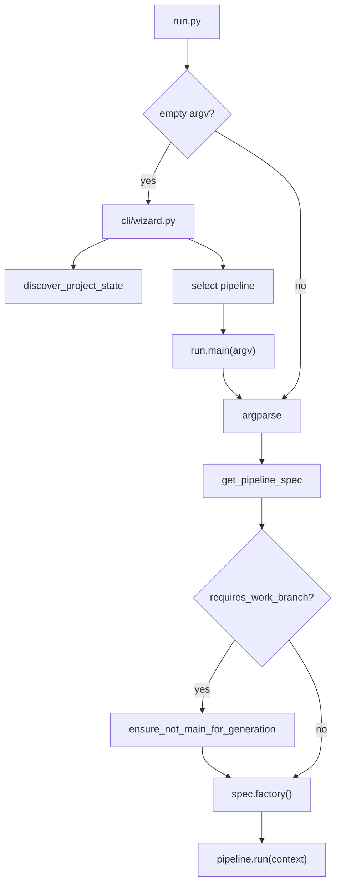
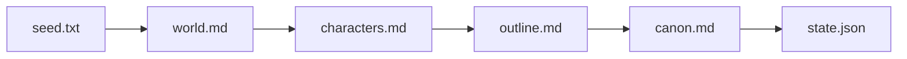
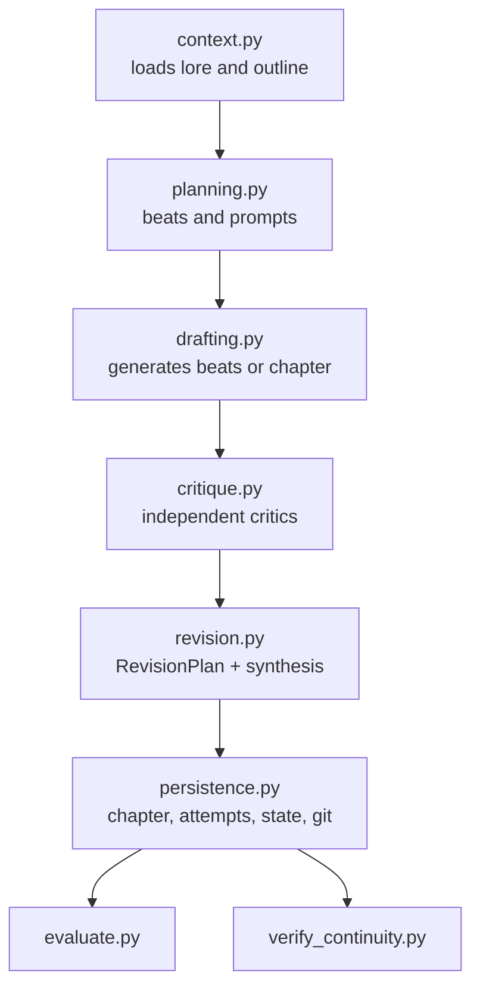
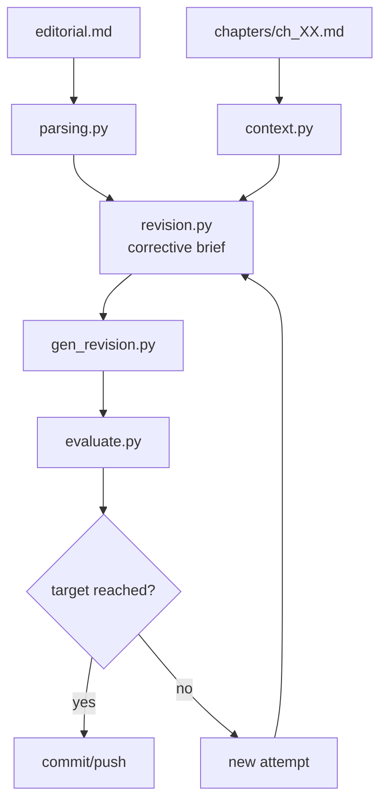

# Pipelines

Autobook pipelines use the Command/Composite pattern defined in
`pipelines/base.py`: each `Pipeline` contains an ordered list of `Step`s, and
each step receives a mutable context dictionary.

## Central Registry

`pipelines/registry.py` declares the available pipelines through
`PipelineSpec`.

| Pipeline | Class | Work branch protected | Relevant flags |
| --- | --- | --- | --- |
| `ideation` | `IdeationPipeline` | Yes | none |
| `foundation` | `FoundationPipeline` | Yes | none |
| `book_generation` | `BookGenerationPipeline` | Yes | `--from-scratch`, `--chapter` |
| `editorial_revision` | `EditorialRevisionPipeline` | Yes | `--chapter` |

All main pipelines require an `autobook/<slug>` branch.

## Entry Flow



## Ideation

Responsibility: turn initial creative input into a usable book seed and initial
state.


Main helpers: `pipelines/ideation_steps/selection.py`.

Common outputs:

- `seed.txt`
- `book_data/MYSTERY.md`
- `book_data/state.json`

## Foundation

Responsibility: generate the structural bibles for the book from `seed.txt`,
`voice.md`, `MYSTERY.md` and `docs/en/others/CRAFT.md`.



Main helpers:

- `foundation_steps/context.py`
- `foundation_steps/persistence.py`

Outputs:

- `book_data/world.md`
- `book_data/characters.md`
- `book_data/outline.md`
- `book_data/canon.md`
- `book_data/state.json`

## Book Generation

Responsibility: generate chapters, critique, revise, evaluate, validate
continuity and persist the best attempt.



Subpackage: `pipelines/book_generation_steps/`.

Important points:

- Chapter count comes from `outline.md`; there is no universal fixed count.
- Beats are used when found; without beats, the pipeline falls back to a full
  chapter draft.
- Critiques are converted to `CriticReport` and consolidated into
  `RevisionPlan`.
- Attempts, critiques and plans are archived under `logs/generation_attempts/`.
- `state.json` records sequential progress.

## Editorial Revision

Responsibility: apply revisions driven by `book_data/editorial.md`, evaluate
attempts and keep the best result.



Subpackage: `pipelines/editorial_revision_steps/`.

Main helpers:

- `config.py`
- `context.py`
- `evaluation.py`
- `parsing.py`
- `revision.py`

## `requires` And `produces` Metadata

`Step` and `Pipeline` support optional metadata:

```python
Step("Name", description="...", requires=["outline"], produces=["chapter"])
```

They exist for future discovery and documentation. In the current state, they
are not blocking dependency validators.
