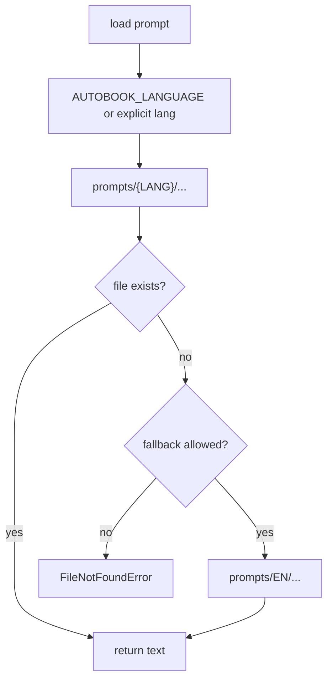

# Prompts

Autobook uses external prompt files whenever the text is part of the system's
editorial behavior. This makes it possible to adjust agents, tools and
evaluators without changing Python code.

## Layout

```text
prompts/
  EN/
    agents/
    evaluation/
    foundation/
    ideation/
    tools/
    draft_chapter_system.txt
    draft_chapter_user.txt
    gen_revision_system.txt
    gen_revision_user.txt
    continuity.json
    editorial.json
    slop.json
    directives.txt
  PT-BR/
    ...
```

## Language Resolution



Relevant variables:

- `AUTOBOOK_LANGUAGE`: active language, for example `EN` or `PT-BR`.
- `AUTOBOOK_GENRE`: genre used by `GenreStrategy`.

## Agents

Agent prompts follow:

```text
prompts/{LANG}/agents/{role}.txt
```

Current roles:

- `drafting`
- `stylist`
- `technical_editor`
- `canon_critic`
- `style_critic`
- `flow_critic`
- `synthesis`

Agents with placeholders validate the template when the file exists. Invalid
placeholders raise an explicit error to avoid silently falling back over a
broken prompt.

## Foundation

Foundation pipeline prompts live in:

```text
prompts/{LANG}/foundation/
```

They cover world, characters, outline and canon. The pipeline also uses
`docs/en/others/CRAFT.md` as a narrative craft reference.

## Evaluation

Evaluation prompts live in:

```text
prompts/{LANG}/evaluation/
```

`evaluate.py` delegates assembly and parsing to the `evaluation/` package,
which combines:

- mechanical slop signals;
- LLM judge;
- JSON normalization;
- report writing.

## Tools

Auxiliary scripts externalize prompts in:

```text
prompts/{LANG}/tools/
```

This group covers tools such as comparison, adversarial editing, audiobook and
voice fingerprint when applicable.

## Legacy Language Files

Some scripts still use direct language files under `prompts/{LANG}/` for
compatibility:

| File | Use |
| --- | --- |
| `draft_chapter_system.txt` | Base system prompt for legacy/auxiliary drafting. |
| `draft_chapter_user.txt` | User template for drafting. |
| `gen_revision_system.txt` | System prompt for `gen_revision.py`. |
| `gen_revision_user.txt` | User prompt for `gen_revision.py`. |
| `continuity.json` | Continuity configuration. |
| `editorial.json` | Editorial configuration. |
| `slop.json` | Mechanical slop rules. |
| `directives.txt` | General editorial directives. |

## Best Practices

- Do not put specific book names in general prompts.
- Avoid undocumented or unused placeholders.
- Prefer JSON when the prompt asks for structured output.
- Use `EN` fallback only for language fallback, not to hide errors in an
  existing template.
- Add tests when a new prompt introduces a format contract.
