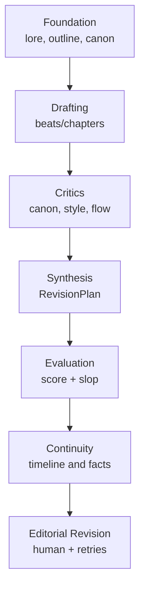

# Quality Analysis

Autobook treats quality in layers. No single layer guarantees a good book; the
goal is to combine planning, specialized agents, automated evaluation,
continuity and editorial revision.

## Layers

## Evaluated Signals

| Signal | Source |
| --- | --- |
| Canon coherence | `canon_critic`, `verify_continuity.py`, evaluation. |
| Voice and style | `style_critic`, genre rules, `voice.md`. |
| Rhythm and flow | `flow_critic`, outline/beats, evaluation. |
| Mechanical slop | `prompts/{LANG}/slop.json`, `evaluation/`. |
| Editorial adherence | `book_data/editorial.md`, `editorial_revision`. |
| Technical repetition | `skills/redundancy_detector.py` when used. |

## Structured Feedback

Critiques are normalized to:

- `CriticFinding`
- `CriticReport`
- `RevisionPlan`
- `VerificationReport`

These contracts live in `writing/feedback.py` and make future revisions less
dependent on free text.

## Known Limits

- Cheap models may lose style in long chapters; this is why the flow uses
  beats, critics and sequential synthesis.
- LLM JSON output still needs robust fallback.
- Some auxiliary tools are experimental and should not be confused with the
  main pipeline quality guarantee.

## Future Improvements

1. Make all critics emit native JSON consistently.
2. Add per-book style memory before chapter generation.
3. Use approved samples as rhythm references for each book.
4. Create qualitative regression dashboards by chapter.
