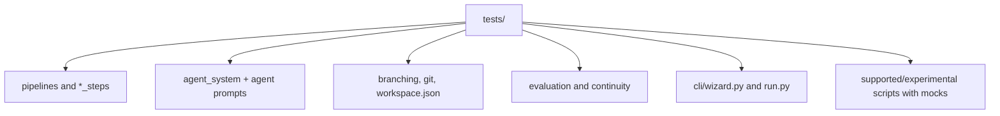

# Tests And Technical Quality

Autobook's modern baseline is the suite under `tests/`. It covers pipelines,
helpers, prompts, agents, workspace, supported scripts and regression flows
without depending on real LLM calls or destructive Git commands.

## Commands

```bash
uv run --group dev ruff check .
uv run --with pytest pytest tests -q
uv run --with pytest pytest legacy/tests -q
git diff --check
```

Expected result:

- Ruff without errors.
- `320 passed` in `tests/`.
- `legacy/tests`: no tests collected and exit code 0.
- `git diff --check`: no invalid whitespace.

## Modern Suite Scope



## Test Categories

| Category | Examples |
| --- | --- |
| Entry | `test_run_entrypoint.py`, `test_wizard.py` |
| Pipelines | `test_*_pipeline.py`, `test_*_steps.py` |
| Book generation | context, planning, drafting, critique, revision and persistence. |
| Agents | registry, factory, external prompts and fallback. |
| Workspace | branches, Git adapter and `workspace.json`. |
| Evaluation | JSON parsing, prompts, slop and reports. |
| Continuity | verification and finding resolution. |
| Scripts | supported behavior without network or real LLM calls. |

## Legacy Tests

`legacy/tests` does not represent the current system. The folder is ignored by
`pytest.ini` and has `legacy/tests/conftest.py` so direct execution returns
success. This prevents historical imports from breaking CI or local audits.

## Standard For New Tests

- Mock LLM, subprocess and Git.
- Prefer testing pure helpers in `*_steps/`.
- Add a light integration test when a public contract changes.
- Avoid fixtures that write outside `tmp_path`.
- Do not depend on real `book_data/` or `chapters/` artifacts.
