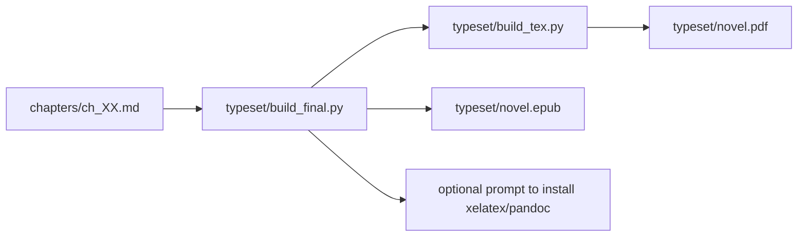

# Typesetting

Typesetting is the supported final step for turning generated chapters into
distributable artifacts. The main command is:

```bash
uv run python typeset/build_final.py
```

By default it generates PDF and EPUB:

```text
typeset/novel.pdf
typeset/novel.epub
```

Each format can also be generated separately:

```bash
uv run python typeset/build_final.py --format pdf
uv run python typeset/build_final.py --format epub
uv run python typeset/build_final.py --format all
```

The command checks external dependencies before compiling. PDF requires
`xelatex`; EPUB requires `pandoc`. If a tool is missing, the terminal shows the
suggested install command and asks whether it should run it:

```bash
sudo apt install -y texlive-xetex pandoc
```

Installation options:

```bash
uv run python typeset/build_final.py --yes
uv run python typeset/build_final.py --no-install
```

`--yes` installs missing dependencies without another prompt. `--no-install`
does not install anything and fails with a clear message if a tool is missing.

## Intermediate Generation

The script below only prepares the intermediate LaTeX files:

```bash
uv run python typeset/build_tex.py
```

It reads chapters from `chapters/` and generates:

```text
typeset/chapters_content.tex
typeset/book_meta.tex
```

`book_meta.tex` is also generated automatically. It contains the book metadata
used by `typeset/novel.tex`; do not edit it manually.

## Book Metadata

The title is required. It comes from:

1. `AUTOBOOK_TITLE`, when defined; or
2. `book_data/workspace.json`, created by the wizard.

Optional metadata:

| Field | Variable | Alternative file |
| --- | --- | --- |
| Author | `AUTOBOOK_AUTHOR` | `book_data/author.md` |
| Subtitle | `AUTOBOOK_SUBTITLE` | none |
| PDF subject | `AUTOBOOK_PDF_SUBJECT` | none |
| Epigraph | `AUTOBOOK_EPIGRAPH` | `book_data/epigraph.md` |
| Colophon | `AUTOBOOK_COLOPHON` | `book_data/colophon.md` |
| End matter | `AUTOBOOK_END_MATTER` | `book_data/end_matter.md` |
| Main font | `AUTOBOOK_MAIN_FONT` | `book_data/main_font.md` |
| Fallback font | `AUTOBOOK_FALLBACK_FONT` | `book_data/fallback_font.md` |
| EPUB language | `AUTOBOOK_EPUB_LANG` | uses `AUTOBOOK_LANGUAGE` or `en` |

Variables can be defined in the process environment or in the project root
`.env` file. For shell and `python-dotenv` compatibility, use the format
`VARIABLE_NAME="value"`, without spaces before or after `=`.

If the title is not defined, `typeset/build_tex.py` fails with a message
instructing the user to create a workspace through the wizard or define
`AUTOBOOK_TITLE`.

To manually generate a PDF from `typeset/novel.tex`, use XeLaTeX. The template
uses `fontspec`, which does not compile with `latex` or `pdflatex`.

```bash
uv run python typeset/build_tex.py
cd typeset
xelatex -interaction=nonstopmode novel.tex
```

The `typeset/latexmkrc` file forces `latexmk` to use XeLaTeX when `latexmk` is
installed. In visual TeX tools, set the compiler to `XeLaTeX` or `LuaLaTeX`.

If `AUTOBOOK_MAIN_FONT` or `book_data/main_font.md` points to a font that is not
installed, the template uses the fallback font. If the user does not define a
fallback, `typeset/build_tex.py` uses `DejaVu Serif`, which covers accents and
common scientific symbols well. If that font is also unavailable, the template
falls back to `Latin Modern Roman`, which ships with TeX Live.

## Flow



## Current State

- Final PDF and EPUB generation is supported through `typeset/build_final.py`.
- Final production depends on external tools: XeLaTeX for PDF and Pandoc for
  EPUB. The final command can guide and run terminal installation on
  environments with `apt` and `sudo`.
- `novel.tex` must not contain fixed title, author, epigraph or colophon text
  from a specific book; these values must come from `book_meta.tex`.
- Test artifacts that existed in this folder were removed from operational
  documentation.

## Evolution Rules

- Add tests for complex markdown, accents, empty chapters and file order.
- Do not mix final artifact generation with narrative generation in the same
  step.
