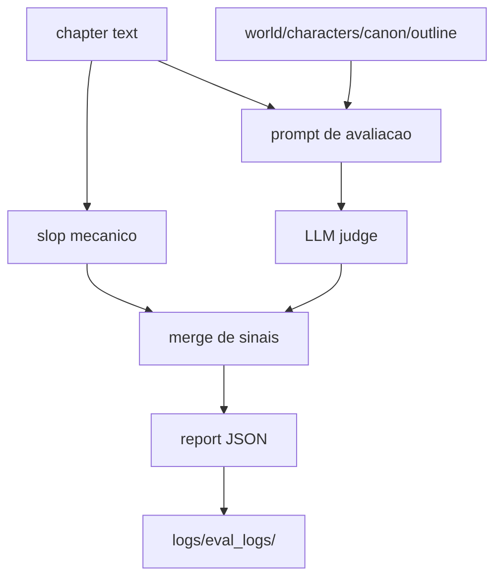

# Avaliacao

A avaliacao mede qualidade textual, aderencia a lore, continuidade local e
sinais mecanicos de prose slop. `evaluate.py` e a fachada/CLI; a implementacao
principal fica no pacote `evaluation/`.

## Fluxo



## Componentes

| Modulo | Responsabilidade |
| --- | --- |
| `evaluate.py` | CLI/fachada para avaliacao de capitulos. |
| `evaluation/` | Pacote com prompts, parsing, scoring e reports. |
| `evaluation/json_utils.py` | Parsing JSON tolerante e reutilizavel. |
| `prompts/{LANG}/evaluation/` | Prompts localizados do juiz. |
| `prompts/{LANG}/slop.json` | Regras mecanicas de slop por idioma. |
| `logs/eval_logs/` | Saidas JSON de avaliacao e continuidade. |

## Uso

```bash
uv run python evaluate.py --chapter 3
uv run python evaluate.py --chapter-file chapters/ch_03.md
```

As pipelines chamam avaliacao internamente, entao o uso manual e mais comum
para auditoria ou depuracao.

## Contrato De Saida

O report pode conter:

- score geral;
- dimensoes de qualidade;
- diagnosticos textuais;
- achados mecanicos de slop;
- metadados de tentativa/capitulo.

Scripts consumidores devem tratar campos ausentes com tolerancia, pois modelos
menores podem devolver JSON parcial.

## Relacao Com Book Generation

Na pipeline `book_generation`, a avaliacao acontece apos a sintese revisada. O
resultado e arquivado junto dos artefatos da tentativa. Se uma avaliacao falhar
depois do arquivamento base, a tentativa ainda fica preservada para diagnostico.

## Relacao Com Editorial Revision

`editorial_revision` usa avaliacao em loop corretivo. O pipeline tenta atingir
metas de qualidade e slop; quando nao consegue, preserva a melhor tentativa
conhecida.
