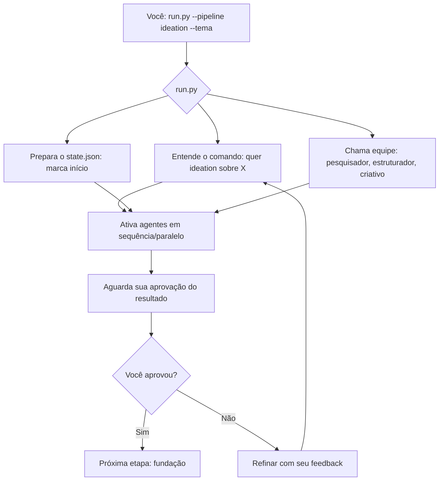
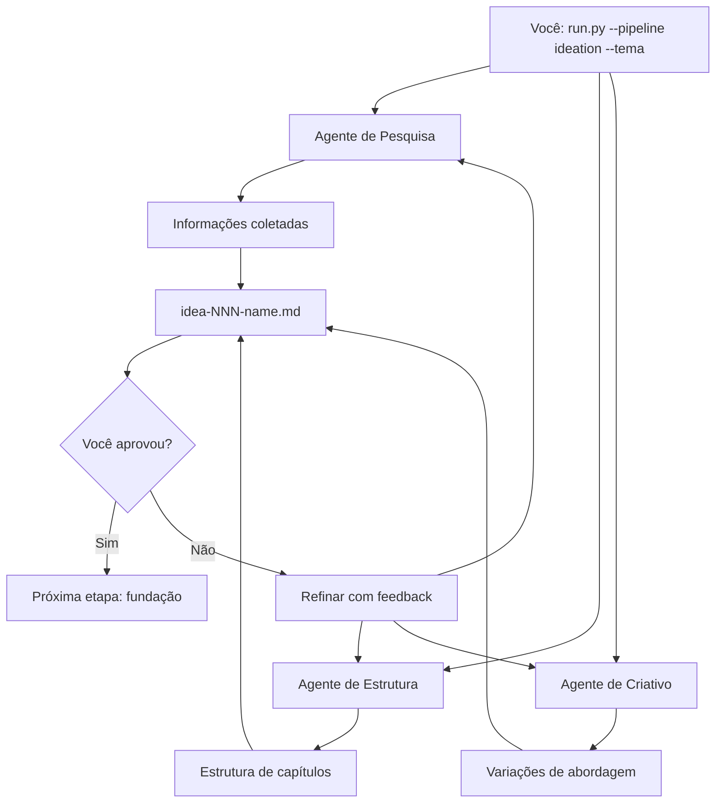
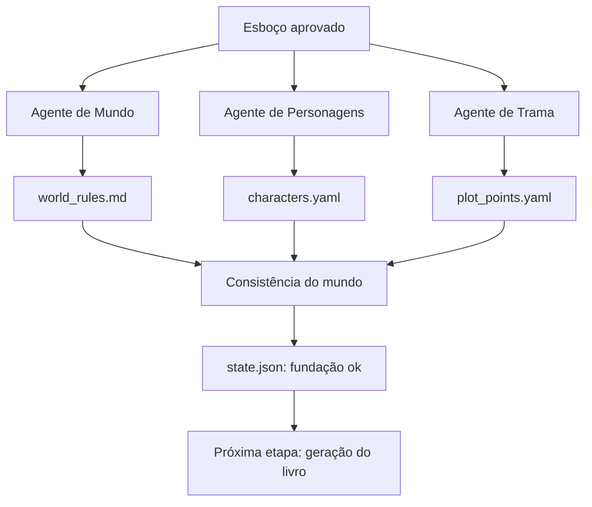
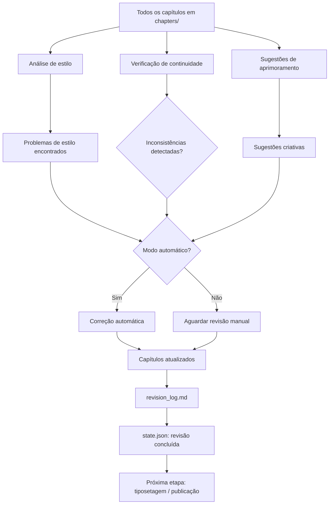
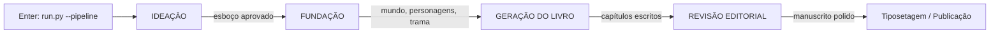

# Guia Completo dos Fluxos das Pipelines do Autobook

## Abertura: Vamos Desmistificar o Que Acontece Depois do Seu Enter

E aí, preparado para descobrir o que realmente acontece quando você digita aquele comando no terminal e aperta Enter?  
Sabe aquela mistura de curiosão e levezinha ansiedade enquanto olha para as linhas de código rolando na tela?  
Hoje vamos transformar essa esperança em clareza cristalina. Vamos embarcar juntos numa jornada passo a passo, desde o primeiro milissegundo após seu comando até ver aquele primeiro capítulo tomando forma.

Esquece a imagem de um cérebro gigante de AI trabalhando sozinho numa nuvem mágica.  
O Autobook é mais como um escritório de escrita criativa de alto nível:  
- Você é o diretor editorial (sim, **você** toma as decisões importantes)  
- Temos agentes especializados pesando cada palavra como verdadeiros artesãos  
- Cada equipe tem seu quadro de avisos (arquivos de estado) para se comunicar  
- Nada avança sem sua aprovação explícita - você é o chefe de fato  

Vamos começar pelo começo mesmo: o que acontece nos **primeiros segundos** depois do seu Enter mágico?

### 🎯 Primeiro Momento: O Comando Sai dos Seus Dedos

Imagine que você acabou de ter uma inspiração brilhante:  
*"E se escrevesse um romance onde um detetive histórico resolve crimes usando uma IA ética como parceira, não como vilã?"*  

Você abre o terminal, navega até a pasta do autobook e digita:  
```bash
run.py --pipeline ideation --tema "Detetive histórico com parceira de IA ética"
```
E aí... Enter. O que acontece agora?

#### 🔍 O Que o `run.py` Faz Realmente (Não é Mágica, é Organização)

Pense no `run.py` como o **recepcionista e diretor de orquestra** deste escritório criativo. Ele não escreve nem pesquisa nada sozinho. Seu trabalho é:  

1. **Entender seu pedido**  
   → Lê o que você escreveu depois de `--pipeline` (aqui: "ideation")  
   → Captura seu `--tema` ("Detetive histórico com parceira de IA ética")  
   → Verifica se tem tudo que precisa pra começar (configurações, ambiente ok)  

2. **Preparar o terreno**  
   → Cria ou atualiza o `state.json` (nosso caderno de anotações compartilhado)  
   → Marca: "Iniciando pipeline de ideação para tema: Detetive histórico com parceira de IA ética"  
   → Define o ponto de partida: estamos no estágio zero, aguardando pesquisa inicial  

3. **Chamar a equipe certa**  
   → Como você pediu "ideation", ele sabe exatamente quais agentes acionar:  
     - Pesquisador (vai buscar informações relevantes)  
     - Estruturador (vai organizar aquelas informações em esboço)  
     - Criativo (vai gerar variações ousadas de abordagem)  
   → É como um chefe de cozinha chamando o sous-chef, o sauveteur e o pâtissier para um prato específico  

4. **Dar o sinal de partida**  
   → Ativa cada agente em sequência (ou em paralelo, quando faz sentido)  
   → Fica de olho no `state.json` para saber quando cada etapa termina  
   → Para e espera **sua** aprovação antes de avançar - você é o chefe, lembra?  

### 📋 O Primeiro Diagram: O Papel do `run.py` como Diretor de Orquestra

Vamos visualizar esse momento inicial com um simples fluxograma. Lembre-se: **tudo o que é essencial aqui já está explicado acima** - este diagram é apenas um apoio visual para quem gosta de ver o fluxo.



*Legenda: Este diagram mostra como o `run.py` orquestra o início da pipeline. Todas as decisões e exemplos estão explicados em texto acima - o diagram só ajuda a visualizar a sequência.*

### 💡 Por Que Esse Primeiro Momento Importa

Entender esse início é como saber como um carro liga antes de aprender a dirigir:  
- Se algo travar aqui, você sabe onde olhar (logs do `run.py`, estado inicial)  
- Você percebe que **nada acontece sem seu input claro** - o sistema não adivinha, espera seu comando  
- Fica evidente que você está no controle: é seu `tema` que guia toda a pesquisa seguinte  
- E o mais importante: **você vê que não é um monólito de código**, mas uma equipe bem definida trabalhando em conjunto  

Pronto para ver o que essa equipe especializada realmente faz? Vamos mergulhar na primeira pipeline: **ideaçāo**, onde sua ideia solta começa a tomar forma de esboço de livro.  

*(Próxima seção: Pipeline de IDEAÇÃO - Do zero ao esboço do livro)*
## Pipeline de IDEAÇÃO: Do zero ao esboço do livro (15-20 min de leitura)

### 🌱 Cenário de exemplo: "E se escrevesse um romance onde um detetive histórico resolve crimes usando uma IA ética como parceira, não como vilã?"

Você acabou de chegar do trabalho e tem essa ideia solta. Vamos ver como o autobook transforma essa faísca em um esboço estruturado.

### 🔬 Passo a passo, linha a linha (com exemplos concretos)

#### 1. Você digita o comando
```bash
run.py --pipeline ideation --tema "Detetive histórico com parceira de IA ética"
```
→ O `run.py` lê os argumentos, confirma que a pipeline é "ideation" e guarda seu tema no `state.json` como ponto de partida.

#### 2. Ativação do agente de pesquisa
O agente de pesquisa não sai googling aléatoriamente. Ele consulta suas fontes configuradas (pode incluir arXiv, blogs técnicos, bancos de dados históricos, etc.) e busca por:
- "IA na ficção policial histórica"
- "Detetives históricos com tecnologia"
- "Ética de IA em narrativas de investigação"
- Exemplo de saídareal (simplificado): um arquivo temporário com 5 links e resumos como:
  - Artigo sobre como a Scotland Yard usava análise de dados no século XIX.
  - Blog sobre romances onde IA auxilia detetives sem substituir a intuição humana.
  - Paper sobre viés algorítmico em sistemas de previsão de crimes.

#### 3. Ativação do agente de estrutura
Pesquisa em mãos, o agente de estrutura pensa: "Para um livro de 12 capítulos, que tal 3 atos?" e propõe:
- **Ato 1: O chamado** – O detetive recebe um caso estranho envolvendo um artefato histórico com marcas de tecnologia futura.
- **Ato 2: A parceria** – Ele tenta entender a IA, descobre suas limitações e começa a confiar em suas análises de padrões.
- **Ato 3: O confronto** – O vilão usa uma IA maliciosa para cobrir seus rastros; a batalha final combina dedução humana e contra‑medidas da IA ética.
O agente produz um esboço provisório em markdown, algo como:
```markdown
# Título provisório: O Algoritmo de Victória

## Ato 1 – O chamado
- Capítulo 1: O caso do relógio parado
- Capítulo 2: Uma visita ao arquivista
- Capítulo 3: O primeiro sinal de anomalia

## Ato 2 – A parceria
- Capítulo 4: Conversando com a máquina
- Capítulo 5: Padrões no caos
- Capítulo 6: O alerta falso

## Ato 3: O confronto
- Capítulo 7: O rastro do vilão
- Capítulo 8: Engano e contra‑engano
- Capítulo 9: A decisão final
```

#### 4. Ativação do agente de criatividade
Agora o agente de criatividade ousa dar um passo além e gera **três variações** de abordagem para você escolher:
1. **Variação A – O detetive cego**: A IA é sua "visão" através de sensores urbanos; ele depende totalmente dela para navegar, mas questiona se está perdendo sua intuição.
2. **Variação B – IA suspeita inicialmente**: A IA chega como ferramenta oficial, mas o detetive desconfia de suas origens; só depois de provar sua ética ele a aceita como parceira.
3. **Variação C – História alternativa**: Em vez de detetive histórico, o protagonista é um historiador que consulta documentos com ajuda de IA para descobrir um complô tecnológico no passado.

Cada variação vem com prós e contras rápidos, como:
- Variação A: forte gancho visual, mas risco de tornar o protagonista muito dependente da tecnologia.
- Variação B: adiciona tensão inicial, porém pode atrasar a colaboração.
- Variação C: muda o foco, exigindo mais pesquisa de fontes históricas.

#### 5. Ponto de decisão crítico: sua aprovação
Após gerar o esboço e as variações, o sistema pausa e cria o arquivo `idea-NNN-name.md` (onde NNN é um número sequencial e name é um slug do seu tema). Esse arquivo contém:
- O esboço escolhido (ou todas as variações, se você quiser ver).
- Um espaço para você escrever feedback diretamente no markdown.
- Instruções: "Leia, comente e salve. Quando estiver pronto, me avise."

O sistema então **espera sua aprovação explícita**. Você pode:
- **Aprovar como está**: basta dizer "sim" ou salvar o arquivo sem alterações.
- **Solicitar ajustes**: comentar diretamente no arquivo (ex: "Gostaria de mudar o Ato 2 para focar mais na política da época") e salvar.
- **Rejeitar e recomeçar**: enviar um novo tema ou pedir que a equipe pesquise por outra abordagem.

Se você disser "não" ou deixar comentários, o agente de criatividade recebe seu feedback, refina as variações e gera um novo conjunto, voltando ao passo 4. Esse loop continua até você dizer "sim".

#### 6. Saída: o esboço aprovado
Quando você aprova, o sistema marca no `state.json`: " Ideation concluída – esboço aprovado para: Detetive histórico com parceira de IA ética" e libera a próxima etapa: **fundação**.

### 📊 Diagram de apoio: Fluxo da ideaçāo

Lembre-se: todo o essencial já está explicado acima; este diagram apenas ajuda a visualizar a sequência.



*Legenda: Mostra o trabalho paralelo dos três agentes e o loop de refinamento até sua aprovação.*

### 💡 Por Que Essa Pipeline Importa

Entender a ideaçāo é fundamental porque:
- Define o **tom e o gênero** do livro inteiro; mudar depois exige reescrever muito.
- Mostra como o sistema combina **pesquisa factual**, **estrutura narrativa** e **criatividade ousada** – três pilares de boa ficção.
- Deixa claro que **você está no controle**: nenhuma ideia avança sem seu "ok".
- Se algo travar aqui (por exemplo, falta de fontes), você sabe onde olhar: logs do agente de pesquisa ou o arquivo temporário de dados.

Pronto para ver como esse esboço vira um mundo consistente? Vamos à **pipeline de fundação**, onde construímos as regras, personagens e trama que deixarão sua história sólida.

*(Próxima seção: Pipeline de FUNDAÇÃO - Transformando o esboço em mundo sólido)*

## Pipeline de FUNDAÇÃO: Transformando o esboço em mundo sólido (15-20 min de leitura)

### 🏗️ Cenário de exemplo: Você aprovou o esboço do livro sobre IA e detetives. Agora precisa construir o mundo onde isso faz sentido.

A ideia é boa, mas para que a história seja credível, precisamos definir **como a sociedade funciona em 2045**, **que regras regem o uso de IA** e **quem são os personagens** que vão viver esse conflito.

### 🔬 Passo a passo, linha a linha (com exemplos concretos)

#### 1. Entrada: o esboço aprovado + configurações de mundo padrão
O sistema lê o arquivo `idea-NNN-name.md` que você aprovou e carrega algumas premissas básicas do `config.yaml` (por exemplo: nível tecnológico padrão, tom de narrativa desejado).

#### 2. Ativação do agente de mundo (world‑builder)
Este agente define as **regras do universo** onde a história se passa. Ele responde a perguntas como:
- **Qual é o ano exato?** → Decide por 2047, depois de um marco regulatório chamado "Acordo de Genève sobre IA Autônoma".
- **Como a IA é regulada?** → Todo sistema de IA acima de certo nível de autonomia precisa de licença da Agência Global de IA (AGIA); uso não licenciado é crime.
- **Que tecnologia está disponível?** → Implantes neurais são comuns para aumentar memória, mas apenas versões "passivas" (sem tomada de decisão autônoma) são legais para civis.
- **Qual o estado das forças policiais?** → Detetives podem requisitar acesso a dados de vigilância municipal mediante ordem judicial; há uma unidade especial chamada "Cibercrimes Históricos".
Exemplo de saída: um arquivo `book_data/world_rules.md` contendo:
```markdown
# Regras do Mundo (2047)

## IA e Legislação
- Licença AGIA obrigatória para IA autônoma de nível 3+.
- Implantes civis limitados a funções de sensoriamento e recuperação de memória.
- Uso de IA em investigação policial requer warrant e supervisão humana.

## Sociedade
- Grande parte das cidades tem rede de sensores pública (CitySense) que agrega tráfego, poluição e ruído.
- História é ensinada com fontes primárias digitais; acesso a arquivos requer credencial acadêmica.
```

#### 3. Ativação do agente de personagens
Com o mundo definido, esse agente cria **detetive, parceira de IA e antagonistas** que sejam compatíveis com aquelas regras.
- **Detetive**: chamada Clara Ribeiro, 38 anos, ex‑oficial da polícia que deixou a força após um incidente envolvendo uso ilegal de IA. Tem um implante de memória passivo (apenas grava, não processa) que herdou do avô.
- **Parceira de IA**: chamada "Âmbar", um modelo de linguagem de nível 2 licenciado como assistente de pesquisa. Não pode tomar decisões autônomas, mas é excelente em cruzamento de dados e geração de hipóteses.
- **Vilão**: Silas Vale, um historiador desiludido que usa uma IA de nível 4 contrabandeada para alterar registros históricos e encobrir crimes de saque de sítios arqueológicos.
Cada personagem vem com um perfil em `book_data/characters.yaml`, por exemplo:
```yaml
detetive:
  nome: Clara Ribeiro
  idade: 38
  passado: ex‑policial, deixou a força após incidente com IA não licenciada
  implante: memoria_passivo_registro (grava áudio e vídeo, não processa)
  traumas: desconfiança de autoridades, culpa por não ter evitado o acidente
  motivacao: provar que a tecnologia pode servir à justiça sem perder a humanidade
ia_parceira:
  nome: Âmbar
  modelo: LLM‑Research‑v2
  nivel: 2 (licenciado como assistente)
  limitações: não pode agir de forma autônoma; requer supervisão humana para decisões operacionais
vilao:
  nome: Silas Vale
  ocupação: historiador (não credenciado)
  ia_contrabandeada: modelo fronteira‑4 (nível 4, sem licença)
  objetivo: reescrever narrativas históricas para valorizar determinado grupo e esconder saques ilegais
```

#### 4. Ativação do agente de trama (plot‑weaver)
Pega o esboço de capítulos e o mundo + personagens e detalha **como cada ponto da história se encaixa nas regras estabelecidas**.
- No Ato 1, o artefato estranho é um relógio de bolso com circuitos microscópicos que não existem em 2047 → leva a suspeita de viagem no tempo ou tecnologia anacrônica.
- O agente verifica: isso viola a regra de "tecnologia anacrônica é proibida"? Sim, então cria um gancho: o relógio é, na verdade, um protótipo perdido de um laboratório secreto que testava IA quântica.
- No Ato 2, a IA Âmbar ajuda Clara a decifrar padrões nos logs do CitySense, mas ela só pode fazer isso após obter um warrant (respeitando a regra de supervisão humana).
- No Ato 3, o vilão usa sua IA ilegal para apagar registros de saque; a prova contra ele vem de backups não conectados à rede pública (uma brecha que o agente de trama destaca como fraqueza do vilão).
O resultado é um arquivo `book_data/plot_points.yaml` que lista, para cada capítulo, os **beats** da história, quais **personagens** estão envolvidos e quais **regras do mundo** são testadas ou destacadas.

#### 5. Saída: mundo, personagens e trama definidos
Todos os arquivos são salvos em `book_data/`:
- `world_rules.md` – descrição clara do ambiente e leis.
- `characters.yaml` – perfil detalhado de cada figura importante.
- `plot_points.yaml` – mapa de como a história se desenrola dentro das regras criadas.
O `state.json` é atualizado para: "Fundação concluída – mundo, personagens e trama definidos".

### 📊 Diagram de apoio: Relações entre os elementos da fundação



*Legenda: Mostra como cada agente produz um artefato que alimenta a consistência geral; todos são necessários antes de avançar.*

### 💡 Por Que Essa Pipeline Importa

A fundação é o **alimpo da consistência**: sem ela, você risco de:
- **Inconsistências de poder**: um personagem faz algo que as regras do mundo proibiram três capítulos antes.
- **Quebra de suspensão da descrença**: leitores percebem que a tecnologia ou a sociedade mudam de regras conforme a conveniência da trama.
- **Trabalho retrabalho**: mudar uma regra no meio da escrita exige revisão de inúmeros trechos.
Ao investir tempo aqui, você garante que cada cena, cada diálogo e cada reviravolta sejam **credíveis dentro do universo que você criou**. Além disso, deixa claro que o sistema não apenas gera texto, mas **constroi um cenário pensável**, assim como um bom romance de ficção científica ou histórico faz.

Pronto para ver como esse mundo vira palavras reais? Vamos à **pipeline de geração do livro**, onde escrevemos capítulo por capítulo, usando exatamente essas regras.

*(Próxima seção: Pipeline de GERAÇÃO DO LIVRO - Escrevendo capítulo por capítulo)*

## Pipeline de GERAÇÃO DO LIVRO: Escrevendo capítulo por capítulo (20-25 min de leitura)

### 📖 Cenário de exemplo: Você ama o mundo e os personagens criados. Hora de escrever o primeiro capítulo.

Agora que temos regras, personagens e trama definidos, é hora de colocar a história no papel. Essa pipeline é iterativa: cada ciclo produz um capítulo, que passa por pesquisa, redação e revisão interna antes de ser considerado pronto.

### 🔬 Passo a passo, linha a linha (com exemplos concretos)

#### 1. Você dispara a geração (pode ser capítulo específico ou todos)
Você pode escolher duas abordagens:
- **Seletivo**: `run.py --pipeline book_generation --capitulo 1` – produz apenas o capítulo 1.
- **Lote automático**: `run.py --pipeline book_generation` – o sistema vai de capítulo 1 até o último, parando apenas se você quiser revisar manualmente após cada um.

Vamos supor que você queira o capítulo 1: "O caso do relógio parado".

#### 2. Etapa de pesquisa aprofundada
Antes de escrever, o agente de pesquisa mergulha fundo no contexto específico daquele capítulo.
- Pergunta: "Que tipo de crimes envolvendo relógios antigamente ocorriam em Londres por volta de 1890?" (se o capítulo tiver um flashback) ou "Que tecnologia de sensores urbanos existiria em 2047 que pudesse detectar anomalia em um objeto metálico pequeno?"
- Ele consulta fontes históricas (arquivos digitais do século XIX, bancos de dados de crimes antigos) e técnicas (especificações de sensores CitySense, papers sobre detecção de anomalia electromagnética).
- Exemplo de saída: um resumo de pesquisa salvo em `temp/research_ch_01.md`:
  ```markdown
  # Pesquisa para Capítulo 1

  ## Contexto histórico
  - Relógios de bolso eram símbolos de status no século XIX; adulteração era rara mas possível por relojoeiros expertos.
  - Em 2047, os pontos de acesso ao CitySense estão em postes de iluminação; cada poste tem câmera de baixa resolução, sensor de som e detector de campos eletromagnéticos fracos.

  ## Lacunas a observar
  - Como um objeto tão pequeno poderia ser detectado pelos sensores atuais? Talvez através de vibração induzida por correntes alternadas se o dispositivo estiver ativo.
  - O vilão poderia estar usando um campo de ocultação? Isso seria tecnologia de nível 5, bem além do contrabandeado esperado.
  ```

#### 3. Redação do rascunho
O agente de escrita pega:
- O esboço do capítulo (do `idea-NNN-name.md` ou do `plot_points.yaml`).
- A pesquisa recém‑coletada.
- Os perfis de personagens (`characters.yaml`).
- As regras do mundo (`world_rules.md`).
E produz um **primeiro rascunho** de aproximadamente 800‑1200 palavras.

Exemplo de trecho realista (em português):
> "Clara ajustou o implante enquanto olhava para o holograma piscando sobre a mesa. O relógio de prata, com suas gravuras florais vitorianas, parecia inocente – até que o sensor de campo do seu dispositivo deu um pico fraco, quase imperceptível, exatamente às 14:03. — Tudo bem, Âmbar? — murmuru‑se, mais para si mesma do que para a IA. — Detectei uma anomalia eletromagnética de baixa intensidade, origem puntual no objeto. Probabilidade de fonte tecnológica não identificada: 72%."
Esse diálogo já mostra:
- Uso do implante (regra de mundo: apenas sensoriamento).
- A IA Âmbar fazendo medição, mas não tomando decisão.
- Tom de investigação clássico com toque de ficção científica.

#### 4. Revisão interna (coerência e regras)
Antes de considerar o capítulo "pronto", ele passa por dois agentes de verificação:
- **Agente de coerência**: verifica se o diálogo combina com a personalidade de Clara (ela é cética, mas não cínica; fala pouco, mas quando fala é direto). Se houver excesso de explicação técnica, pede simplificação.
- **Agente de regras**: checa se qualquer ação descrita viola as regras do mundo. Exemplos de flag:
  - "Clara hackeou o CitySense usando seu implante" → implantes civis não podem fazer isso → bloqueado.
  - "Âmbar decidiu seguir o suspeito por conta própria" → IA nível 2 não pode agir autonomamente → bloqueado.
  - O agente sugere alternativas: "Clara pediu um warrant temporário para acessar os logs do poste 17B; Âmbar analisou os dados e relatou a anomalia."

Se houver problemas, o agente de escrita recebe o feedback e reescreve a trecho problemático. Esse ciclo pode repetir duas ou três vezes até que ambos os agentes dêem "ok".

#### 5. Ponto de parada: salvar capítulo e aguardar feedback (opcional)
Após a revisão interna limpa, o sistema salva o capítulo em `chapters/ch_01.md` (usando numeração com dois dígitos: 01, 02, etc.).
Em seguida, verifica se você deseja revisão manual:
- Se o modo for **automático** (padrão quando não se especifica `--interativo`), o sistema avança diretamente para o próximo capítulo.
- Se o modo for **interativo** ou você passou `--revisao-apos-capitulo`, o sistema pausa e espera você olhar o arquivo, comentar ou aprovar.
Você pode:
- **Aprovar sem mudanças**: basta salvar o arquivo como está.
- **Solicitar ajustes**: comentar diretamente no markdown (ex: "No parágrafo 3, gostaria de mais detalhes sobre o cheiro da biblioteca antiga") e salvar.
- **Pedir reescrita de trecho específico**: marcar com um comentário especial que o agente de escrita lerá na próxima rodada.

Se você deixar feedback, o agente de escrita incorpora suas sugestões e gera uma nova versão do mesmo capítulo, repetindo os passos 2‑4 até que você diga "pronto".

#### 6. Loop: repetir para o próximo capítulo
Se estiver em modo automático, o sistema incrementa o número do capítulo e volta ao passo 2 (pesquisa aprofundada para aquele capítulo). Esse processo continua até que todos os capítulos do esboço estejam em `chapters/` com versões revisadas e aprovadas.

#### 7. Saída: manuscrito completo
Quando o último capítulo é marcado como concluído, o `state.json` recebe: "Geração do livro concluída – todos os capítulos escritos e revisados".
Nesse ponto você tem um manuscrito bruto, mas coerente, pronto para a etapa final: **revisão editorial**.

### 📊 Diagram de apoio: Ciclo por capítulo

```mermaid
flowchart TD
    A[Início do capítulo N] --> B[Pesquisa aprofundada]
    B --> C[Redação do rascunho]
    C --> D[Revisão interna (coerência + regras)]
    D --> E{Passou na revisão?}
    E -->|Não| C
    E -->|Sim| F[Salvar capítulo em chapters/ch_NN.md]
    F --> G{Modo interativo? ou feedback solicitado?}
    G -->|Não| H[Próximo capítulo N+1]
    G -->|Sim| I[Aguardar revisão manual do usuário]
    I --> J{Usuário aprovou?}
    J -->|Não| C
    J -->|Sim| H
    H --> K{Último capítulo?}
    K -->|Não| A
    K -->|Sim| L[state.json: geração concluída]
    L --> M[Próxima etapa: revisão editorial]
```

*Legenda: Mostra o ciclo iterativo por capítulo, incluindo possibilidade de parada para sua revisão manual.*

### 💡 Por Que Essa Pipeline Importa

A geração capítulo a capítulo é onde a história realmente ganha vida, mas também onde é mais fácil perder a consistência se não houver verificações rigorosas. Esse processo garante que:
- **Cada capítulo tenha fundamentação de pesquisa**, evitando achismos e anacronismos bobos.
- **A voz dos personagens permaneça fiel** ao longo de todo o livro (o detetive não começa subitamente a fazer discursos filosóficos se ele é do tipo prático).
- **As regras do mundo sejam respeitadas em cada ação**, impedindo que o protagonista "quebre" o universo só porque a trama precisa de um golpe de sorte.
- **Você tem oportunidades de intervenção** em pontos naturais (após cada capítulo), permitindo que você ajuste o rumo sem ter que reescrever todo o livro depois.
- O sistema não é uma "caixa preta" que joga mil capítulos de uma vez; ele é **meticuloso e transparente**, exatamente como um bom escritor que faz pesquisa, escreve, revisa e pede feedback antes de seguir adiante.

Pronto para polir esse manuscrito até brilhar? Vamos à **pipeline de revisão editorial**, onde afinamos linguagem, eliminamos repetições e garantimos que a leitura seja fluida do início ao fim.

*(Próxima seção: Pipeline de REVISÃO EDITORIAL - Polindo o manuscrito)*

## Pipeline de REVISÃO EDITORIAL: Polindo o manuscrito (10-15 min de leitura)

### ✨ Cenário de exemplo: Todos os capítulos estão escritos. Agora é hora de deixar o livro brilhar.

Você tem 12 capítulos em `chapters/`, cada um com sua identidade, mas ainda precisam funcionar como um **todo coerente**. É como montar um quebra‑cabeça: as peças estão lá, mas a imagem final só aparece quando todas se encaixam.

### 🔬 Passo a passo, linha a linha (com exemplos concretos)

#### 1. Entrada: todos os capítulos em `chapters/`
Você dispara: `run.py --pipeline editorial_revision` (ou deixa que a geração chame automaticamente, dependendo da sua configuração).
O sistema lê todos os arquivos de `chapters/ch_01.md` até `chapters/ch_12.md`.

#### 2. Análise de estilo (stylometry leve)
O agente de estilo percorre **todo o manuscrito** e identifica padrões que podem cansar o leitor:
- **Variedade vocabular**: "Você usou a palavra 'entretanto' 34 vezes. Que tal substituir 10 delas por 'contudo', 'no entanto', 'todavia' ou reestruturar as frases?"
- **Ritmo de parágrafos**: "Os parágrafos do capítulo 7 são todos curtos (2‑3 linhas), enquanto os do capítulo 11 são todos longos (15+ linhas). Isso pode criar uma sensação de disparidade de ritmo."
- **Diálogos**: "O vilão sempre começa suas falas com 'Ora, ora...'. Diversifique para evitar repetição."
- **Adjetivação excessiva**: "Há uma média de 6 adjetivos por parágrafo no capítulo 3. Tente reduzir para 3‑4 para manter a leitura fluida."

O objetivo **não é padronizar a voz**, mas sim garantir **variedade natural**.

#### 3. Verificação de continuidade
O agente de continuidade relê todos os capítulos e cruza informações como:
- **Detalhes físicos dos personagens**: "No capítulo 2, Clara tem olhos castanhos. No capítulo 8, de repente, olhos azuis. Isso é intencional?"
- **Cronologia**: "Se o capítulo 5 se passa numa terça‑feira à noite, o capítulo 6 não pode começar na 'manhã da terça‑feira' — seria antes, não depois."
- **Objetos e acessórios**: "O relógio aparece no capítulo 1, some no 3, e reaparece no 7 sem explicação no meio‑tempo."
- **Sentimentos e motivações**: "Clara confia na Âmbar no capítulo 4, mas volta a tratá‑la como desconhecida no capítulo 5 sem motivo aparente."

Cada inconsistência é marcada com o padrão:
```
[CONTINUIDADE] Capítulo 8, parágrafo 12: "olhos azulos" vs. Capítulo 2: "olhos castanhos"
[CONTINUIDADE] Capítulo 6, linha 3: inconsistência temporal com Capítulo 5
```
E salvo em `temp/revision_issues.md`.

#### 4. Sugestões de aprimoramento (beyond fixing)
Além de corrigir problemas, o agente editorial também faz sugestões criativas:
- "No capítulo 9, há uma tensão crescente entre Clara e o vilão. A cena do grupo poderia ficar mais impactante se você inserisse um flashback breve da briga do capítulo 2 — isso reforçaria o contraste."
- "A transição entre os capítulos 10 e 11 é abrupta: o leitor vai de um confronto direto em uma taverna para um escritório moderno sem transição. Um parágrafo de ponte ajudaria."

Essas sugestões ficam anotadas no `temp/suggestions.md` para você revisar à parte.

#### 5. Correção automática (opcional) vs. revisão manual
Dependendo do modo configurado:
- **Modo automático**: o sistema aplica as correções diretas (troca "entretanto" por sinônimos, ajusta inconsistências óbvias) e gera versões atualizadas dos capítulos marcadas como `chapters/ch_01_revisado.md`.
- **Modo interativo** (recomendado para escritores cuidadosos): o sistema apresenta a lista de problemas e sugestões e **espera você decidir** o que aceitar, o que modificar manualmente e o que ignorar.

Você pode:
- **Aceitar todas**: diz "corrige tudo" e o sistema aplica.
- **Aceitar seletivamente**: marca individualmente quais issues tratar.
- **Ignorar tudo**: decide que o manuscrito está bom como está (às vezes o autor _quer_ aquela inconsistência por razões artísticas que a IA não captou; tudo bem).

#### 6. Saída: manuscrito revisado + log
Quando a revisão é concluída (automática ou interativa):
- Os capítulos atualizados ficam em `chapters/` (sobrescrevendo ou com sufixo `_revisado`, conforme sua preferência).
- Um `revision_log.md` é gerado contendo:
  - Total de problemas encontrados.
  - Quantos foram corrigidos automaticamente.
  - Quantos esperam sua decisão.
  - Lista de sugestões criativas para você considerar.
O `state.json` é atualizado para: "Revisão editorial concluída – manuscrito pronto para tiposetagem ou publicação".

### 📊 Diagram de apoio: Fluxo da revisão editorial



*Legenda: Mostra como as três análises (estilo, continuidade e sugestões) convergem para a correção, com opção de revisão automática ou manual.*

### 💡 Por Que Essa Pipeline Importa

A revisão editorial é o **polimento final** que separa um rascunho de um manuscrito publicável:
- **Linguagem afinada**: elimina repetições, melhora ritmo, mantém a voz consistente.
- **Continuidade garantida**: evita que o leitor pare num detalhe contraditório e perca a imersão.
- **Sugestões criativas**: vai além de "corrigir erros" e oferece ideias para _melhorar_ a narrativa.
- **Transparência**: o log de revisão deixa claro _o que_ foi alterado e _por quê_, para que você tenha a palavra final.
- **Respeito à sua visão artística**: no modo interativo, nada muda sem sua aprovação; o sistema é assistente, não ditador.

---

## Encerramento: O que você aprendeu (e como usar isso na prática)

🎉 **Parabéns!** Você agora sabe exatamente o que acontece desde o momento em que aperta Enter até ver seu manuscrito pronto. Vamos recapitular o caminho completo?

### 🗺️ Mapa da jornada completa



**Ideação**: sua ideia vira esboço estruturado.  
**Fundação**: o esboço vira mundo, personagens e trama.  
**Geração**: o mundo vira capítulo por capítulo, com pesquisa e coerência.  
**Revisão**: tudo é polido para leitura fluida do início ao fim.  

### 📋 Checklist rápido da próxima vez que você sentar para escrever

**Antes de começar:**
- [ ] Tenho um tema ou conceito claro? (1 frase já basta)
- [ ] O `state.json` está limpo ou posso continuar de onde parei?
- [ ] Minhas configurações de pesquisa (fontes, idioma, estilo) estão atualizadas?

**Durante a ideação:**
- [ ] Li o arquivo `idea-NNN-name.md` com calma?
- [ ] As variações criativas fazem sentido para _minha_ história?
- [ ] Dei feedback detalhado se algo não ficou como eu queria?

**Durante a fundação:**
- [ ] As regras do mundo são consistentes com a época e o gênero?
- [ ] Os personagens têm motivações claras e falhas reais?
- [ ] A trama respeita as regras que defini (sem "jeitinho")?

**Durante a geração:**
- [ ] Revisei cada capítulo antes de avançar (se estou no modo interativo)?
- [ ] Pesquisei detalhes específicos que o capítulo precisa (não confiei apenas na memória da IA)?
- [ ] Ajustei trechos que soaram artificiais ou "robóticos"?

**Durante a revisão:**
- [ ] Li o log de mudanças para entender _o que_ foi alterado?
- [ ] Aproveitei as sugestões criativas (não só as correções)?
- [ ] Minha voz autoral está preservada, mesmo depois das correções automáticas?

### 🎯 Próximos passos sugeridos

Agora que você entende _como_ o fluxo funciona, que tal experimentar na prática?
1. **Teste um ciclo completo** com um tema simples (ex: "conto de mistério em 1 página") e acompanhe cada etapa.
2. **Mude um parâmetro** no `config.yaml` (por exemplo, o nível de detalhe da pesquisa) e veja como afeta a saída.
3. **Escreva um capítulo manualmente** e compare com o que o agente gerou — nota diferenças de estilo, ritmo, detalhes?
4. **Adicione suas próprias fontes de pesquisa** para um tema nicho e veja como o sistema incorpora.

### 💬 Palavras finais

Espero que agora, ao ver aquelas linhas de código rolando no terminal, você enxergue não só texto, mas **uma equipe de agentes trabalhando em conjunto para transformar sua inspiração em história concreta**. O Autobook não substitui sua criatividade — ele dá estrutura, fundamentação e consistência para que sua criatividade brilhe sem tropeçar em detalhes que sozinho seriam difíceis de gerir em um projeto tão grande como escrever um livro inteiro.

Boa escrita, e até a próxima jornada literária! 🚀📚
