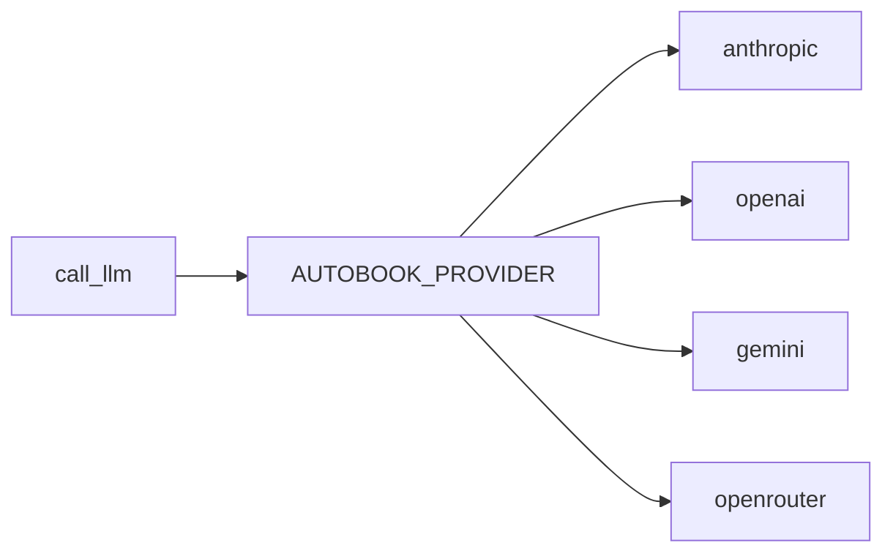

# Cliente LLM

`llm.py` centraliza chamadas a modelos. Ele isola provedores, variaveis de
ambiente, timeout, retry e erros de configuracao.

## Provedores

## Modelos Por Papel

| Variavel | Uso |
| --- | --- |
| `AUTOBOOK_WRITER_MODEL` | Escrita de capitulos, foundation e prompts criativos. |
| `AUTOBOOK_JUDGE_MODEL` | Avaliacao e verificacoes. |
| `AUTOBOOK_REVIEW_MODEL` | Revisao editorial e sintese quando separado. |

O projeto aceita modelos mais baratos, mas compensa com mais etapas,
criticos, retries e validacao estruturada.

## Contratos De Uso

- Nao chamar SDKs diretamente em pipelines.
- Usar `call_llm` ou wrappers existentes.
- Testes devem mockar chamadas LLM.
- Erros de configuracao devem ser propagados de forma clara.

## Custo E Qualidade

O desenho atual favorece volume de interacoes e especializacao de etapas:

1. contexto e planejamento antes da escrita;
2. drafting por beat quando possivel;
3. criticos independentes;
4. sintese sequencial;
5. avaliacao e continuidade.

Isso permite usar modelos intermediarios em partes do fluxo, mantendo um
supervisor ou modelo melhor para etapas de auditoria quando necessario.
