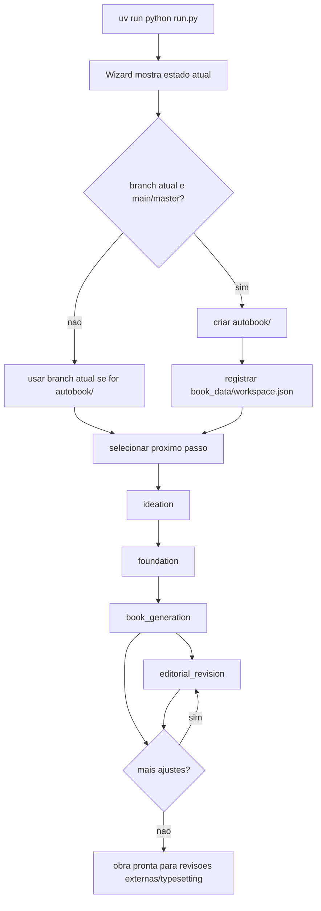
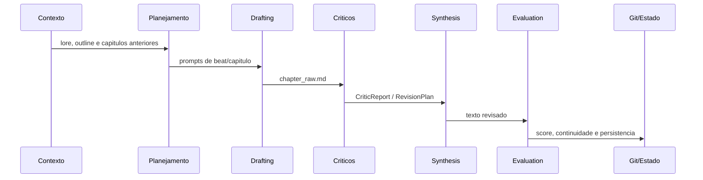

# Guia Completo Dos Fluxos

Este guia descreve a jornada operacional atual para criar e revisar uma obra
com Autobook.

## Fluxo Recomendado



## 1. Preparar Workspace

Na branch principal, rode:

```bash
uv run python run.py
```

O wizard pode sugerir e criar uma branch:

```bash
git switch -c autobook/<slug>
```

Depois da criacao, ele registra metadados em:

```text
book_data/workspace.json
```

## 2. Ideacao

Objetivo: transformar escolhas criativas em uma semente utilizavel.

```bash
uv run python run.py --pipeline ideation
```

Saidas esperadas:

- `seed.txt`
- `book_data/MYSTERY.md` quando aplicavel
- `book_data/state.json`

## 3. Fundacao

Objetivo: gerar as biblias que sustentam o livro.

```bash
uv run python run.py --pipeline foundation
```

Entradas principais:

- `seed.txt`
- `book_data/MYSTERY.md`
- `book_data/voice.md`
- `docs/en/others/CRAFT.md`

Saidas:

- `book_data/world.md`
- `book_data/characters.md`
- `book_data/outline.md`
- `book_data/canon.md`

## 4. Geracao De Capitulos

```bash
uv run python run.py --pipeline book_generation --from-scratch
uv run python run.py --pipeline book_generation --chapter 3
uv run python run.py --pipeline book_generation --chapter 5-7
```

Fluxo interno:



Cada tentativa fica rastreada em `logs/generation_attempts/`.

## 5. Revisao Editorial

Crie ou atualize `book_data/editorial.md` com instrucoes gerais e por capitulo.

```bash
uv run python run.py --pipeline editorial_revision --chapter 4
uv run python run.py --pipeline editorial_revision --chapter 2,5,7
```

O pipeline:

1. interpreta o markdown editorial;
2. monta briefs iniciais e corretivos;
3. chama `gen_revision.py`;
4. avalia cada tentativa;
5. preserva o melhor resultado quando a meta nao e atingida.

## 6. Continuidade

`book_generation` roda `verify_continuity.py` automaticamente ao persistir
capitulos. Para rodar manualmente:

```bash
uv run python verify_continuity.py
```

Para transformar achados de continuidade em uma revisao editorial:

```bash
uv run python resolve_continuity.py
```

## 7. Artefatos Finais

Typesetting e scripts auxiliares existem, mas nao sao uma pipeline unica
fechada. Consulte:

- [../typesetting/typesetting.md](../typesetting/typesetting.md)
- [../scripts/scripts.md](../scripts/scripts.md)

## Regras De Seguranca

- Nao rode pipelines protegidas em `main`, `master` ou `feature/*`.
- Use sempre branch `autobook/<slug>` para obras.
- Nao edite `state.json` manualmente sem entender o cursor de capitulos.
- Trate `legacy/` e `docs/*/others/` como historico, salvo arquivos explicitamente
  referenciados pela documentacao atual.
