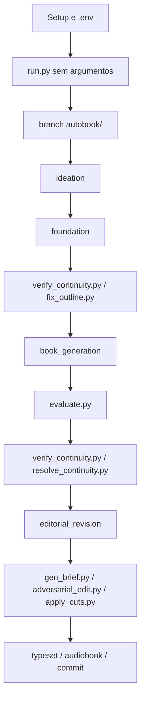

# Comandos De Terminal Do Autobook

Este documento lista os comandos de terminal disponiveis para interagir com o
projeto. Execute os comandos a partir da raiz do repositorio.

Convenções usadas:

- Comando recomendado: `uv run python <script.py>`.
- Pipelines de obra devem rodar em branch `autobook/<slug>`.
- A branch `main` deve ficar limpa, sem arquivos de obra gerados.
- Scripts em `legacy/` sao historicos; use apenas quando houver motivo claro.

## Visao Geral



## Setup E Ambiente

| Comando | Parametros | Uso |
| --- | --- | --- |
| `uv sync` | nenhum | Instala dependencias do projeto. |
| `cp .env.example .env` | nenhum | Cria configuracao local a partir do template. |
| `uv run python tests/test_llm_connectivity.py` | nenhum | Testa a conexao com o modelo configurado. |

Exemplo:

```bash
uv sync
cp .env.example .env
uv run python tests/test_llm_connectivity.py
```

### Variaveis De Ambiente Operacionais

Essas variaveis podem ser definidas no `.env` ou prefixadas no comando.

| Variavel | Padrao | Uso |
| --- | --- | --- |
| `AUTOBOOK_PROVIDER` | `anthropic` em codigo; template usa `openrouter` | Provedor LLM: `anthropic`, `openai`, `gemini`, `openrouter`. |
| `AUTOBOOK_API_BASE_URL` | URL do provider | Base URL alternativa para APIs compativeis. |
| `AUTOBOOK_WRITER_MODEL` | default do provider | Modelo para escrita e geracao criativa. |
| `AUTOBOOK_JUDGE_MODEL` | default do provider ou `openrouter/free` em avaliadores | Modelo(s) de avaliacao. Aceita lista separada por virgula em avaliacao/continuidade. |
| `AUTOBOOK_REVIEW_MODEL` | default do provider | Modelo de revisao/sintese quando separado. |
| `ANTHROPIC_WRITER_MODEL`, `ANTHROPIC_JUDGE_MODEL`, `ANTHROPIC_REVIEW_MODEL` | vazio | Overrides especificos do provider Anthropic. |
| `OPENAI_WRITER_MODEL`, `OPENAI_JUDGE_MODEL`, `OPENAI_REVIEW_MODEL` | vazio | Overrides especificos do provider OpenAI. |
| `GEMINI_WRITER_MODEL`, `GEMINI_JUDGE_MODEL`, `GEMINI_REVIEW_MODEL` | vazio | Overrides especificos do provider Gemini. |
| `OPENROUTER_WRITER_MODEL`, `OPENROUTER_JUDGE_MODEL`, `OPENROUTER_REVIEW_MODEL` | vazio | Overrides especificos do provider OpenRouter. |
| `AUTOBOOK_LANGUAGE` | `EN` | Idioma ativo de prompts e configuracoes localizadas. Exemplos: `EN`, `PT-BR`. |
| `AUTOBOOK_GENRE` | `drama` | Genero ativo para regras literarias. Exemplos: `drama`, `crime_mystery`, `cyber_horror`, `light_novel`. |
| `AUTOBOOK_PIPELINE_TIMEOUT` | `3600` | Timeout geral usado como fallback para chamadas LLM. |
| `AUTOBOOK_LLM_TIMEOUT` | vazio | Timeout especifico para chamada LLM; se vazio, usa `AUTOBOOK_PIPELINE_TIMEOUT`. |
| `AUTOBOOK_CRITICS` | `canon_critic,style_critic,flow_critic` | Criticos usados em `book_generation`, separados por virgula. |
| `MAX_CHAPTER_ATTEMPTS` | `3` | Tentativas por capitulo em `book_generation`. |
| `CHAPTER_THRESHOLD` | `6.0` | Nota minima para aceitar uma tentativa de capitulo. |
| `CONTINUITY_THRESHOLD` | `7.0` | Threshold usado pela validacao de continuidade dentro da geracao de capitulos. |
| `NUM_EDITORIAL_RETRIES` | `5` | Loops corretivos por capitulo em `editorial_revision`. |
| `FIX_OUTLINE_GLOBAL_PLAN` | `1` | Liga/desliga plano global antes da correcao em lotes do outline. |
| `FIX_OUTLINE_CHUNK_CHAPTERS` | `4` | Quantidade de capitulos por lote em `fix_outline.py`. |
| `FIX_OUTLINE_CONTEXT_CHAPTERS` | `1` | Capitulos vizinhos enviados como contexto de referencia por lote. |
| `FIX_OUTLINE_MAP_CHARS_PER_CHAPTER` | `900` | Limite de caracteres por capitulo no mapa global compacto do outline. |
| `OPENROUTER_API_KEY`, `OPENAI_API_KEY`, `ANTHROPIC_API_KEY`, `GEMINI_API_KEY` | vazio | Chaves dos provedores LLM. |
| `FAL_KEY` | vazio | Chave para scripts legados/experimentais de imagem. |
| `ELEVENLABS_API_KEY` | vazio | Chave para scripts de audiobook. |

Exemplo com variaveis apenas em uma execucao:

```bash
AUTOBOOK_LANGUAGE=PT-BR \
AUTOBOOK_LLM_TIMEOUT=300 \
AUTOBOOK_CRITICS=canon_critic,style_critic,flow_critic \
uv run python run.py --pipeline book_generation --chapter 1-3
```

## Git E Workspace

| Comando | Parametros | Uso |
| --- | --- | --- |
| `git status --short` | nenhum | Mostra alteracoes locais de forma compacta. |
| `git switch main` | branch | Volta para a branch principal. |
| `git switch -c autobook/<slug>` | nome da branch | Cria uma branch de obra manualmente. |
| `git add <arquivos>` | caminhos | Prepara arquivos para commit. |
| `git commit -m "<mensagem>"` | mensagem | Cria commit local. |
| `git push -u origin autobook/<slug>` | remoto e branch | Publica a branch de obra pela primeira vez. |
| `git push` | nenhum | Publica commits em branch com upstream configurado. |

O wizard tambem pode sugerir/criar a branch `autobook/<slug>` e registrar:

```text
book_data/workspace.json
```

Exemplo manual:

```bash
git status --short
git switch main
git switch -c autobook/minha-obra
```

## Entrada Principal: `run.py`

### Wizard Interativo

| Comando | Parametros | Uso |
| --- | --- | --- |
| `uv run python run.py` | nenhum | Abre o wizard interativo. |
| `uv run python main.py` | nenhum | Delegador equivalente a `run.py`. |

O wizard:

- mostra branch atual;
- mostra workspace registrado;
- lista pipelines disponiveis;
- sugere proximos passos;
- pode sugerir/criar branch `autobook/<slug>`;
- pode montar e executar a chamada classica de `run.py`.

### CLI Classica De Pipelines

Sintaxe:

```bash
uv run python run.py --pipeline <pipeline> [--from-scratch] [--yes] [--chapter <lista>]
```

Parametros:

| Parametro | Valores | Obrigatorio | Uso |
| --- | --- | --- | --- |
| `--pipeline` | `ideation`, `foundation`, `book_generation`, `editorial_revision` | sim | Pipeline a executar. |
| `--from-scratch` | flag | nao | Reinicia progresso quando a pipeline suporta reset. |
| `--yes` | flag | nao | Autoaprova prompts de confirmacao quando usados pela pipeline. |
| `--chapter` | string | nao | Capitulos especificos. Aceita `3`, `1-4`, `1,3,7`, `2-4,8`. |

Pipelines registradas:

| Pipeline | `--chapter` | `--from-scratch` | Requer branch `autobook/<slug>` | Uso |
| --- | --- | --- | --- | --- |
| `ideation` | nao | sim | sim | Cria/preserva seed e inicializa estado criativo. |
| `foundation` | nao | sim | sim | Gera world, characters, outline e canon. |
| `book_generation` | sim | sim | sim | Escreve capitulos, critica, sintetiza, avalia e valida continuidade. |
| `editorial_revision` | sim | nao | sim | Reescreve capitulos a partir de `book_data/editorial.md`. |

Exemplos:

```bash
uv run python run.py --pipeline ideation
uv run python run.py --pipeline foundation --from-scratch
uv run python run.py --pipeline book_generation --from-scratch
uv run python run.py --pipeline book_generation --chapter 5-7
uv run python run.py --pipeline editorial_revision --chapter 3
uv run python run.py --pipeline editorial_revision --chapter 2,5,7
```

## Avaliacao E Continuidade

### `evaluate.py`

Sintaxe:

```bash
uv run python evaluate.py (--phase foundation | --chapter <N> | --full)
```

Parametros mutuamente exclusivos:

| Parametro | Valores | Uso |
| --- | --- | --- |
| `--phase` | `foundation` | Avalia documentos de fundacao. |
| `--chapter` | numero inteiro | Avalia um capitulo especifico. |
| `--full` | flag | Avalia a obra inteira. |

Exemplos:

```bash
uv run python evaluate.py --phase foundation
uv run python evaluate.py --chapter 4
uv run python evaluate.py --full
```

### `verify_continuity.py`

Sintaxe:

```bash
uv run python verify_continuity.py [-s|--strict] [-t|--threshold <nota>]
```

Parametros:

| Parametro | Padrao | Uso |
| --- | --- | --- |
| `-s`, `--strict` | desligado | Sai com codigo 1 se a nota ficar abaixo do threshold. |
| `-t`, `--threshold` | `7.5` | Threshold usado no modo strict. |

Exemplos:

```bash
uv run python verify_continuity.py
uv run python verify_continuity.py --strict --threshold 7.0
```

Saida principal:

```text
logs/eval_logs/continuity_report.json
```

### `fix_outline.py`

Sintaxe:

```bash
uv run python fix_outline.py
```

Parametros CLI: nenhum.

Entradas:

- `book_data/outline.md`
- `logs/eval_logs/continuity_report.json`

Saida:

- reescreve `book_data/outline.md`

Controles por variavel de ambiente:

| Variavel | Padrao | Uso |
| --- | --- | --- |
| `FIX_OUTLINE_GLOBAL_PLAN` | `1` | Cria plano global antes dos lotes. |
| `FIX_OUTLINE_CHUNK_CHAPTERS` | `4` | Capitulos por lote. |
| `FIX_OUTLINE_CONTEXT_CHAPTERS` | `1` | Capitulos vizinhos enviados como contexto. |
| `FIX_OUTLINE_MAP_CHARS_PER_CHAPTER` | `900` | Tamanho do resumo compacto por capitulo no plano global. |
| `AUTOBOOK_WRITER_MODEL` | `openrouter/owl-alpha` se ausente no script | Modelo usado para reescrever o outline. |

Exemplos:

```bash
uv run python verify_continuity.py
uv run python fix_outline.py
uv run python verify_continuity.py --strict --threshold 7.0
```

```bash
FIX_OUTLINE_CHUNK_CHAPTERS=3 \
FIX_OUTLINE_CONTEXT_CHAPTERS=2 \
uv run python fix_outline.py
```

### `resolve_continuity.py`

Sintaxe:

```bash
uv run python resolve_continuity.py
```

Parametros CLI: nenhum.

Uso:

- le ou gera `logs/eval_logs/continuity_report.json`;
- cria backup de `book_data/editorial.md`;
- gera novo `book_data/editorial.md` corretivo;
- chama `run.py --pipeline editorial_revision --chapter <capitulos_afetados>`.

Exemplo:

```bash
uv run python verify_continuity.py
uv run python resolve_continuity.py
```

## Revisao E Refinos Manuais Assistidos

### `gen_brief.py`

Sintaxe:

```bash
uv run python gen_brief.py (--panel <CH> | --eval <CH> | --cuts <CH> | --auto) [--dry-run]
```

Parametros:

| Parametro | Uso |
| --- | --- |
| `--panel <CH>` | Gera brief a partir de feedback de reader panel para o capitulo. |
| `--eval <CH>` | Gera brief a partir dos callouts da avaliacao. |
| `--cuts <CH>` | Gera brief a partir dos cortes de `adversarial_edit.py`. |
| `--auto` | Detecta automaticamente o capitulo mais fraco e gera brief combinado. |
| `--dry-run` | Imprime no stdout sem salvar arquivo. |

Regras:

- Exatamente um modo deve ser informado: `--panel`, `--eval`, `--cuts` ou `--auto`.
- Sem `--dry-run`, salva em `book_data/briefs/chXX_<tipo>.md`.

Exemplos:

```bash
uv run python gen_brief.py --eval 3
uv run python gen_brief.py --cuts 8 --dry-run
uv run python gen_brief.py --auto
```

### `gen_revision.py`

Sintaxe:

```bash
uv run python gen_revision.py <chapter_num> <brief_file> [--temperature <valor>]
```

Parametros:

| Parametro | Padrao | Uso |
| --- | --- | --- |
| `chapter_num` | obrigatorio | Numero do capitulo a reescrever. |
| `brief_file` | obrigatorio | Caminho do brief de revisao. |
| `--temperature` | `0.8` | Temperatura criativa da reescrita. |

Exemplo:

```bash
uv run python gen_revision.py 3 book_data/briefs/ch03_eval.md --temperature 0.7
```

Normalmente esse script e chamado pela pipeline `editorial_revision`.

### `adversarial_edit.py`

Sintaxe:

```bash
uv run python adversarial_edit.py <chapter_num|all>
```

Parametros:

| Parametro | Uso |
| --- | --- |
| `chapter_num` | Analisa um capitulo especifico. |
| `all` | Analisa capitulos 1 a 24. |

Saida:

```text
logs/edit_logs/chXX_cuts.json
```

Exemplos:

```bash
uv run python adversarial_edit.py 12
uv run python adversarial_edit.py all
```

### `apply_cuts.py`

Sintaxe:

```bash
uv run python apply_cuts.py <chapter|all> [--types <TYPE...>] [--min-fat <PCT>] [--dry-run]
```

Parametros:

| Parametro | Valores | Uso |
| --- | --- | --- |
| `chapter` | numero ou `all` | Capitulo a processar, ou todos com arquivo de cortes. |
| `--types` | `FAT`, `GENERIC`, `OVER-EXPLAIN`, `REDUNDANT`, `STRUCTURAL`, `TELL` | Aplica apenas tipos de corte informados. |
| `--min-fat` | inteiro | Processa apenas capitulos com `overall_fat_percentage` maior ou igual. |
| `--dry-run` | flag | Mostra cortes sem alterar arquivos. |

Exemplos:

```bash
uv run python apply_cuts.py 12 --dry-run
uv run python apply_cuts.py all --types OVER-EXPLAIN REDUNDANT
uv run python apply_cuts.py all --min-fat 17
```

### `compare_chapters.py`

Sintaxe:

```bash
uv run python compare_chapters.py
uv run python compare_chapters.py <chapter_a> <chapter_b>
```

Parametros:

| Parametro | Uso |
| --- | --- |
| nenhum | Executa torneio de comparacao entre capitulos 1 a 24. |
| `chapter_a chapter_b` | Compara dois capitulos especificos. |

Saida do torneio:

```text
logs/edit_logs/tournament_results.json
```

Exemplos:

```bash
uv run python compare_chapters.py
uv run python compare_chapters.py 1 10
```

### `voice_fingerprint.py`

Sintaxe:

```bash
uv run python voice_fingerprint.py
```

Parametros CLI: nenhum.

Uso:

- mede padroes quantitativos de voz nos capitulos;
- imprime tabela no terminal;
- salva `logs/edit_logs/voice_fingerprint.json`.

## Typesetting E Audiobook

### `typeset/build_tex.py`

Sintaxe:

```bash
uv run python typeset/build_tex.py
```

Parametros CLI: nenhum.

Saida:

```text
typeset/chapters_content.tex
```

### `gen_audiobook_script.py`

Sintaxe:

```bash
uv run python gen_audiobook_script.py [start] [end]
```

Parametros:

| Parametro | Uso |
| --- | --- |
| nenhum | Processa todos os capitulos encontrados em `chapters/`. |
| `start` | Processa apenas um capitulo quando usado sozinho. |
| `start end` | Processa intervalo fechado de capitulos. |

Saida:

```text
audiobook/scripts/chXX_script.json
```

Exemplos:

```bash
uv run python gen_audiobook_script.py
uv run python gen_audiobook_script.py 1
uv run python gen_audiobook_script.py 1 5
```

### `legacy/gen_audiobook.py`

Historico/auxiliar para gerar audio a partir dos scripts.

Sintaxe:

```bash
uv run python legacy/gen_audiobook.py [start] [end] [--list-voices] [--test <CH>] [--assemble] [--status]
```

Parametros:

| Parametro | Uso |
| --- | --- |
| `start` | Capitulo inicial. |
| `end` | Capitulo final. |
| `--list-voices` | Lista vozes disponiveis na API. |
| `--test <CH>` | Gera modo teste com os 10 primeiros segmentos do capitulo. |
| `--assemble` | Junta audios de capitulos em `audiobook/full_audiobook.mp3`. |
| `--status` | Mostra status de geracao dos capitulos. |

Exemplos:

```bash
uv run python legacy/gen_audiobook.py --status
uv run python legacy/gen_audiobook.py --test 1
uv run python legacy/gen_audiobook.py 1 5
uv run python legacy/gen_audiobook.py --assemble
```

## Qualidade, Testes E Lint

| Comando | Parametros | Uso |
| --- | --- | --- |
| `uv run --with pytest pytest tests -q` | suite/caminho opcional | Roda a suite moderna. |
| `uv run --with pytest pytest legacy/tests -q` | nenhum | Confirma que a suite legada esta desativada sem erro. |
| `uv run --group dev ruff check .` | caminho opcional | Roda lint configurado no `pyproject.toml`. |
| `git diff --check` | caminhos opcionais | Detecta whitespace e conflitos em diffs. |
| `uv run python tests/test_llm_connectivity.py` | nenhum | Testa chamada real ao LLM configurado. |

Exemplos:

```bash
uv run --with pytest pytest tests -q
uv run --with pytest pytest tests/test_fix_outline.py -q
uv run --group dev ruff check .
git diff --check
```

## Scripts Legados E Historicos

Use essa secao apenas quando precisar acessar comportamento antigo. O fluxo
principal moderno passa por `run.py`.

| Comando | Parametros | Observacao |
| --- | --- | --- |
| `uv run python legacy/seed.py` | `--count <N>`, `--riff <texto>` | Gerador historico de sementes. Pode exigir `PYTHONPATH` dependendo do ambiente. |
| `uv run python legacy/gen_world.py` | nenhum | Gerador historico de mundo. |
| `uv run python legacy/gen_characters.py` | nenhum | Gerador historico de personagens. |
| `uv run python legacy/gen_outline.py` | nenhum | Gerador historico de outline. |
| `uv run python legacy/gen_outline_part2.py` | nenhum | Complemento historico de outline. |
| `uv run python legacy/gen_canon.py` | nenhum | Gerador historico de canon. |
| `uv run python legacy/build_outline.py` | nenhum | Reconstrucao historica de outline a partir de capitulos. |
| `uv run python legacy/build_arc_summary.py` | nenhum | Sumario historico de arco. |
| `uv run python legacy/reader_panel.py` | nenhum | Painel historico de leitores via LLM. |
| `uv run python legacy/review.py` | `--output <arquivo>`, `-o <arquivo>`, `--parse` | Revisao profunda historica. |
| `uv run python legacy/draft_chapter.py <N>` | numero do capitulo | Draft historico de capitulo. |
| `uv run python legacy/run_drafts.py` | nenhum | Orquestrador historico de drafts. |
| `uv run python legacy/gen_art.py style` | nenhum | Deriva estilo visual. Requer `FAL_KEY` para comandos nao-vectorize. |
| `uv run python legacy/gen_art.py curate <cover|ornament|map|scene-break> [--n <N>]` | tipo e quantidade | Gera variantes de arte. |
| `uv run python legacy/gen_art.py pick <art_type> <number>` | tipo e numero | Seleciona variante final. |
| `uv run python legacy/gen_art.py ornaments-all` | nenhum | Gera ornamentos para capitulos. |
| `uv run python legacy/gen_art.py scene-break` | nenhum | Gera decoracao de quebra de cena. |
| `uv run python legacy/gen_art.py vectorize [target]` | alvo ou `all` | Converte imagens para SVG. |
| `uv run python legacy/gen_art.py all` | nenhum | Pipeline historico completo de arte. |
| `uv run python legacy/gen_art_directions.py [art_type] [n]` | tipo e quantidade opcionais | Direcoes historicas de arte. |
| `uv run python legacy/gen_cover_composite.py <art_path>` | `--title`, `--author`, `--subtitle`, `--preset auto|dark|light`, `--output` | Compoe texto sobre capa. |
| `uv run python legacy/gen_cover_print.py <art_path>` | `--title`, `--author`, `--subtitle`, `--blurb`, `--pages`, `--preview`, `--output`, `--canvas-width`, `--canvas-height`, `--spine-width` | Capa print-ready historica. |

## Exemplos Para Situacoes Comuns

### Abrir o wizard e deixar ele guiar

```bash
uv run python run.py
```

### Criar branch de obra manualmente

```bash
git switch main
git status --short
git switch -c autobook/minha-obra
```

### Rodar a fundacao desde o zero

```bash
uv run python run.py --pipeline ideation --from-scratch
uv run python run.py --pipeline foundation --from-scratch
```

### Gerar capitulos em lotes

```bash
AUTOBOOK_LLM_TIMEOUT=300 \
uv run python run.py --pipeline book_generation --from-scratch --chapter 1-3

AUTOBOOK_LLM_TIMEOUT=300 \
uv run python run.py --pipeline book_generation --chapter 4-6
```

### Reduzir custo durante geracao

```bash
AUTOBOOK_CRITICS=canon_critic \
MAX_CHAPTER_ATTEMPTS=1 \
uv run python run.py --pipeline book_generation --chapter 7-9
```

### Fazer verificacao e correcao de outline

```bash
uv run python verify_continuity.py
uv run python fix_outline.py
uv run python verify_continuity.py --strict --threshold 7.0
```

### Gerar revisao editorial para capitulos especificos

```bash
NUM_EDITORIAL_RETRIES=2 \
uv run python run.py --pipeline editorial_revision --chapter 2-3
```

### Transformar achados de continuidade em revisao

```bash
uv run python verify_continuity.py
uv run python resolve_continuity.py
```

### Analisar excesso e aplicar cortes com seguranca

```bash
uv run python adversarial_edit.py 8
uv run python apply_cuts.py 8 --dry-run
uv run python apply_cuts.py 8 --types OVER-EXPLAIN REDUNDANT
```

### Gerar artefato de typesetting

```bash
uv run python typeset/build_tex.py
```

## Sequencia End-To-End Para Gerar Uma Obra

Esta e uma sequencia operacional completa. Ajuste modelos, idioma e genero no
`.env` antes de comecar.

### 1. Preparar ambiente

```bash
uv sync
cp .env.example .env
uv run python tests/test_llm_connectivity.py
```

Descricao: instala dependencias, cria `.env` e valida a conexao LLM.

### 2. Criar workspace da obra

```bash
git switch main
git status --short
uv run python run.py
```

Descricao: o wizard deve criar/sugerir a branch `autobook/<slug>` e registrar
`book_data/workspace.json`. Se preferir manual:

```bash
git switch -c autobook/minha-obra
```

### 3. Criar ideacao

```bash
uv run python run.py --pipeline ideation --from-scratch
```

Descricao: gera ou preserva a semente criativa e inicializa estado.

### 4. Gerar fundacao

```bash
uv run python run.py --pipeline foundation --from-scratch
uv run python evaluate.py --phase foundation
```

Descricao: cria `world.md`, `characters.md`, `outline.md` e `canon.md`, depois
avalia a fundacao.

### 5. Validar e corrigir outline antes dos capitulos

```bash
uv run python verify_continuity.py
uv run python fix_outline.py
uv run python verify_continuity.py --strict --threshold 7.0
```

Descricao: verifica continuidade global do planejamento e corrige o outline em
lotes coordenados por plano global. Se o score continuar baixo, repita a
rodada com `FIX_OUTLINE_CONTEXT_CHAPTERS` maior ou `FIX_OUTLINE_CHUNK_CHAPTERS`
menor antes de gerar capitulos.

### 6. Gerar capitulos

Para uma obra curta ou quando o custo for aceitavel:

```bash
AUTOBOOK_LLM_TIMEOUT=300 \
uv run python run.py --pipeline book_generation --from-scratch
```

Para controle de custo e retomada segura, prefira lotes:

```bash
AUTOBOOK_LLM_TIMEOUT=300 \
uv run python run.py --pipeline book_generation --from-scratch --chapter 1-3

AUTOBOOK_LLM_TIMEOUT=300 \
uv run python run.py --pipeline book_generation --chapter 4-6
```

Descricao: cada capitulo passa por drafting, criticos, sintese, avaliacao e
validacao de continuidade.

### 7. Avaliar resultado parcial ou completo

```bash
uv run python evaluate.py --chapter 1
uv run python evaluate.py --full
uv run python verify_continuity.py
```

Descricao: mede qualidade de capitulos e continuidade global.

### 8. Resolver problemas de continuidade detectados

```bash
uv run python resolve_continuity.py
```

Descricao: converte inconsistencias em `book_data/editorial.md` e roda revisao
editorial nos capitulos afetados.

### 9. Rodar revisao editorial planejada

Quando houver instrucoes em `book_data/editorial.md`:

```bash
NUM_EDITORIAL_RETRIES=2 \
uv run python run.py --pipeline editorial_revision --chapter 1-3
```

Descricao: reescreve capitulos com loops corretivos e preserva o melhor
resultado quando a meta nao e atingida.

### 10. Fazer refino opcional por cortes e briefs

```bash
uv run python adversarial_edit.py all
uv run python gen_brief.py --auto
uv run python apply_cuts.py all --dry-run
```

Descricao: identifica gordura textual, gera brief e testa cortes antes de
alterar capitulos.

### 11. Fechar qualidade

```bash
uv run python evaluate.py --full
uv run python verify_continuity.py --strict --threshold 7.0
uv run python voice_fingerprint.py
```

Descricao: valida qualidade global, continuidade e consistencia quantitativa de
voz.

### 12. Gerar artefatos finais

```bash
uv run python typeset/build_tex.py
uv run python gen_audiobook_script.py
```

Descricao: prepara conteudo para typesetting e, opcionalmente, scripts de
audiobook.

### 13. Validar repositorio e persistir

```bash
uv run --with pytest pytest tests -q
git diff --check
git status --short
git add book_data chapters logs docs
git commit -m "book: generate minha obra"
git push -u origin autobook/minha-obra
```

Descricao: roda testes, valida whitespace, revisa o que sera versionado e
publica a branch da obra. Nao faca esse commit em `main`.
