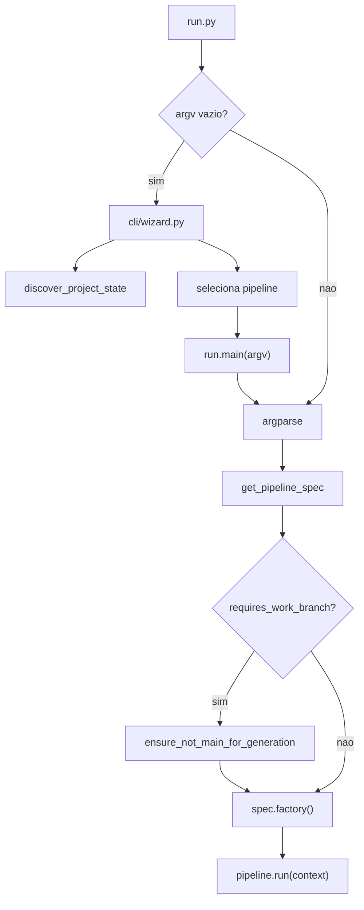
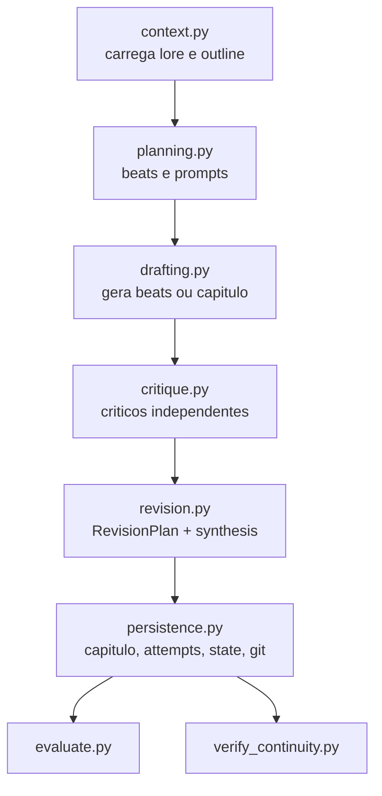
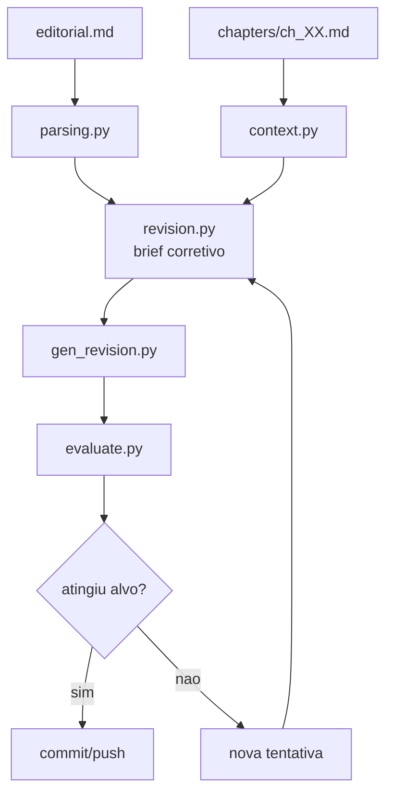

# Pipelines

As pipelines do Autobook usam o padrao Command/Composite definido em
`pipelines/base.py`: cada `Pipeline` contem uma lista ordenada de `Step`s, e
cada step recebe um dicionario de contexto mutavel.

## Registro Central

`pipelines/registry.py` declara as pipelines disponiveis por meio de
`PipelineSpec`.

| Pipeline | Classe | Protegida por branch | Flags relevantes |
| --- | --- | --- | --- |
| `ideation` | `IdeationPipeline` | Sim | nenhuma especial |
| `foundation` | `FoundationPipeline` | Sim | nenhuma especial |
| `book_generation` | `BookGenerationPipeline` | Sim | `--from-scratch`, `--chapter` |
| `editorial_revision` | `EditorialRevisionPipeline` | Sim | `--chapter` |

Todas as pipelines principais exigem branch `autobook/<slug>`.

## Fluxo De Entrada



## Ideation

Responsabilidade: transformar entradas criativas iniciais em uma semente de
obra e estado inicial.


Helpers principais: `pipelines/ideation_steps/selection.py`.

Saidas comuns:

- `seed.txt`
- `book_data/MYSTERY.md`
- `book_data/state.json`

## Foundation

Responsabilidade: gerar as biblias estruturais da obra a partir de `seed.txt`,
`voice.md`, `MYSTERY.md` e `docs/en/others/CRAFT.md`.


Helpers principais:

- `foundation_steps/context.py`
- `foundation_steps/persistence.py`

Saidas:

- `book_data/world.md`
- `book_data/characters.md`
- `book_data/outline.md`
- `book_data/canon.md`
- `book_data/state.json`

## Book Generation

Responsabilidade: gerar capitulos, criticar, revisar, avaliar, validar
continuidade e persistir a melhor tentativa.



Subpacote: `pipelines/book_generation_steps/`.

Pontos importantes:

- Quantidade de capitulos vem do `outline.md`; nao ha numero fixo universal.
- Beats sao usados quando encontrados; sem beats, o pipeline cai para draft de
  capitulo inteiro.
- Criticas sao convertidas para `CriticReport` e consolidadas em
  `RevisionPlan`.
- Tentativas, criticas e planos sao arquivados em `logs/generation_attempts/`.
- `state.json` registra progresso sequencial.

## Editorial Revision

Responsabilidade: aplicar revisoes orientadas por `book_data/editorial.md`,
avaliar tentativas e preservar o melhor resultado.



Subpacote: `pipelines/editorial_revision_steps/`.

Helpers principais:

- `config.py`
- `context.py`
- `evaluation.py`
- `parsing.py`
- `revision.py`

## Metadados `requires` E `produces`

`Step` e `Pipeline` suportam metadados opcionais:

```python
Step("Nome", description="...", requires=["outline"], produces=["chapter"])
```

Eles existem para discovery e documentacao futura. No estado atual, nao sao
validadores bloqueantes de dependencias.
