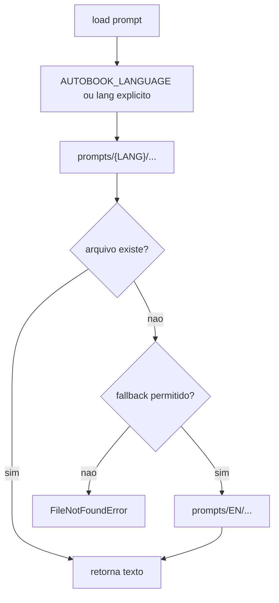

# Prompts

Autobook usa prompts externos sempre que o texto faz parte do comportamento
editorial do sistema. Isso permite ajustar agentes, ferramentas e avaliadores
sem alterar codigo Python.

## Layout

```text
prompts/
  EN/
    agents/
    evaluation/
    foundation/
    ideation/
    tools/
  PT-BR/
    ...
  EN/
    draft_chapter_system.txt
    draft_chapter_user.txt
    gen_revision_system.txt
    gen_revision_user.txt
    continuity.json
    editorial.json
    slop.json
    directives.txt
  PT-BR/
    ...
```

## Resolucao Por Idioma



Variaveis relevantes:

- `AUTOBOOK_LANGUAGE`: idioma ativo, por exemplo `EN` ou `PT-BR`.
- `AUTOBOOK_GENRE`: genero usado por `GenreStrategy`.

## Agentes

Prompts de agentes seguem:

```text
prompts/{LANG}/agents/{role}.txt
```

Roles atuais:

- `drafting`
- `stylist`
- `technical_editor`
- `canon_critic`
- `style_critic`
- `flow_critic`
- `synthesis`

Agentes com placeholders validam template quando o arquivo existe. Placeholder
invalido gera erro explicito para evitar fallback silencioso sobre prompt
quebrado.

## Foundation

Prompts da pipeline de fundacao vivem em:

```text
prompts/{LANG}/foundation/
```

Eles cobrem world, characters, outline e canon. A pipeline tambem usa
`docs/en/others/CRAFT.md` como referencia de tecnica narrativa.

## Evaluation

Prompts de avaliacao ficam em:

```text
prompts/{LANG}/evaluation/
```

`evaluate.py` delega a montagem e parsing ao pacote `evaluation/`, que combina:

- sinais mecanicos de slop;
- juiz LLM;
- normalizacao JSON;
- escrita de reports.

## Tools

Scripts auxiliares externalizam prompts em:

```text
prompts/{LANG}/tools/
```

Esse grupo cobre ferramentas como comparacao, edicao adversarial, audiobook e
voice fingerprint quando aplicavel.

## Arquivos Legados Por Idioma

Alguns scripts ainda usam arquivos diretos por idioma em `prompts/{LANG}/` por
compatibilidade:

| Arquivo | Uso |
| --- | --- |
| `draft_chapter_system.txt` | Prompt base de drafting legado/auxiliar. |
| `draft_chapter_user.txt` | Template de usuario para drafting. |
| `gen_revision_system.txt` | Sistema para `gen_revision.py`. |
| `gen_revision_user.txt` | Usuario para `gen_revision.py`. |
| `continuity.json` | Configuracao de continuidade. |
| `editorial.json` | Configuracao editorial. |
| `slop.json` | Regras mecanicas de slop. |
| `directives.txt` | Diretivas editoriais gerais. |

## Boas Praticas

- Nao inserir nomes de obras especificas em prompts gerais.
- Evitar placeholders nao usados ou nao documentados.
- Preferir JSON quando o prompt pede saida estruturada.
- Manter fallback em `EN` apenas para idioma, nao para mascarar erro de
  template existente.
- Adicionar testes quando um prompt novo introduz contrato de formato.
