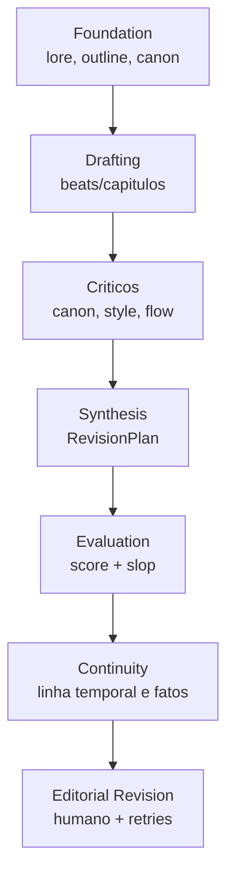

# Analise De Qualidade

A qualidade no Autobook e tratada em camadas. Nenhuma camada isolada garante um
livro bom; o objetivo e combinar planejamento, agentes especializados,
avaliacao automatica, continuidade e revisao editorial.

## Camadas

## Sinais Avaliados

| Sinal | Fonte |
| --- | --- |
| Coerencia de canon | `canon_critic`, `verify_continuity.py`, avaliacao. |
| Voz e estilo | `style_critic`, regras de genero, `voice.md`. |
| Ritmo e fluxo | `flow_critic`, outline/beats, avaliacao. |
| Slop mecanico | `prompts/{LANG}/slop.json`, `evaluation/`. |
| Aderencia editorial | `book_data/editorial.md`, `editorial_revision`. |
| Repeticao tecnica | `skills/redundancy_detector.py` quando usado. |

## Feedback Estruturado

Criticas sao normalizadas para:

- `CriticFinding`
- `CriticReport`
- `RevisionPlan`
- `VerificationReport`

Esses contratos ficam em `writing/feedback.py` e permitem que revisoes futuras
sejam menos dependentes de texto livre.

## Limites Conhecidos

- Modelos baratos podem perder estilo em capitulos longos; por isso o fluxo usa
  beats, criticos e sintese sequencial.
- Saida JSON de LLM ainda precisa fallback robusto.
- Algumas ferramentas auxiliares sao experimentais e nao devem ser confundidas
  com garantia de qualidade da pipeline principal.

## Melhorias Futuras

1. Fazer todos os criticos emitirem JSON nativo de forma consistente.
2. Adicionar memoria de estilo por obra antes da geracao de capitulos.
3. Usar amostras aprovadas como referencia de ritmo por livro.
4. Criar dashboards de regressao qualitativa por capitulo.
