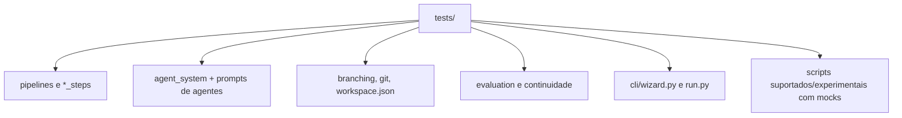

# Testes E Qualidade Tecnica

O baseline moderno do Autobook e a suite em `tests/`. Ela cobre pipelines,
helpers, prompts, agentes, workspace, scripts suportados e fluxos de regressao
sem depender de chamadas reais a LLM ou comandos Git destrutivos.

## Comandos

```bash
uv run --group dev ruff check .
uv run --with pytest pytest tests -q
uv run --with pytest pytest legacy/tests -q
git diff --check
```

Resultado esperado:

- Ruff sem erros.
- `320 passed` em `tests/`.
- `legacy/tests`: nenhum teste coletado e exit code 0.
- `git diff --check`: sem whitespace invalido.

## Escopo Da Suite Moderna



## Categorias De Teste

| Categoria | Exemplos |
| --- | --- |
| Entrada | `test_run_entrypoint.py`, `test_wizard.py` |
| Pipelines | `test_*_pipeline.py`, `test_*_steps.py` |
| Book generation | contexto, planejamento, drafting, critica, revisao e persistencia. |
| Agentes | registry, factory, prompts externos e fallback. |
| Workspace | branches, Git adapter e `workspace.json`. |
| Avaliacao | parsing JSON, prompts, slop e reports. |
| Continuidade | verificacao e resolucao de achados. |
| Scripts | comportamento suportado sem rede/LLM real. |

## Legacy Tests

`legacy/tests` nao representa o sistema atual. A pasta e ignorada por
`pytest.ini` e tem `legacy/tests/conftest.py` para retornar sucesso mesmo quando
executada diretamente. Isso evita que imports historicos quebrem CI ou auditoria
local.

## Padrao Para Novos Testes

- Mockar LLM, subprocess e Git.
- Preferir testar helpers puros de `*_steps/`.
- Adicionar teste de integracao leve quando um contrato publico muda.
- Evitar fixtures que escrevam fora de `tmp_path`.
- Nao depender de artefatos reais de `book_data/` ou `chapters/`.
