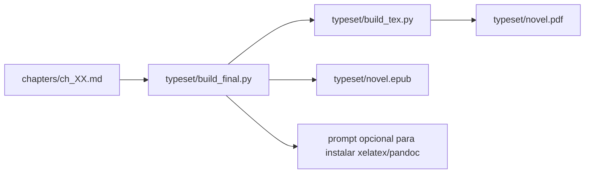

# Typesetting

Typesetting e a etapa final suportada para transformar os capitulos gerados em
artefatos distribuiveis. O comando principal e:

```bash
uv run python typeset/build_final.py
```

Por padrao ele gera PDF e EPUB:

```text
typeset/novel.pdf
typeset/novel.epub
```

Tambem e possivel gerar cada formato separadamente:

```bash
uv run python typeset/build_final.py --format pdf
uv run python typeset/build_final.py --format epub
uv run python typeset/build_final.py --format all
```

O comando verifica dependencias externas antes de compilar. Para PDF, precisa
de `xelatex`; para EPUB, precisa de `pandoc`. Se alguma ferramenta estiver
ausente, o terminal mostra o comando de instalacao sugerido e pergunta se deve
executa-lo:

```bash
sudo apt install -y texlive-xetex pandoc
```

Opcoes de instalacao:

```bash
uv run python typeset/build_final.py --yes
uv run python typeset/build_final.py --no-install
```

`--yes` instala dependencias faltantes sem nova pergunta. `--no-install` nao
instala nada e falha com mensagem clara se alguma ferramenta estiver ausente.

## Geracao Intermediaria

O script abaixo apenas prepara os arquivos LaTeX intermediarios:

```bash
uv run python typeset/build_tex.py
```

Ele le capitulos em `chapters/` e gera:

```text
typeset/chapters_content.tex
typeset/book_meta.tex
```

`book_meta.tex` tambem e gerado automaticamente. Ele contem os metadados da
obra usados por `typeset/novel.tex`; nao edite esse arquivo manualmente.

## Metadados Da Obra

O titulo e obrigatorio. Ele vem de:

1. `AUTOBOOK_TITLE`, quando definido; ou
2. `book_data/workspace.json`, criado pelo wizard.

Metadados opcionais:

| Campo | Variavel | Arquivo alternativo |
| --- | --- | --- |
| Autor | `AUTOBOOK_AUTHOR` | `book_data/author.md` |
| Subtitulo | `AUTOBOOK_SUBTITLE` | nenhum |
| Assunto do PDF | `AUTOBOOK_PDF_SUBJECT` | nenhum |
| Epigrafe | `AUTOBOOK_EPIGRAPH` | `book_data/epigraph.md` |
| Colofao | `AUTOBOOK_COLOPHON` | `book_data/colophon.md` |
| Texto final | `AUTOBOOK_END_MATTER` | `book_data/end_matter.md` |
| Fonte principal | `AUTOBOOK_MAIN_FONT` | `book_data/main_font.md` |
| Fonte fallback | `AUTOBOOK_FALLBACK_FONT` | `book_data/fallback_font.md` |
| Idioma do EPUB | `AUTOBOOK_EPUB_LANG` | usa `AUTOBOOK_LANGUAGE` ou `en` |

As variaveis podem ser definidas no ambiente do processo ou no arquivo `.env`
da raiz do projeto. Para compatibilidade com shell e `python-dotenv`, use o
formato `NOME_DA_VARIAVEL="valor"`, sem espaco antes ou depois de `=`.

Se o titulo nao estiver definido, `typeset/build_tex.py` falha com uma mensagem
orientando a criar o workspace pelo wizard ou definir `AUTOBOOK_TITLE`.

Para gerar PDF manualmente a partir de `typeset/novel.tex`, use XeLaTeX. O
template usa `fontspec`, que nao compila com `latex` ou `pdflatex`.

```bash
uv run python typeset/build_tex.py
cd typeset
xelatex -interaction=nonstopmode novel.tex
```

O arquivo `typeset/latexmkrc` forca `latexmk` a usar XeLaTeX quando `latexmk`
estiver instalado. Em ferramentas visuais de TeX, configure o compilador como
`XeLaTeX` ou `LuaLaTeX`.

Se `AUTOBOOK_MAIN_FONT` ou `book_data/main_font.md` apontar para uma fonte que
nao existe na maquina, o template usa a fonte fallback. Se nenhum fallback for
definido pelo usuario, `typeset/build_tex.py` usa `DejaVu Serif`, que cobre bem
textos com acentos e simbolos cientificos comuns. Se essa fonte tambem nao
existir no ambiente, o template cai para `Latin Modern Roman`, distribuida com
TeX Live.

## Fluxo



## Estado Atual

- A geracao final de PDF e EPUB e suportada por `typeset/build_final.py`.
- A producao final depende de ferramentas externas: XeLaTeX para PDF e Pandoc
  para EPUB. O comando final pode orientar e executar a instalacao via terminal
  em ambientes com `apt` e `sudo`.
- `novel.tex` nao deve conter titulo, autor, epigrafe ou colofao fixos de uma
  obra especifica; esses dados devem vir de `book_meta.tex`.
- Artefatos de teste que existiam nesta pasta foram removidos da documentacao
  operacional.

## Regras Para Evoluir

- Adicionar testes para markdown complexo, acentos, capitulos vazios e ordem de
  arquivos.
- Nao misturar geracao de arte final com geracao narrativa no mesmo step.
